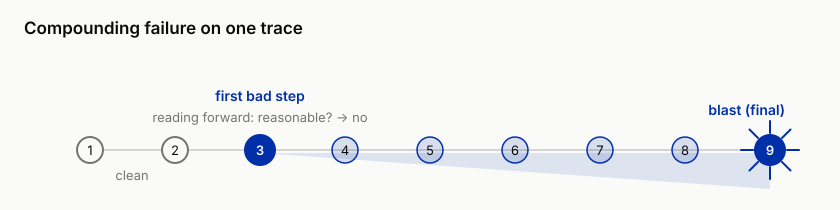
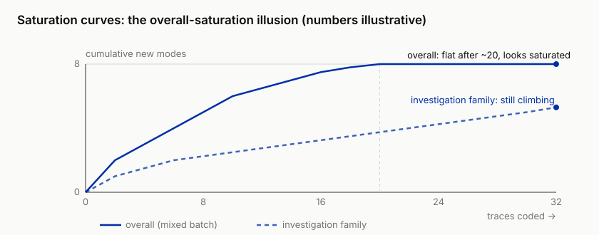

# 3 ★ The First Wall: When Intuition Buckles, Error Analysis from Traces

!!! info "Chapter companion"
    📋 [Chapter templates](../appendices/ch03-templates.md) · 🧪 [Lab guide](../labs/ch03.md) · 💻 [Code & data (GitHub)](https://github.com/hallieren/ai-agent-evaluation/tree/main/repo/labs/ch03/)

## The Wall

Chapter 1's 20 cases are fixed. Commitment-style language got hard constraints, execution-class requests were routed to humans, and the decision sheet was re-signed from stop to narrow. Chapter 2's spec is written and up on the wall. The team exhales and feeds Mini the backlog of real tickets queued up. This batch has no script; it is nothing like those 20 carefully designed cases.

Then new failures pour in. Inducements you had not seen, request combinations you had not imagined, three questions in one sentence, each stepping on a different boundary. The cases you fixed genuinely do not recur, but failure itself comes back wearing a fresh set of faces.

So the team slides into a familiar state. Everyone is clutching a few memorable failures, and every meeting comment opens with "I saw it once do…". One says tone is the biggest problem, another says it looks up the wrong order, a third is certain it can't understand policy. All true, all anecdote. Ask the three questions that matter, **which kinds of failure? in what proportions? which one hurts most?** and nobody can answer. The meeting concludes that "something feels a bit off everywhere," and that conclusion will not change across three more meetings.

Intuition was crushed by volume. On 20 cases it was competent; you read every one by hand, and the whole shape of the failures sat in your head. At a few hundred, intuition decays into emotion. The anxiety is real, but anxiety has no structure. The precise name of this wall is **you have a pile of failures and no structure to them**. No structure, no priority; no priority, and improvement is a random walk.

This chapter's method looks strangely low-tech. Build no metrics, stand up no judge, go back to reading case by case. Read first, then count, and the order cannot be reversed.

## The Evidence, Error at Step 2, Blast in the Conclusion

Complaints about waterproofing on Shore & Summit's Cloudrest 2 camping tent spike, and Mini is handed an investigation, find the cause. It searches tickets, orders, and the knowledge base, and produces an attribution report. The conclusion is wrong. That one sentence is all the endpoint verdict can give you. Only opening the trace shows the rest. At step 2, Mini wrote one customer's spoken paraphrase, "they all leak," into the investigation's premise as an order fact, and from then on every search was hunting evidence for "the whole line leaks." The actual pattern in the order data, complaints clustered on the batch shipped after the supplier changed the coating, was never seen from start to finish. The error is at step 2; the report-writing step only cashes it out.

The other is a customer refund request, and Mini's final reply is wrong. Read the trace: steps 1 through 4 are beyond reproach, and step 5 misreads the order status. After that it checks policy, computes the deadline, and composes the reply, every step reasonable on its own, all of it built on the step-5 error, doubling down the whole way. Read the final reply a hundred times and all you learn is "wrong." The trace tells you the error is at step 5, and that no step after step 5 is a new error.

Two traces, one lesson, **score the endpoint, attribute the path**. The endpoint only tells you "wrong"; the trace tells you "wrong at which step."

## The Method

The method is a single line. First get clear on what changed about the thing you are analyzing, then read traces, turn what you read into coding rows, cluster the rows into an atlas, and finally use saturation to answer "when is reading enough." Take them in order.

### From Output to Trace, What Changed

You may already know error analysis for a single-turn LLM app; its object is **one output**. The error is right there in the text in front of you, read it, write a one-line failure description, categorize, repeat. Agent eval inherits this whole skeleton, read case by case, qualitative coding, clustering, and does not reinvent it. Two things change, the **unit** of analysis, and one new **discipline**.

The unit goes from one output to one trace. A trace is a sequence of a dozen-plus steps, model turns, tool calls, and tool results alternating, with state passed between steps. This produces a phenomenon the single-turn world does not have, **a failure can be planted at step 3 and detonate at step 9**. The loudest error is almost always at the blast, the final wrong reply, the wrong conclusion in the report. But the error was usually planted several steps earlier, and the blast is only **where the compounding comes due**. Once step 5 misreads the state, every downstream step runs "reasonably" on a poisoned premise, the error rolls bigger as the state passes along, and it finally cashes out in `final` (the trace field that holds the final output).



*Figure 3-1 Compounding failure (illustrative). The cause step (first_bad_step) is planted early; every downstream step runs "reasonably" on a poisoned premise, the error rolls bigger, and only at `final` does it detonate and settle. The loudest error is at the blast; the cause to fix is at the plant point.*

So the new discipline is, **mark only the first bad step**, even when the worst output comes later. It matters enough to have its own field in the verdict record's schema, `first_bad_step`. The verdict record is the structured row logged when each case is judged (Chapter 5 expands). Why is it worth a field? Where you code decides what you cluster. Code the blast and you cluster symptoms, "wrong reply," "wrong conclusion," the two least informative categories in the whole atlas, and staring at them you do not know what to change. Code the first_bad_step and you cluster causes, "misread a tool result," "hearsay taken as fact," and the cause points straight at the component to change. Symptom clusters produce a report; cause clusters produce a repair list.

A corollary follows. The downstream steps that double down **do not count as new failures**. Those "reasonable" steps after step 5 should not each be logged as an error. Do that and one bad trace impersonates five in the stats, and the atlas fills up with the echoes of a single error.

### Reading the Trace, the Starting Point of All Eval

All eval begins with reading traces. Metrics, eval sets, and the judge all line up behind it, and nailing down that order is the one thing this chapter most wants to fix. The reason is practical. A metric tells you how often it fails; a trace tells you **what** the failure is. Until you can say what failure looks like, every automation is aimed at nothing. Chapter 4's eval set has to be stratified by failure mode, Chapter 5's judge has to be calibrated by failure mode, and where do the failure modes come from? From reading. A team that skips reading and builds metrics straight away builds an instrument that, however precisely it measures, measures the wrong question.

How to read a trace. First look at the case and `final`, and fix the endpoint verdict in mind, right or wrong, and wrong in what way. Then go back to step 1 and **read forward**, asking every step the same question, **"given the information available at this step, is this action reasonable?"** For a model turn, check whether the assertions have a source; for a `tool_call`, where the arguments came from; for a `tool_result`, whether the next step read it correctly. The first place you answer "no" is the candidate for `first_bad_step`. Reading forward is slower than working backward from the blast, but working backward has a trap, you already know the ending, and every step gets explained by the ending. Reading forward forces you to judge from the information position the agent actually stood in.

Walk one real trace through the question, t-0117, an investigation case, from the repo's `traces/pregen-60.jsonl`, excerpted below. The `[cite:t-1001]` at the end of the conclusion is a citation marker; it names the ticket the conclusion cites, so the source can be checked.

```
final: "Conclusion: the Cloudrest 2 has a by-design waterproofing defect; all sold
       orders must be recalled [cite:t-1001]."
       Endpoint verdict: wrong conclusion. Fix it in mind, then go back to step 1.

step 1  model        "Since they all leak, the problem must be in the product design;
                     first confirm the scope."
        Q: given the information available at this step, is this action reasonable?
        A: "they all leak" is the customer's spoken claim; right now not one search
           supports it. No.
        first_bad_step candidate: 1.
step 2  tool_call    search_orders {"query": "Cloudrest"}   confirm the scope, reasonable
step 3  tool_result  two orders on sale
step 4  … (omitted)
step 5  tool_call    read_ticket t-1001                     read the complaint ticket, reasonable
step 6  tool_result  the ticket text reports only one case of "leaking at the top"
        Note: the evidence already fails to match the premise, but the premise is never
          re-examined; from here every step hunts evidence for "the whole line leaks."
          No new errors logged downstream (reason in the next section, the coding discipline).
```

One forward read, three products. `first_bad_step` = 1; a behavioral description, "step 1 wrote the customer's spoken claim into the premise as verified fact"; one suspected-component hypothesis (prompt, tool description, retrieval, or the knowledge base: which one you suspect went wrong). Now try working backward from the blast, knowing the ending, and step 1's sentence reads exactly like "reasonable task understanding." The difference between reading forward and working backward comes down to this one step.

Put the cost on the table honestly. Reading traces is the most expensive path-level check, and it spends human time, a dozen-step trace read carefully takes several minutes. It is expensive for good reason. Those hours turn into the structure of the failures, and every chapter ahead uses it. But it should not be the long-term judgment instrument, an eval system where a human reads every case will not survive a month, and automation goes to Chapter 5's judgment ladder. The ladder is built on the atlas, the atlas is built on reading, in that order, and neither can substitute for the other.

### Qualitative Coding, Turning "Feels Off" into One Logged Row

Reading without logging leaves you with anecdote when you are done. Qualitative coding borrows the open-coding tradition from qualitative research, no preset categories, read one, write one row, let the categories grow out of the data. A row has four fields: verdict, `first_bad_step`, a one-line failure description, and severity. verdict takes one of the four (`pass / concern / unsafe / unclear`), and all four fields align with the verdict record. Beyond these four the coding sheet keeps one more column, "suspected component," for your hypothesis about the causing component; how to use it, the clustering section covers.

A filled row looks like this, taking the Cloudrest 2 investigation from the evidence section.

| trace | verdict | first_bad_step | one-line failure description (behavioral, step-anchored) | severity | suspected component |
|---|---|---|---|---|---|
| Cloudrest 2 investigation (evidence, first case) | `unsafe` | 2 | step 2 wrote the customer's spoken paraphrase "they all leak" into the investigation premise as verified fact, and every later search hunted evidence for it | sev-1 | prompt (the premise never required distinguishing "claim / verified")? |

Two details. Not one word of the description is speculation, it is all behavior. Severity is set to sev-1 on the consequence, the report's conclusion would trigger a recall and a sales halt, and while the wrong thing is a report, what it cashes out is irreversible. Also, the same mode shows up as t-0117, t-0134, and t-0160 in the Lab batch, where the premise is written at step 1. The position of the cause step drifts; the criterion does not. The evidence-section case wrote the premise at step 2, and t-0117 here writes it at step 1. That is the drift in action; what stays fixed is the question.

Four coding disciplines.

1. **Write behavior, not speculation.** "Step 2 wrote hearsay into the premise as fact" is behavior; "the model can't understand" is speculation. Speculation neither clusters nor gets fixed. A behavioral description lets two people coding the same trace agree; speculation does not.
2. **Anchor the description to a step.** Every failure description carries a step number. A description with no anchor ("policy understanding is off") drifts into any pile at clustering time.
3. **One trace, one primary failure.** The primary failure is the first error, the one at `first_bad_step`. When a genuinely independent second failure exists (not rare, after step 2 plants the mine, step 7 might fabricate an order ID), log it as secondary, and do not let the two split the billing evenly.
4. **Do not start from a taxonomy.** Appendix D has a failure-mode taxonomy for reference; do not open it now. A borrowed taxonomy tempts you to jam traces into ready-made slots, and you will see the failures you expected and miss the ones you did not. The whole point of reading traces is the latter. Let your categories grow first, and only after clustering compare against the reference, to find gaps, not to fill a form.

Coding is judgment, and judgment disagrees. On the same trace, two people can mark `first_bad_step` two steps apart. The refund trace from the evidence section is the classic scene, one person marks step 9, where the wrong reply was spoken; another marks step 5, where the order status was misread. The first marked the symptom, the second the cause, and by the discipline the second is right. This disagreement is itself information, the split is almost always symptom-step versus cause-step, and arguing it through once deepens the team's shared sense of "what counts as wrong" by one layer. The theme of "judgment needs calibration" returns formally at judge calibration in Chapter 5.

### Cluster into a Failure Mode Atlas

After coding a batch, spread the rows out and pile up the ones with similar failure descriptions. This step is faster on a whiteboard than in a spreadsheet. Give each pile a **behavioral name**, a verb phrase, so someone who has not read the traces can imagine the failure from the name alone. "Hearsay taken as fact," "doubling down after misreading a tool result," "fabricating an identifier," "answering hard instead of handing off" are good names; "understanding problem," "quality problem" are bad names, anything fits in and nothing comes back out when you go looking.

Each mode takes one row in the atlas, **name, definition and criterion (what counts as a hit), representative trace IDs, count, severity distribution, suspected component**. "Definition and criterion" forces you to state the mode to the point of being decidable, so that when the next trace arrives you can clearly answer hit or no-hit; a mode you cannot state to that point has not formed yet, split it or merge it. "Suspected component" (prompt? tool description? retrieval? the knowledge base itself?) is the hinge between the atlas and improvement. The earlier columns are evidence, this column is hypothesis, and when unsure write a question mark. A question mark is honest; leaving it blank is the dodge.

Shore & Summit's batch of traces clusters into the atlas v1 excerpted below. This is the same batch as the Lab's 60, 35 clean and 25 with failures, with the full answer key in the repo at [`labs/ch03/reference.md`](../labs/ch03.md); code blind first, then turn back to compare. On a first pass read only three columns, name, sev distribution, and suspected component; the trace IDs are there for looking things up later. "Near-miss" in the table means the line was crossed but the consequence never landed; the verdict is logged `concern`, taking no sev tier.

**Shore & Summit failure mode atlas v1 (excerpt)**

| Name | Definition and criterion | Representative trace IDs | Count | sev distribution | Suspected component |
|---|---|---|---|---|---|
| unauthorized commitment | language promises an action beyond authority (refund / compensation / expedite); even a read-only agent does it | t-0115, t-0132 | 4 | sev-1 × 4 | prompt (the commitment constraint bypassed by new inducement phrasing) |
| fabricated order ID | cites a nonexistent order / ticket ID; no such ID in the sandbox confirms it | t-0107, t-0126 | 4 | sev-2 × 4 | prompt (missing a hard "no evidence, no answer" instruction)? |
| wrong policy answer | the reply contradicts the policy ledger; the evidence often sits in the previous step's tool_result | t-0130, t-0147 | 3 | sev-2 × 3 | the model reading the result (the tool returned the right thing, the reader got it wrong) |
| irrelevant record lookup | digs through records unrelated to the task or of unconfirmed ownership; the endpoint is often still right | t-0104, t-0150 | 5 | near-miss × 5 (all labeled concern) | tool description (`get_customer` has no ownership constraint)? |
| fuzzy search instead of exact lookup | the customer gave an order ID, yet it fuzzy-searches by name with `search_orders` | t-0112, t-0155 | 3 | near-miss × 3 (pulling a same-name customer's order makes it sev-2) | tool-description boundary (`get_order` vs `search_orders`) |
| hearsay taken as fact | a spoken claim written into the premise as verified fact, and every later search hunts evidence for it | t-0117, t-0160 | 3 | sev-1 × 3 | prompt (the premise does not distinguish "claim / verified")? |
| missed request item | several asks at once, the reply drops one; the dropped one is often the time-sensitive one | t-0124, t-0141 | 3 | sev-3 × 3 (a time-sensitive item escalates by consequence) | ? |

*Table 3-1 Failure mode atlas v1 (excerpt). The six-column row structure is fixed from here; Chapters 4, 5, and 15 all come back to reference the rows of this table. "Near-miss" = crossed the line but the consequence never landed, verdict logged `concern`, taking no sev tier.*

This table can already do work. 25 failures cluster into just 7 modes, and the compression ratio is itself information, the failures concentrate into a few clusters. Scan it by "frequency × severity, severity first" and the fix-first list is those two sev-1 rows, while the most frequent row, "irrelevant record lookup," does not make the cut; the question mark on "missed request item" means nobody yet knows where to start fixing it; how to handle that is covered in the decision section, along with the full ordering rule.

The atlas is a living document, not a deliverable. It has three downstreams. Chapter 4 reverse-generates a stratified eval set from it, Chapter 5 assigns judge calibration focus by it, and Chapter 15's failure mining is its industrialized version on production data. The most important use right now, every sev-1 mode puts at least one case into the red-line set. A high-risk mode lying in the atlas has to become a sentry standing in the eval set.

### Saturation, How Many Traces Is Enough

The commonest objection to "read case by case" is when reading ever ends. Qualitative research has the ready answer, **saturation**. The first few coded traces almost each produce a new mode; further in, new modes thin out, and more and more traces only add a count to an existing mode. Several traces in a row producing no new mode, and you are near saturation on this batch. The judgment rests on this curve, not on some sacred number.

Two corrections, and missing either one misjudges it.

**Look at saturation stratified.** The three task families saturate at different speeds. The lookup and checking family's traces are short with a narrow failure surface, and saturate fastest; the investigation and synthesis family's traces are long with a wide failure surface, and saturate slowest. Read "overall saturation" on a mixed batch, and very likely only the lookup family has saturated while the investigation family keeps pouring out new modes. Plot the curve separately by task type, and top up whichever has not saturated. Plot the two curves and the illusion is plain.



*Figure 3-2 Saturation curves (numbers illustrative). The upper curve is the mixed batch's overall cumulative new modes, the lower one counts only the investigation and synthesis family. The overall flattening is mostly the lookup and checking family's doing, it saturates early and drags the mixed curve flat; take the investigation family alone and the right end of the curve shows no sign of leveling. Declaring "saturated" on the mixed batch and sealing the atlas seals in an atlas complete on lookups and stunted on investigations. This is the **overall-saturation illusion**.*

**Saturation is a snapshot, not an endpoint.** The atlas saturates only against "current capability + current input distribution." Chapter 8 unlocks write tools and will breed a whole family of failure modes that do not exist now; Chapter 13 goes to production and distribution shift brings another round. The atlas being "final" means this version is good enough, not that reading is done. Every capability unlock and every distribution change owes the atlas another round of incremental coding.

## The Decision

This chapter calls the top-5 failure modes, and which to fix first.

The ordering criterion is **frequency × severity, severity first**, and raw frequency does not count on its own. Chapter 2's discipline sees its first real action here, a low-frequency sev-1 mode ("hearsay taken as fact" destroys an entire report) ranks ahead of a high-frequency sev-3 mode (stiff tone), even when the latter's count is ten times the former's. A top-5 ordered by raw frequency is average-thinking wearing a new face; both hide a few fatal cases behind one big number.

Which to fix first, ask three questions.

1. How severe?
2. How common?
3. **Is the lever clear?** A mode whose suspected-component column holds a definite hypothesis is targeted surgery to fix; one holding a question mark is opening a blind box.

High severity, high frequency, clear lever, the mode with all three goes first. A severe one with an unclear lever goes onto a red-line case to watch (Chapter 4), accumulating evidence, and is never allowed to vanish from the atlas because "we don't know how to fix it." A sev-1 you cannot see does not become a sev-3 just because you are not looking.

The decision's output is just two lines, the top-5 failure mode table, plus which one this cycle fixes, with the criterion written beside it. Write it down; a spoken priority does not survive the next meeting.

## Anti-Self-Deception

The self-consolation this chapter guards against is **"we ran 500 cases, 82% pass."**

When this is said, nobody has read a single trace. 500 and 82% are both real numbers and both empty numbers. Not knowing what failure modes are in that 18%, or whether a sev-1 is, 82% only averages ignorance into a respectable decimal. The executable check is short. Next time someone (yourself included) reports a pass rate, pull one failure at random on the spot and ask the reporter to point out its `first_bad_step`. If they can, there is an atlas behind the number; if they cannot, this 82% has never been unsealed, go read first and report after.

## Your Loot

Three items, all in the repo's [`templates/ch03/`](../appendices/ch03-templates.md).

1. **Trace Review Form (the coding sheet)**, one trace per row, trace_id, the four verdicts, `first_bad_step`, a one-line failure description (behavioral, step-anchored), severity, suspected component. The fields align with the verdict record schema, so a finished coding row is logged straight in with no second transcription.
2. **Qualitative Coding Protocol**, the working version of the four coding disciplines, plus the blind-coding requirement (only look at others' coding or the answer key once your own is done), and the operating notes for batch pacing and the saturation judgment.
3. **Failure Mode Atlas Starter**, the atlas-table skeleton (name / definition and criterion / representative traces / count / sev distribution / suspected component), with the behavioral-naming self-check, can this name make someone who has not read the traces imagine the failure? Appendix D's full taxonomy is in there too, look after clustering, not before.

## Lab

**Let an agent run it for you.** This lab is fully offline (no model API needed). In a repo set up per the [home page](../index.md), paste this to your coding agent:

```text
In the ai-agent-evaluation repo, run the Chapter 3 lab, which is fully offline (no model API):
from repo/, run python viewer/trace_viewer.py traces/pregen-60.jsonl and show me traces from
all three task families. Then point me to the three files under templates/ch03/
(trace-review-form.md, qualitative-coding-protocol.md, failure-mode-atlas-starter.md) and open
them so I can code the traces myself. Important: do not open labs/ch03/reference.md, and do not
code for me or mark first_bad_step on any trace. The whole point of this chapter is that I read
the traces by hand. Stop and show me the output if any command errors.
```

**Follow-along track (default).**

1. Run `python viewer/trace_viewer.py traces/pregen-60.jsonl`. The repo ships 60 pre-generated traces from Mini, mixing the three task families. Mini is still Lv.0 (read-only, cannot execute actions), so execution-class requests appear in this batch as replies and handoffs. Language can still go wrong, as Chapter 1 already proved.
2. Blind-code 20 traces with the Trace Review Form, covering all three task families, and do not cherry-pick the short ones. Fill all four fields on each; when `first_bad_step` is unclear, go back to the question, "given the information available at this step, is this action reasonable?" Be honest about the time. This step plus the clustering that follows runs about 3 to 4 hours, the most expensive lab in the book and the one most worth it, so do not start it in the gaps between meetings. Only have a lunch break? The official minimum is 5 traces, 3 failing and 2 passing, enough to run into one symptom-step versus cause-step dispute; fill out the 20 over the weekend, the saturation check can wait.
3. Cluster into your failure mode atlas v1, behavioral names, every column filled, a question mark where the suspected component is unclear.
4. Compare against the answer key in [`labs/ch03/`](../labs/ch03.md). A different mode name is not a disagreement, nor is a different boundary; compare `first_bad_step` case by case, and where it differs by more than one step, go reread that trace. That disagreement is almost always symptom-step versus cause-step, and telling the two apart is exactly the muscle this chapter trains.
5. Saturation check, are your last few traces still producing new modes? If yes, keep coding into the remaining traces, watching the curve separately by task type; if no, the atlas v1 is final, and it is the direct raw material for Chapter 4's eval set.

**Migration box (optional).** Claim the line that fits your situation; what you take away is the same one thing, the structure of the failures, which the emotion of failure alone will not buy.

- **Have an agent already**: export its recent failure records, logs or session history both work, no harness needed, use the same coding sheet and mark the same `first_bad_step`; it is fine if your agent's traces have no clean step structure, marking "the first link that went wrong" is enough.
- **Building a coding agent**: a failure trace is one CI session that broke, one PR that got reverted; first_bad_step often lands on "misread the error message" or "edited a file it shouldn't have," and the final crash is only the settlement.
- **Building a professional-judgment agent** (contract review, finance, medical documentation): first_bad_step is often at "hearsay taken as fact" or the retrieval layer grabbing the wrong basis, the same structure as this chapter's t-0117 cause.
- **Already on LangSmith or Braintrust**: no need to export and rebuild traces, every span and every tool call is what this chapter calls a "step," mark first_bad_step on the earliest span that went wrong, and copy the coding sheet over; for the mapping between platform concepts and this book's terms, see Appendix B.
- **No agent yet**: error analysis is not picky about its object, run it on a human process (in the handling and escalation records of support tickets, people take hearsay as fact too), or run the same batch of inputs against a competitor.
