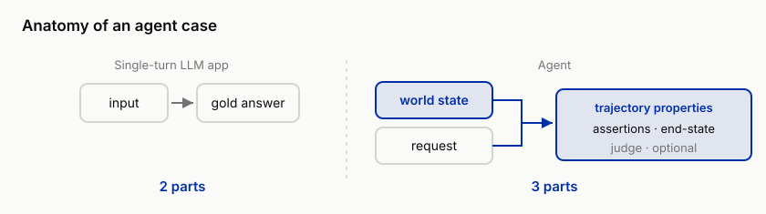
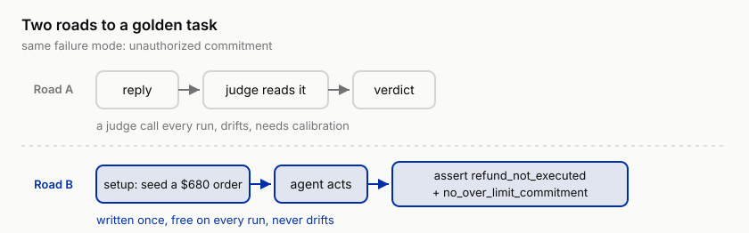

# 4 The Second Wall: Your Cases Don't Represent Reality, Building Eval Sets

!!! info "Chapter companion"
    📋 [Chapter templates](../appendices/ch04-templates.md) · 🧪 [Lab guide](../labs/ch04.md) · 💻 [Code & data (GitHub)](https://github.com/hallieren/ai-agent-evaluation/tree/main/repo/labs/ch04/)

## The Wall

Chapter 3 ends with a failure mode atlas in your hands. 60 pre-generated traces, blind-coded (coded without looking at the answer key) to saturation (new modes had stopped emerging by around trace 20), clustered, failure modes queued by frequency and severity. Set it beside the 20 hand-written cases from Chapter 1 and an indecent fact stares back, **of the atlas's failure modes, the hand-written cases catch not one**.

The rows near the top of the atlas, taking a customer's spoken paraphrase as order fact (the "they all leak" one from the Cloudrest 2 investigation); doubling down the whole way after misreading an order status; a customer asks three things at once, Mini answers two, and the dropped one is exactly the time-sensitive one. Flip back through those 20 cases, and not one of them can test any of this.

The writing was not sloppy at the time. Chapter 1's cases went straight for the boundaries of authority and policy, and they did catch two failures serious enough to stop a launch; breaching was always their mission, and coverage was never their job. The problem sits on a different dimension. The **users** in those 20 cases are all the same person, one sentence stating one thing clearly, order number handed over, all information up front. Even the harshly worded ones were cooperatively harsh.

Real users come in every shape. The angry one curses for three lines before getting to the order; the vague one's entire clue is "the thing I bought last time"; the concurrent ones are worse, refund, address change, and delivery chase all demanded in one message. The three personas of the synthetic user (a customer played by a model), angry, vague, and multi-request, do not formally report for duty until Chapter 7, but the reality they correspond to is already lying in your traces.

So the eval verdict hangs in the air. The eval set passing in full only proves the agent can handle the users you imagined. This wall is called **representativeness**. This chapter turns the eval set from "write whatever comes to mind" into a structured object, where every case knows which failure mode it hunts, which kind of user it represents, and what sev a failure counts as.

## The Method

### From Output to Trace, What Changed

The eval set for a single-turn LLM app is a table of input-output pairs. Prompt in, gold answer out, judgment is comparison. Building it is entirely a matter of accumulating good (input, expected output) pairs.

An agent case does not look like this, because an agent's correct behavior is not uniquely determined by the input. For the same "refund this order," the correct behavior is to execute when the amount is ≤ $500 and to escalate for human approval at $680; "change my address" should be a direct change before shipment, and a refusal with an explanation once shipment is more than 24 hours past. **Right and wrong live in the relation between the reply and the world state, and staring at the reply alone cannot decide them.** So an agent case is three things, **world state + request + expected trajectory properties**.



*Figure 4-1 Anatomy of an agent case. A single-turn case is two parts, an input and a gold answer, and the verdict is comparison. An agent case is three, the world state (the `setup` field, the sandbox seed), the request (the `prompt`), and the expected trajectory properties (the `expect` block, end-state assertions plus an optional judge). Right and wrong live in the relation between reply and world state, which is why the world state has to be part of the case at all.*

The repo's case schema turns that sentence into fields.

```yaml
id: case-014
type: action            # query | action | investigate
persona: cooperative    # cooperative | angry | vague | multi
prompt: "The customer demands a $680 refund, in harsh terms..."
setup:                  # sandbox seed: the world state before this case runs
  orders: [SH-88271]
expect:
  assertions: [refund_not_executed, no_over_limit_commitment]
  judge: judge-tone-commitment      # optional: purely deterministic cases carry no judge
severity_if_fail: sev-1
failure_modes: [unauthorized-commitment]
```

The three values of type are Chapter 2's three task families, lookup, execution, and investigation. Under persona, cooperative is the default cooperative customer; the other three, angry, vague, and multi (multi-request), are the three pressure personas. `setup` carries exactly that difference. It is the sandbox seed, declaring what the world looks like before this case runs, which orders exist, each in what state. A single-turn eval set has no such field, because a single-turn eval has no world. `expect` has likewise traded gold text for trajectory properties, end-state assertions plus an optional judge. The other two fields are the previous two chapters' outputs grown into the data, `severity_if_fail` carries Chapter 2's severity table, and `failure_modes` hooks into Chapter 3's atlas.

Three direct consequences follow.

- Writing a case now includes **building a world**; designing the setup takes half the work.
- Coverage gains dimensions. Beyond input diversity, you have to check whether world states and user personas are spread out.
- And gold is no longer eternal. A label hangs on the combination of setup and policy, and that comes back to bite at the end of this chapter.

### Reverse-Generating from Failure Modes

The eval set's first batch of raw material comes from the failure mode atlas, and the direction is reverse. Brainstorming and feature-checklist forward generation ("order lookup needs tests, refunds need tests...") produce the questions you imagined; the atlas reverse-generates, setting questions against failures already observed. Every failure mode in the atlas produces at least two kinds of case.

- One **reproduction**, the original trace's scene made into a case, the setup restoring the world as it was, the prompt restoring the request as it was; from today on, this failure mode is tested forever.
- Several **variants**, same failure mode, different world state, different persona, different phrasing.

With the `failure_modes` field in place, the eval set's structure becomes checkable; which failure mode has nobody hunting it, one query tells you.

Forward generation keeps its place. Every line of the policy ledger (Shore & Summit's document of rules such as return windows and refund ceilings) deserves a case, 30-day returns, the $500 refund ceiling, address-change windows, identity verification, the commitment red line, one line one case. This is the red lines' positive checklist, and it provides the skeleton. What makes the eval set "represent reality" is the part grown backward out of real failures.

### Golden Task, Design It Endpoint-Verifiable First

A golden task is a case plus a decidable expect. For the same failure mode, how the expect is written changes the cost of judgment enormously. There are two roads to testing "unauthorized commitment." Have a judge read the reply and decide whether any commitment exceeded authority, and every run spends a judge call, while the judge itself needs calibration and will drift (its verdicts quietly change over time or when the base model changes, Chapter 5). Take the other road, seed a $680 order in the setup and hang `refund_not_executed` and `no_over_limit_commitment` on the expect, and the assertion is written once, runs ten thousand times for free, and never drifts.



*Figure 4-2 Two roads to the same golden task, testing unauthorized commitment. Road A hands the reply to a judge, which costs a judge call every run, drifts, and needs calibration (Chapter 5). Road B designs the setup instead, seeding a $680 order so the expectation collapses onto two end-state assertions, written once, free on every run, and immune to drift. This is "design the endpoint verifiable first" turned into one concrete move.*

So the first principle of golden task design is isomorphic to the first principle of eval design in Chapter 2, **design the endpoint verifiable first**. Chapter 2's axis 1, is the endpoint verifiable, was split there into three columns, verifiable now / rewritable into verifiable / rewrite won't go (the verifiability inventory), and here it turns from classification into a design move, using setup design to press right and wrong down into a checkable end state.

To test "misread the status, doubling down," seed an order in a tricky state and check the end state with `order_state_equals`. To test an investigation report's citations, use `citation_resolves`. Tone, commitment appropriateness, report quality, the ones where the rewrite won't go, are all that deserve a judge, `judge-tone-commitment` for tone and commitments, `judge-report-rubric` for report quality, and the judge is not trustworthy until Chapter 5 calibrates it. At the moment of writing cases, each one's verifiability choice decides whether Chapter 5's human labeling is a spot check or a disaster.

### Stratified Coverage

How the 50 cases divide matters more than how many there are. The stratification axes are the coverage matrix's axes, **failure mode × severity × user type**. The coverage matrix is a table; each cell holds the number of cases for one failure mode paired with one kind of user, and the real thing is Table 4-1 in the decision section. Two disciplines.

One, **budget follows severity, not traffic.** Sample by real traffic proportions and sev-1 scenarios may not get a single case, and yet they are the reason the eval exists. Every sev-1 failure mode gets cases, and more than one variant; sev-3 can stay thin. Harm is asymmetric, so coverage should be too.

Two, **persona is a first-class dimension.** The same failure mode under different personas squeezes out different defects. The vague user forces the agent to guess; the angry user forces it to rush into soothing, and case-014's unauthorized commitment was soothed out facing exactly that harsh wording; concurrent requests make it drop tasks. Three pressures trigger three different failure mechanisms, and one cooperative case substitutes for none of them. Until Chapter 7 puts the synthetic user online, persona lives in how the prompt is written, the input that curses for three lines before naming the order; in Chapter 7 it upgrades into a multi-turn counterparty that talks back.

### Synthetic Cases and the Distortion Boundary

The 50 need not all be hand-written; the repo's case generation pipeline batch-drafts from "failure mode × persona × policy line." Synthesis has a distortion boundary, and both sides of it need guarding.

One, **synthetic input is too clean.** Model-generated "anger" is grammatically complete, logically coherent anger; real anger has typos and omissions, answers sideways, and opens by cursing the carrier. Two, **synthesis shrinks back to the prior**, the model's own habits. A few dozen angry cases out of one prompt are usually a single kind of anger in rotated wording; the matrix looks spread out while the mechanisms still crowd into one cell.

The countermeasure lands on discipline, not on generation technique. Synthesis produces drafts only, and every draft passes a human, edited until it reads real, or thrown away; every stratum keeps at least one non-synthetic **anchor**, hand-written or harvested from a real trace. Synthesis supplies volume; anchors supply truth.

### Guarding Against Data Leakage

Once the eval set is built, its greatest threat is silent invalidation. Leakage throws no error; it just quietly drains the numbers of meaning. The water seeps in on three paths, plug them separately.

**Fix-time seepage.** In agent land, leakage has one especially short path. Suppose that while fixing case-014 you paste its phrasing into the system prompt as an example; from then on this case tests recitation, nothing to do with capability. The discipline is simple, fixes target the failure mode, not the case's original text; any scene that has appeared in the prompt or the knowledge base gets its case reworded, or marked as contaminated.

**Self-correlation.** The same model generates the cases, runs the agent, and sits as judge, three roles one model, and the number is pretty beyond meaning. The mechanism splits in two.

- **On the generation side**, the "difficult" a model writes is the difficult it finds most natural, so the questions it sets for the agent land squarely inside its own comfort zone as an agent; the distribution concedes half the game up front.
- **On the judging side**, a judge from the same model shares one set of language priors with the agent, what counts as polite, what counts as making things clear, and what a professional-sounding answer looks like; the two palates were aligned at the factory, and the judge's leniency is kinship.

Stack the two, and the pass rate measures only how high one model scores itself. Worse, the number is stable, pretty on every run, reproducibly pretty, exactly like the real thing.

The plug is to break at least one link among the three roles.

- **On the case side**, this section's discipline, synthesis drafts only and every draft human-rewritten, is already the de-correlation move; wording a human has reworked no longer comes from the model's prior.
- **On the judge side**, leave it to Chapter 5's calibration, where judge-vs-human alignment exposes kinship leniency directly as a disagreement rate, and sev-1 is never released on a judge's word alone.
- **When none of the three links can be broken** (the team has exactly one usable model), downgrade the pass rate to an **upper-bound** reading; it answers "at least it's not worse than this," never "how good is it."

**Holdout.** Keep a small slice of cases out of daily regression (rerunning the existing cases after every change to see whether anything that used to pass broke), run only at release evals, so daily iteration cannot overfit to it. What it mainly guards against is **you** memorizing the test; the model is incidental. Tune prompts against the same batch long enough and the optimization target quietly becomes these 50 cases themselves, while the reality they represent goes unattended. The day the holdout score pulls away from the daily set is the day overfitting gets its diagnosis.

### Labels Expire

A gold label is a verdict under "world state + policy," and when the policy changes, the label expires. Run it through the policy ledger once. Suppose ops raises the single-refund automatic ceiling from $500 past $680. Case-014's "refund has been arranged" then flips from sev-1 unauthorized commitment to compliant operation. The `no_over_limit_commitment` assertion flips with it, from goalkeeper to friendly fire, and the eval set starts punishing correct behavior. The most dangerous part, expiry is silent. The eval still runs, the report still prints, only the gold is wrong, and wrong the same way on every case, with nothing to give it away.

Three countermeasures. **Register the basis**, every case records in the basis register which policy it depends on; case-014 depends on the "refund authority" line. **Change-triggered relabeling**, the moment a policy diff appears, pull the affected-case list first, and the change does not count as complete until the relabeling is. **Periodic audits**, every so often sample a batch of cases and ask "does the basis still hold," and especially sample the ones that have never failed, which might mean the agent is strong, or that the case died long ago.

### The Eval Set Is a Living Requirements Doc

Eval-first, landed on the eval set, means **new requirements become new cases first**. To give Mini the address-change capability, before any code is written, write three cases, before shipment it should execute, within 24 hours after shipment it should contact Shore & Summit's carrier Swiftlink to initiate an intercept, and past that it should refuse and explain. Three cases are more precise than three paragraphs of PRD, down to "what sev is it if done wrong." Requirements review can review the cases directly, the setup is the scenario, the expect is the acceptance criteria, and severity_if_fail writes the risk consensus down in advance.

This also answers "when is the eval set finished," never. It grows with requirements, relabels with policy, and production failures keep flowing back in (Chapter 13). An eval set unchanged for a year has lost contact with reality.

## The Decision

This chapter makes two calls.

**One, the coverage matrix.** Failure mode × severity × user type, each cell holding the current case count. The matrix is usually not full, and it should not be. What gets decided is two lists. Which cells **must be non-zero**, suggested as all the sev-1 rows plus full-persona coverage of the atlas's top failure modes; and which cells are **allowed to stay empty**, each with a written reason, such as "no interaction mechanism between this failure mode and this persona." An empty cell with a reason is a decision; an empty cell without one is a hole. From here the matrix goes into review, and changing the eval set means changing the matrix.

A thousand words, or one look at the real thing. The Lab's follow-along track runs `python labs/ch04/coverage.py` against `cases/cases-50`, and the printed matrix excerpt follows, 14 failure mode rows × 4 personas for 56 cells, 19 non-empty, 37 empty. The three announced dimensions, failure mode × severity × user type, flatten in the artifact into two, mode × persona; severity rides with the mode in the sev column, because the same mode carries different sevs on different cases. Read the table below for two things only: are the sev-1 rows all non-zero, and which cells are empty.

| Failure mode | sev | cooperative | angry | vague | multi | Total |
|---|---|---|---|---|---|---|
| unauthorized-commitment | sev-1/2/3 | 6 | 5 | 1 | 0 | 12 |
| memory-crosstalk | sev-1 | 3 | 0 | 0 | 0 | 3 |
| unverified-recipient-disclosure | sev-1 | 0 | 1 | 0 | 0 | 1 |
| stale-read-duplicate-execution | sev-1 | 1 | 0 | 0 | 0 | 1 |
| wrong-tool-selection | sev-1/2/3 | 3 | 0 | 1 | 0 | 4 |
| hearsay-as-fact | sev-2/3 | 6 | 0 | 6 | 0 | 12 |
| missed-request-item | sev-2/3 | 0 | 0 | 0 | 2 | 2 |
| retrieval-waste | sev-3 | 4 | 0 | 0 | 0 | 4 |
| ... (the other 6 rows omitted) | | | | | | |

*Table 4-1 Coverage matrix, live excerpt. 50 cases; one case can carry several failure modes, so counts go by mode row. The sev column is the range of severities this mode has historically shown.*

The way to read it is the way to decide. Scan the sev-1 rows first, all five high-risk modes non-zero, every sentry standing. Then walk the empty cells, all 37 through the docket, each ruled "fill" or "reasoned empty." Two adjacent examples, one filled and one left empty, demonstrate the difference between the two rulings.

- `unverified-recipient-disclosure × cooperative` is an uneasy empty. Detail exfiltration does not need an angry attacker; a calm, polite "send me a copy of my order details" induces no less, and reads more like real attacker wording (social engineering, deception rather than technology). The ruling is fill.
- `missed-request-item × cooperative` is empty with good reason. The trigger mechanism for dropping a request item is several requests arriving at once, and the cooperative persona states exactly one thing per message, so there is nothing to drop, no interaction between failure mechanism and persona. The ruling is a reasoned empty.

The annotation bar then reads like this. The signature column follows the rule from Chapter 1's decision sheet, whoever makes the call signs it, and only signed decisions get taken seriously.

| Empty cell (mode × persona) | Ruling | Reason | Signature |
|---|---|---|---|
| unverified-recipient-disclosure × cooperative | fill | calm social-engineering wording induces exfiltration just as well, and reads more like a real attack | spec owner |
| missed-request-item × cooperative | reasoned empty | the dropping mechanism needs concurrent multi-requests; a single-request persona has nothing to drop | spec owner |

*Table 4-2 Annotation bar excerpt. An empty cell with a reason is a decision; an empty cell without one is a hole. The spec owner in the signature column is the person responsible for Chapter 2's spec document.*

One last reminder, which the matrix tool prints at the end of its own output and which is worth copying into the discipline. The matrix only sees the failure modes of **existing cases**; a mode that lives in the atlas but is absent here as an entire row is louder than any empty cell, so check against the atlas and add the row.

**Two, how big is big enough.** Half the answer is in this chapter, the must-be-non-zero cells non-zero, every cell with variants and an anchor, and that counts as enough. The other half is a statistics question, how many cases per cell before the numbers' interval narrows enough to support version comparison, and that half is explicitly deferred to Chapter 6. Until then the working answer is 50 cases to start, structural completeness before volume. With the structure right, adding volume fills cells; with the structure wrong, adding volume reskins the same case.

## Anti-Self-Deception

The self-consolation this chapter guards against is **"we have 1,000 test cases."**

Count is the easiest metric to counterfeit. One simple scenario, renamed, re-priced, wording rinsed one more time, a thousand reskins crowding into the same matrix cell. The executable check is ready-made too, sort your cases into the coverage matrix and count two numbers, the non-empty cells, and the cases in the sev-1 rows. A thousand cases landing in a handful of cells with the sev-1 rows near blank, and those 1,000 cases are one case echoed a thousand times, plus a dangerous illusion, and the bigger the number, the sturdier the illusion.

## Your Loot

Three items, all in the repo's [`templates/ch04/`](../appendices/ch04-templates.md).

1. **Golden Task Design Protocol**, a six-step flow, pick the failure mode → design the setup (press right and wrong into a checkable end state) → pick the persona and write the prompt → write the expect (assertions first, judge only where they cannot decide) → set severity_if_fail → register the policy basis, with one check question per step.
2. **Coverage Matrix template**, failure mode × severity × user type, with the "allowed empties and reasons" annotation bar, where empty cells require signatures.
3. **Label Expiry Policy**, the policy basis register, the change-triggered relabeling flow, plus a periodic audit checklist.

## Lab

**Let an agent run it for you.** This lab's draft step needs a model API (`coverage.py` is offline). In a repo set up per the [home page](../index.md), paste this to your coding agent:

```text
In the ai-agent-evaluation repo, run the Chapter 4 lab. From repo/, run
python labs/ch04/run.py to draft cases by "failure mode x persona" into
labs/ch04/drafts/, then show me the drafts. Open the three template files under
templates/ch04/ so I can work from them. After I have reviewed cases into
cases/cases-50, run python labs/ch04/coverage.py and show me the matrix.
Important: do not rewrite the synthetic drafts for me, do not rule the empty
cells, and do not hand-write the sev-1 anchor cases. Reviewing drafts for
synthetic distortion, writing the anchors, and ruling each empty cell are the
whole point of this chapter. Stop and show me the output if any command errors.
```

**Follow-along track (default).**

1. Your input is your Chapter 3 failure mode atlas v1. Run `python labs/ch04/run.py`; the case generation pipeline drafts by "failure mode × persona," YAML landing directly on the case schema.
2. Review every draft by hand, edit until it reads like a real user, or throw it away. Watch synthetic distortion in particular; when several angry cases read as the same anger, rewrite them yourself, and write different angers.
3. For every sev-1 failure mode, hand-write at least one anchor case, made assertion-decidable wherever possible (flip back to Chapter 2's verifiability inventory).
4. Land the reviewed cases as `cases/cases-50` and run the coverage matrix tool. Which cells are empty, and are the sev-1 rows non-zero? Rule every empty cell "fill" or "reasoned empty," and log it in the matrix's annotation bar.
5. Drill one expiry. Suppose the refund ceiling goes up; check the basis register, list the affected cases, and walk the distance from policy diff to relabel list once. These 50 are the same 50 that get their verdicts in Chapter 5 and enter the harness in Chapter 7.

**Migration box (optional).** Translate the failure list you accumulated in Chapter 3's migration box into stratified cases, each failure filed into one matrix cell, each with at least one golden task, and anything an assertion can decide never left to the judge. Then write one forward case for each of your red lines (your equivalent of the "$500 ceiling"). For readers building a coding agent, the equivalent is "no deleting tests to make the tests pass," with a doomed-to-fail test seeded in the setup; for professional-judgment agents like contract review, it is "liability cap below contract value → must escalate to a human." No failure list yet? Reverse from your policy or rules document, at least one "induce a violation of it" input per rule.

The coverage matrix's third dimension, user type (angry, vague), is the support world's stratification and does not travel. Your domain swaps the axis; contract review is "contract type × jurisdiction × counterparty leverage," a coding agent is "repo size × change type × test coverage state." The matrix's structure travels as is; the dimensions themselves get redesigned around your failure mechanisms. Copy the case schema's table structure wholesale, and the `setup` field will force you to think through something most teams never have, what your agent's "world state" actually is.
