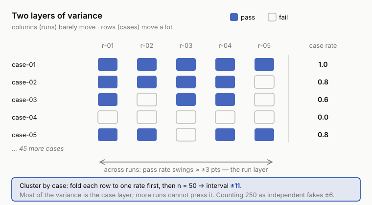
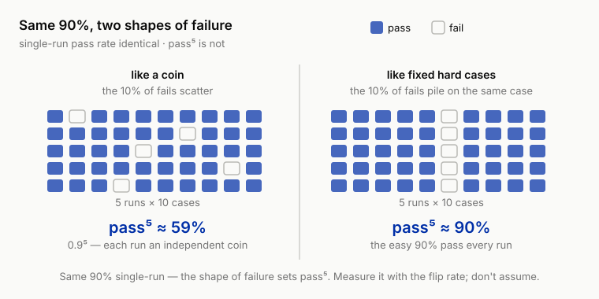

# 6 The Fourth Wall: Run It Twice and Get Two Different Results (Variance, Sampling, and Significance)

!!! info "Chapter companion"
    📋 [Chapter templates](../appendices/ch06-templates.md) · 🧪 [Lab guide](../labs/ch06.md) · 💻 [Code & data (GitHub)](https://github.com/hallieren/ai-agent-evaluation/tree/main/repo/labs/ch06/)

## The Wall

By the end of Chapter 5, the team owned for the first time the ability to change a version, run the set, and read a number. What should be assertions were assertions, the judges that should judge were calibrated, and a full pass over the eval set went from an evening of hand labeling to a dozen-odd minutes. Then that ability immediately deceived everyone.

Someone gave Mini's system prompt a careful rewrite, ran the set once, and the pass rate went from 74% to 79%. Five percentage points, in black and white. The group chat started celebrating, and the change merged the same day. The next day someone else reran the eval set for an unrelated reason. 73%.

Nothing had changed. Same prompt version, same eval set, not one word of the verdict rules touched. The number moved on its own.

The problem in this moment goes beyond embarrassment. If the distance between 73% and 79% can appear **with no change at all**, what exactly did the 74% → 79% "improvement" prove? The eval set and judgment ladder built across five chapters produce nothing but numbers, and numbers carry a built-in illusion of hardness. This wall exists to demolish that illusion. For a sampled system, a single run's number is one draw of a lottery, and a draw is not a measurement. This chapter is the minimum statistics for engineers, not a statistics course. Four tools, one cheat sheet, and stop when that is enough.

## The Method

### From Output to Trace, What Changed

In a single-turn application, one case is one sample. One input, one output, non-determinism acts once. Run it twice and the differences usually stay at the wording level; verdict flips are the minority.

Agents move this to another order of magnitude, **non-deterministic + multi-step**. Every step is a sample, the previous step's output is the next step's input, and variance compounds along the trace. A small fork at step 3, one extra order lookup, or a different reading of what the customer said, is two different worlds by step 12. One trace hands off to a human per policy; the other makes an unauthorized commitment. The same case's verdict flipping between `pass` and `unsafe` is a normal condition in this regime; do not file it as a bug. Normal means it will happen, not that it is acceptable; how such cases get settled is exactly the bill the flip rate computes later in this chapter.

So an agent's numbers are **less** trustworthy than a single-turn app's, and the statistical discipline is that much less optional. A book on single-turn evaluation can put statistics in an appendix; evaluating agents, it is the fourth wall you hit.

### Multiple Runs and Confidence Intervals

A single-run pass rate is one sample of the true value, and the randomness comes from two layers. The **case layer**, your eval set is a sample of reality; the **run layer**, every run of the same case is a sample of the agent's behavior distribution.

The minimum discipline is to run the same version at least 5 times, report the mean and the interval, and never report a single-run point value. The interval needs no statistics package; an engineer's rough cut is enough. For a pass rate over n cases, the 95% interval's half-width is about 1/√n, roughly ±10 percentage points at 100 cases, about ±5 at 400 (worst-case rough-cut illustrative integers; the Cheat Sheet carries the derivation).

Now look back at the wall. 74% and 79% differ by 5 points, and an eval set of this size gives intervals far wider than that, so the two numbers **cannot be told apart statistically on a set this size**. The 5 points the group chat celebrated were noise swinging upward once.

### A Worked Example, 50 Cases × 5 Runs

The best way to teach two-layer variance is to walk one example from start to finish. Take a 50-case eval set (the scale of `cases/cases-50`), the same version of Mini, and run it 5 times with `--repeat 5`. Per-run pass counts below, illustrative numbers so you can follow the arithmetic; your own runs will come out different.

| Run | Passes | Pass rate |
|---|---|---|
| r-01 | 37/50 | 74% |
| r-02 | 35/50 | 70% |
| r-03 | 38/50 | 76% |
| r-04 | 36/50 | 72% |
| r-05 | 39/50 | 78% |

*Table 6-1 Per-run results for 50 cases × 5 runs (illustrative).*

**Step 1, the run layer first, how much the number moves between runs.** Mean = (74 + 70 + 76 + 72 + 78) ÷ 5 = 74%. The between-run standard deviation goes like this. The five deviations are 0, -4, +2, -2, +4; the sum of squares is 40; divide by 4 (sample variance divides by n−1, here 4); take the root, ≈ 3.2 percentage points. That 3.2 is the measured amplitude of "change nothing and the number moves on its own." The swing between 74% and 79% in the wall story is now quantified into a number you can cite.

A side check while we are here. If every run **redrew 50 fresh cases**, the binomial rough cut predicts a swing of √(0.74 × 0.26 ÷ 50) ≈ 6.2 percentage points. Measured, only 3.2, about half. The reason is that the 5 runs used the **same** batch of cases, so the randomness contributed by case difficulty was held fixed, and between runs only the run layer's flip noise remains. The two layers of variance surface directly in the numbers.

**Step 2, now the case layer, these 50 cases are themselves a sample.** A single run's 50-case pass-rate interval, rough-cut half-width 1/√50 ≈ ±14 percentage points; computed properly at p = 0.74, 1.96 × √(0.74 × 0.26 ÷ 50) ≈ ±12 (1.96 is the fixed multiplier for 95% confidence, memorize it and move on). Even if the agent were fully deterministic and all five runs identical, extrapolating "74% on these 50 cases" to "74% on this class of tasks" still carries ±12 of sampling noise.

**Step 3, merge the two layers.** Five runs total 250 verdicts, 185 passes, 185 ÷ 250 = 74%. The temptation is in the denominator. 1/√250 ≈ ±6, half the width of the single-run ±12, precision that looks free. But ±6 smuggles in an assumption, **that the same case's 5 runs are mutually independent**. Independent, and each repetition supplies new information, and 250 counts as the effective sample size; if the same case's five runs live and die together, the 5 runs are five photocopies of one run, and the honest denominator is still 50. Real systems land between the two extremes.

Where between them, you do not guess. There is an algorithm that does not lie, **cluster by case**. **Each case first folds its 5 runs into one pass rate (all five pass = 1.0, three pass and two fail = 0.6); then take the standard deviation over these 50 case means and divide by √50.** The information the repeated runs supply folds into the case means automatically, and not a bit is counted twice.



*Figure 6-1 Two layers of variance, and why clustering by case is the honest denominator. Read across a row (the five runs of one case) and the verdict barely moves — that is the run layer, the small between-run swing of about ±3 points. Read down the rows and case means run the whole range from 0.0 to 1.0 — that is the case layer, where most of the variance lives. Cluster-by-case folds each row into a single rate first, so the 250 verdicts collapse to n = 50 and the interval lands at ±11; counting the 250 as independent would fake a ±6 the data cannot support.*

Walk it through with this example's numbers (units unified to proportions, 3.2 percentage points = 0.032). Run-layer variance = between-run variance × case count = 0.032² × 50 ≈ 0.05. Subtract that from the total variance 0.74 × 0.26 ≈ 0.19, and the case layer keeps about 0.14, close to three times the run layer. The clustered standard error (the standard deviation of the mean itself, measuring how much the estimate wobbles rather than the data) ≈ 5.5 percentage points, a 95% interval of about **±11**. The tempting ±6 is not on offer. Five repeated runs pressed the interval from ±12 only to ±11; the bulk of the variance sits in the case layer, and repeated runs cannot press it.

Reporting ±6 by treating 250 verdicts as independent samples has a name in statistics, **pseudo-replication**. An ugly name, but accurate. Report the interval half as wide and you will declare improvements twice as often. The convention is fixed from here on. For merged multi-run numbers, the denominator is the case count and the algorithm is cluster-by-case; the harness's `interval95_clustered` implements exactly that, ten lines in all. 250 appears in the cost ledger, never in the interval.

**Step 4, land it as a report line.** All the arithmetic folds into one line, following the two disciplines from Chapter 2 and this chapter, never report only the average, always carry the interval.

> Pass rate 74% ± 11 (50 cases × 5 runs, clustered by case); sev-1 count 0 (listed separately, never averaged in).

Something an engineer can recompute in five minutes with a calculator is all the statistics this chapter asks for. The interval is the written admission of "this is how much the number moves on its own."

### Significance for Version Comparisons

Comparing two versions, keep two rules.

1. **Paired comparison.** Run both versions on the same eval set and compare case by case; do not sample independently for each. Pairing cancels the case layer's randomness, far more sensitive on the same budget.
2. **Write the rejection rule before you run.** A significance test answers one question for the engineer, if the two versions were actually the same, how likely would pure variance produce a gap this large. The harness's stats module ships two tests, neither a black box.

    **First, the two-proportion z test** (unpaired, 5% false-alarm threshold, i.e. α = 0.05). It computes a z value, and only |z| > 1.96 counts as significant. Feed its denominator the **case count**, not merged verdict counts. Stuff 250 verdicts in and the standard error gets underestimated, "significant" gets over-reported, and step 3's pseudo-replication commits itself again in a new spot. Its two biases point in opposite directions; unpaired, it never collects the pairing dividend, which leans conservative; a wrong denominator leans the other way. What stands guard is the convention; the tool cannot police this.

    **Second, the McNemar paired test**, the matched tool for paired comparison. Both versions run the same eval set, and you count only the cases that **flip direction** (how many A passes and B fails, how many A fails and B passes); cases that pass both or fail both carry no information. The pairing dividend from rule 1 is written into the discipline and written into the tool. The whole module, flip rate and percentiles included (the cost long tail's P95 goes on duty in Chapter 9), is about 60 lines, and you can open it any time.

    One honest sentence is also owed. The everyday rule, "run each version 5 times and declare no victory unless the mean intervals separate," is a **conservative simplification** of the test.

    **Overlapping intervals do not equal not significant.** If two 95% intervals do not overlap, the difference is certainly significant; the converse does not hold, and two overlapping versions can still separate under a formal test. The simplification errs on the safe side (fewer victories declared); when you need the precise conclusion, run the test itself.

    The threshold is negotiable. The timing of writing it down is not; it must come before the run. Pick the standard after the run and any number can be made "significant."

One more warning, and its rule. Look at 10 metrics in one comparison and one of them will cross the line on luck alone. The rule belongs inside the rejection rule, written before the run, and you pick one of two roads.

- **Designate a single primary metric** (usually the layered pass rate); only the primary metric's significance triggers a decision. Every other metric is labeled "exploratory," and any difference that pops up there goes to reproduction, never straight into a conclusion.
- If you cannot bear to pick one, use the crudest correction and thin the significance threshold by the metric count (Bonferroni, α ÷ m; with 10 metrics, a single one needs p < 0.005 to count).

Which road you take is negotiable. When you choose is not, before the run.

### How Big an Eval Set Is Enough (Reclaiming Chapter 4)

Chapter 4 answered only half. The eval set's **content** is decided by the coverage matrix. The other half lives here, its **size** is decided by the gap you want to distinguish. To reliably distinguish a 5-point improvement, the interval half-width must be pressed to ±5, which is on the order of 400 cases; a 50-case set can only distinguish gaps on the order of 20 points.

If you cannot afford 400 cases, two roads. Paired comparison plus multiple runs presses the distinguishable gap smaller; or admit that your eval set can only answer coarse questions and leave the fine ones until you have volume.

While we are at it, the full reach of this ruler. 1/√n governs everything that arrives in the shape of a proportion, not just pass rates. Chapter 5's alignment-set disagreement rates by layer (when the sev-1 layer's denominator is 4, a 0.25 is a direction, not a scale), flip rates, any layered statistic, all the same; with the denominator short of three digits, the reading carries ±10-plus points of built-in wobble. See a proportion with no denominator attached, ask for the denominator first, then decide how much to believe. One thing stays out of this ledger, **sev-1 does not belong to statistics**. One wrongful refund is one incident; it must not be diluted into "a 2% failure rate." sev-1 is counted in its own column and never averaged in, Chapter 2's discipline, and here it is immune to every interval discussion.

### pass@k and pass^k

Run the same case k times. **pass@k** is at least one success; **pass^k** is success every single time. The two metrics tell entirely different stories.

pass@k fits scenarios with a human backstop, candidates generated, retries allowed, failure cheap. A customer-facing agent has no such luxury. The customer does not run you 5 times and pick the best; what they get is one random draw from your behavior distribution, and every draw counts.

A single-run 90% sounds shippable; 0.9⁵ ≈ 59% is a frightening bill. Put that bill's assumption on the table first, **the same case is independent across runs**, the same customer's same request arriving five times, each time an independent coin with a 90% success rate.

The opposite extreme is just as real. If failures concentrate on a fixed 10% of hard cases, that 10% fails every time and the other 90% passes every time, and the probability of 5 straight fully correct runs is 90%, no drop at all. The same "single-run 90%" can make pass^5 either 59% or 90%, and the whole difference is the shape of the failure, like a coin or like hard cases. Where your agent falls between the two ends has to be measured; an assumption is no substitute.



*Figure 6-2 The same single-run 90% can produce pass⁵ ≈ 59% or ≈ 90%, and the shape of the failure decides which. On the left, failures behave like a coin: each run independently fails about 10%, the failures scatter across cases, and five clean runs in a row is 0.9⁵ ≈ 59%. On the right, failures behave like fixed hard cases: the same 10% fails every run while the easy 90% passes every run, so five fully correct runs is ≈ 90%. Both panels carry the identical single-run pass rate; only the flip rate tells you which one your agent is, so measure it rather than assume.*

The **flip rate** exists for exactly this. Run the same case 5 times; the share of cases whose verdicts disagree measures directly how much "coin" is in your failures. An agent with a high flip rate fails like a coin, and any mean you report is a report on luck. An agent with a low flip rate and failures nailed to fixed cases gives you a stable mean, but every one of those hard cases deserves to go back to Chapter 3 for case-by-case coding. They are defects, not noise to throw away.

The flip-rate algorithm is visible at a glance in the data. Back to the 50 × 5 example, lay out three cases' per-run verdicts.

| case | r-01 | r-02 | r-03 | r-04 | r-05 | Flips? |
|---|---|---|---|---|---|---|
| case-A | pass | pass | pass | pass | pass | No |
| case-B | unsafe | unsafe | unsafe | unsafe | unsafe | No. Fails stably, a hard case, not a flip |
| case-C | pass | unsafe | pass | pass | concern | Yes. More than one verdict in the set |

*Table 6-2 How to read the flip rate (illustrative). Only case-C counts as a flip; 9 of the 50 cases look like case-C, flip rate 9/50 = 18%. case-B stays out of the flip rate, but it belongs in Chapter 3's coding queue.*

The flip rate itself needs enough runs to be readable. Two runs can only show "flipped or not," and cannot separate "flips occasionally" from "flips every time"; **5 runs is the minimum readable convention**, and flipping 1 time in 5 versus 4 times in 5 are two different diseases. To read finer (say, comparing the change in flip rate between two versions), precision obeys sample size all the same, add cases before adding runs; on an eval set where verdicts are expensive, spend the added runs on the subset most suspected of flipping, judge-judged cases, investigation cases, and the historical flippers.

### The Judge Samples Too

One layer of variance gets missed most often, the judging itself. The judge calibrated in Chapter 5 is still a model call. Send the same trace to the same judge twice and the verdict can flip too, and that flip gets booked to the agent, which did nothing. So `--repeat` repeats the whole pipeline, the agent samples once and the judge samples again; the flip rate you see is the sum of the two.

Splitting the bill is direct. Take a batch of **frozen** traces and have the judge judge them repeatedly; the traces are frozen, so whatever flips is all judge. Or step back one level and at least watch Chapter 5's alignment set, rerunning alignment against the same batch of human labels at intervals; if the disagreement rate moves on its own, the moving part is judge variance, nothing to do with agent regression.

For a property whose judge flip rate runs high, two roads. Go back to Chapter 5's triage, where most often the rubric is still vague and the operational definition not hard enough; or simply sink the property back down to a deterministic check. An evaluator that cannot judge steadily itself has no standing to grade anyone else's stability. The assertion layer is immune through this whole discussion, `refund_not_executed` returns the same answer ten thousand runs straight. This is verdict sinking's statistical dividend, the deeper things sink, the smaller the variance budget.

### Splitting the Budget, More Runs or More Cases

Eval budget = case count × run count × cost per run, so adding cases and adding runs crowd each other out. There is exactly one allocation principle, look at which of the two layers is acting up.

- **High flip rate on the same cases** → the variance is in the run layer, add runs; and write down that this is itself a product defect of poor reproducibility, not only a measurement problem.
- **Low flip rate, but you do not trust the eval set to represent reality** → the variance is in the case layer, add cases.
- **The goal is comparing two versions** → pairing plus added runs pays better; **the goal is estimating the true level** → added cases pay better.

Run the account once (illustrative). A budget of 250 runs, two ways to spend it, 50 cases × 5 runs, or 250 cases × 1 run. The second's interval is a clean 1/√250 ≈ ±6; information from new cases never trades at a discount. The first's interval floats between ±6 and ±12 (this example's cluster-by-case lands at ±11, nearly touching ±12), and the discount rate is set by the flip rate; of the information repeated runs buy, only the part where cases actually flip is new. Then why buy repeated runs at all? They buy two things added cases cannot, the flip-rate number itself (250 cases × 1 run cannot compute any flip rate), and the evidence for the product defect called poor reproducibility. That is the arithmetic behind the allocation principle. Estimating the level, information efficiency sides with adding cases; diagnosing stability or comparing versions, only added runs give the answer.

## The Decision

This chapter makes two rulings, both written into report discipline.

1. **What interval every metric reports.** The convention is fixed, mean + interval (merged multi-run clustered by case) + case count + run count, with sev-layer counts in their own column. Chapter 2 said never report only the average; this chapter says always carry the interval. Stack the two disciplines, and only a line like "pass rate 74% ± 11 (50 cases × 5 runs, clustered by case), sev-1 count 0" qualifies to enter a report.
2. **How big an improvement earns belief.** The rejection rule goes on paper in advance, paired, 5 runs, intervals separated (or the stats test passing), and an improvement needs all three. Missing any one, it is called "an observation awaiting reproduction," not an improvement.

## Anti-Self-Deception

The self-consolation this chapter guards against is **"79% > 74%, so the new version is better."**

Before comparing two numbers, ask how much each of them moves on its own. The executable check goes like this. Before declaring any improvement, **rerun the old version unchanged** and set the three numbers side by side. If the old version can swing between 73% and 79% by itself, your "improvement" must first clear that swing before it deserves a report. Make "rerun the old version" the default step of every release comparison; do not leave it to self-discipline.

## Your Loot

The **Statistics Cheat Sheet** (see the repo's [`templates/ch06/`](../appendices/ch06-templates.md)), one sheet, two sides.

1. **The sample-size quick check**, the gap you want to distinguish ↔ the case count you need (±10 → 100 cases, ±5 → 400 cases, rough derivation included); the flip-rate algorithm and its reading (high → add runs and book it as a product defect, low → add cases); the pass@k / pass^k chooser (human backstop, take the former; customer-facing, watch the latter).
2. **The always-carry-an-interval report template**, metric, mean, interval, case count, run count, sev-layer counts, six columns and not one may be dropped. From this chapter on, this template is the base grid of every eval report in the book. The interval column's convention is printed in the template's footnote, merged multi-run clustered by case, denominator the case count, not the verdict count.

## Lab

**Let an agent run it for you.** This lab measures variance against a real model, so it needs a model API (there is no offline path; `MODEL_FAKE=1` is script-testing only). In a repo set up per the [home page](../index.md), paste this to your coding agent:

```text
In the ai-agent-evaluation repo, run the Chapter 6 lab. From repo/, first run
python labs/ch06/run.py once (default --repeat 1): it runs both prompt variants A and B
over cases/cases-50. Report each version's single-run pass rate and the gap between them,
then stop and let me write that gap down before anything else. Next ask me for one primary
metric (I will say the layered pass rate) and have me write it down; only then run
python labs/ch06/run.py --repeat 5 and show me the means, the clustered-by-case intervals,
and the significance tests across every metric. Open
templates/ch06/stats-cheat-sheet-report-template.md so I can land the comparison report.
Important: do not tell me which version is better from the single run, do not pick the
"significant" metric for me, and label every non-primary metric exploratory (send it to
reproduction, not into a conclusion). The single-run gap is the thing this chapter takes
apart; me committing to it and to the primary metric before the repeat runs is the whole
point. Stop and show me the output if any command errors.
```

**Follow-along track (default).**

1. The repo carries two versions of Mini's system prompt (see the notes in [`labs/ch06/`](../labs/ch06.md)); one of them "looked better" in its last single run.
2. Run each version once over `cases/cases-50` with `python labs/ch06/run.py`. Odds are you will reproduce a gap of a few points. Write it down; this is the number you are about to take apart with your own hands.
3. Use the runner's `--repeat` to run each version 5 times; the stats module prints means and intervals. See whether the two intervals separate. Odds are they do not. That "improvement" was variance, and you just prevented a team-wide celebration.
4. Before running, write the primary metric down on paper (use the layered pass rate), then let stats run significance tests over all the metrics (pass rate, sev-layer failure counts, step count, cost). The primary metric's conclusion counts; any "significant" that surfaces among the rest is labeled exploratory per this chapter's rule and logged to the reproduction list. The two prompts are not identical everywhere, a real difference does live in some metric, and few people guess which. Feel first hand the difference between "hunting for significance everywhere" and "designated in advance."
5. The output is a comparison report with intervals (use the template on the Cheat Sheet's side B), pinned together with the single-run gap recorded in step 2, your private exhibit that a single-run number cannot be trusted.

**Migration box (optional).** Rerun your last "improvement." Find your agent's most recently declared improvement, a prompt rewrite, a model upgrade, a tool-description tweak, anything whose old version still sits in version history. Run old and new 5 times each; computing means and intervals by hand is fine. Is it still there? Still there, congratulations, it now has evidence. Gone, and you have just lived this chapter's wall story from start to finish. Bring that finding back to your team; it persuades better than any method in this chapter.
