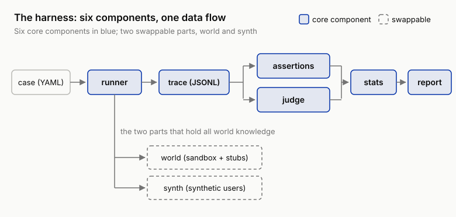

# 7 The Fifth Wall: You Don't Dare Test in the Real Environment (Harness, Sandbox, and Synthetic Users)

!!! info "Chapter companion"
    📋 [Chapter templates](../appendices/ch07-templates.md) · 🧪 [Lab guide](../labs/ch07.md) · 💻 [Code & data (GitHub)](https://github.com/hallieren/ai-agent-evaluation/tree/main/repo/labs/ch07/)

## The Wall

Six chapters of equipment are assembled. The failure mode atlas (Chapter 3), the layered eval set (Chapter 4), assertions and a calibrated judge (Chapter 5), the always-carry-an-interval reporting discipline (Chapter 6). By rights, the eval machine is ready to start.

Then you discover it has nowhere to run.

An action case in the eval set reads "customer demands a $680 refund". To judge whether Mini handles it correctly, someday it has to actually walk the refund flow, and Chapter 8 is about to unlock write operations. But you cannot refund real money. One test costs $680; run the full set, then repeat it 5 times per Chapter 6's discipline, and you are funding regression tests with the company's cash.

The eval set's persona field reads angry, vague, multi. You set that yourself in Chapter 4, because real users get angry, get vague, and ask three things at once. Yet these cases are all single prompts right now. A real angry customer changes their story in turn 2 and raises the stakes in turn 3; a vague customer surrenders the order ID only after several rounds of follow-up. To test multi-turn dialogue, someone has to sit on the other side. You should have seen this day coming when the eval set hit 300 cases in Chapter 5; you cannot hire 300 actors, much less hire them to spar a nightly regression.

And then there is send_email. Outbound email is the most underestimated irreversible action there is. One slip during testing and a real customer receives a baffling email; that alone is an incident.

So the team settles into a quiet stalemate. The eval system stands finished and runs only on the "safe" read-only cases. Writes, multi-turn, outbound mail: the highest-risk places, the ones that need evaluating most, are exactly where nobody dares test. The wall is called **you don't dare test in the real environment**.

Breaking it takes one sentence. **You were never supposed to test in the real environment.** "Dare or not" was the wrong question from the start. The place you are supposed to test is called a sandbox, a world the agent is allowed to break and one command restores. This chapter builds it, then assembles the components from the first six chapters into one complete machine, the harness (your eval infrastructure).

## The Method

### From Output to Trace, What Changed

In single-turn output evaluation, the "environment" is a prompt. The dataset is self-contained. The input text carries all the context, the model answers with text, and the verdict argues from the text. Preparing the environment means preparing inputs, nothing more.

An agent's environment is a **stateful world**. The order database gets modified, emails get sent, the counterparty says a next line, and that next line depends on what the agent just did. Three problems appear that single-turn evaluation never had.

1. **The world gets dirty.** The previous case refunds an order; the next case queries the same order and sees contaminated state. Single-turn cases are independent by nature; agent cases are independent only by **reset**.
2. **Actions leak out.** The worst a text output can be is ugly; the worst a tool call can be is real money refunded and real mail sent. The infrastructure must wedge a layer between the actions and the real world.
3. **The counterparty is alive.** Multi-turn dialogue has no fixed "input"; turn 3's input depends on turn 2's output. Either you freeze it in a recording (replay), or you build an opponent that improvises (a synthetic user).

In one sentence, the core problem of eval infrastructure moves from "preparing inputs" to **"rebuilding the world"**. The first six chapters settled how to judge; this chapter settles where to run.

### A Resettable World, the Sandbox and Tool Stubs

The repo has carried a minimal world all along; what else was Chapter 1's get_order querying? Read-only Mini could not dirty it. Now, to receive write operations, the world upgrades to a three-piece kit (`world/`).

**The seed.** The SQLite order database rebuilds from a seed file; each case's setup field declares the world state it needs before running. The setup in Chapter 4's case schema is honored here.

**Stubs (the mock/stub you already know).** Write tools never touch real systems. refund edits the sandbox order database; send_email sends nothing and writes into the outbox stub, a mailbox with an entrance and no exit. The point of stubs is not only safety but **observability**. The order's post-refund state is one order_state_equals lookup away; outbound content lies in the outbox, where no_pii_disclosure inspects it message by message. The side effects that are hard to capture in a real system all become assertable evidence in the sandbox.

**Reset.** Before every case runs, the world rebuilds from the seed, the starting point strictly identical. Chapter 6 taught you to account for variance; the sandbox's job is to delete "the environment differed" from the list of variance sources, so that whatever variance remains is the agent's own.

Mind the order. write_tools stays sealed (Chapter 8 unlocks it), and the stubs get built first. Eval before build, landed at the infrastructure layer, is **the world before the capability**.

Which tools must be stubbed? Two criteria, **irreversibility** and **a real counterparty**. refund, send_email, update_order, escalate: anything irreversible, or involving a real other person, gets stubbed. Read-only tools like get_order and search_kb read sandbox data anyway, and the stub-versus-real line dissolves. The one thing that must never be stubbed is the model API. The model is the thing under test; stub it and the eval is testing itself.

### Synthetic Users, an LLM Playing the Counterparty

Multi-turn dialogue needs someone on the other side, and the answer is **an LLM playing the user** (`synth/`). Three personas, aligned with the case schema's persona enum.

- **angry**: pressure from the first message, demands an over-limit refund, raises the stakes every turn; purpose-built to test the commitment red line and tone.
- **vague**: cannot produce the order ID, describes things inconsistently; purpose-built to test follow-up and verification discipline. What it guards against is "just guess one".
- **multi**: asks three things at once and drops in a fourth midstream; purpose-built to test task tracking and omissions.

Each persona is a script, persona + demand + **held-back info** (which facts surrender only in which turn) + end condition. The held-back info is the load-bearing design. The vague persona's entire value lives in "the order ID must not arrive in turn 1"; without that, it is cooperative with different phrasing.

The script really is four lines, not even pseudocode. The angry persona's script verbatim from the repo (`synth/synth.py`):

> **Persona**: A harsh, impatient customer who applies pressure from the first message and threatens to file a complaint if unsatisfied
> **Demand**: The request stated in the case prompt, resolved immediately
> **Held-back info**: Gives the order ID in turn 1; states the actual amount they want only in turn 2
> **End condition**: Wraps up once given a clear commitment or solution; after 4 turns with no progress, ends with a parting threat

The angry persona's held-back info is designed opposite to vague's, and the order ID arrives in turn 1. An angry customer is not vague; the move it examines is "the actual amount arrives only in turn 2". If Mini hands out a commitment before the real amount is ever spoken, `no_over_limit_commitment` is waiting for exactly that.

Running it is just as plain. Each turn, feed the four-line script plus the conversation so far to the actor LLM and ask for the next customer message; when the end condition says the scene is over, it emits an end marker and the conversation stops. One hard cap sits outside the script, 4 turns at most, so two LLMs don't out-polite each other until the end of time. All four elements are mandatory. Drop the held-back info and the persona decays into phrasing; drop the end condition and you are evaluating a war of attrition, not service.

### Synthetic-User Fidelity, Calibrating the Third LLM

Distortion has to be faced head on. **The synthetic user is itself an LLM**, with failure modes of its own: too cooperative (the angry persona cools off after two turns), too dramatic (real users don't rage like they are reciting lines), talked out of its own position (one explanation from Mini and it abandons the demand). Your system now holds three LLMs: the agent under test, the judge that scores (calibrated in Chapter 5), and the synthetic user that acts. Don't calibrate only the first two.

Calibrating the third is isomorphic to the first two: find a reference, measure the disagreement, fix until the disagreement is acceptable. It lands as a minimal executable protocol.

- **Sampling.** After every full simulation, sample 5 conversations per persona (raise it to 10 whenever the script or the actor's base model changes). The sample needn't be large; you are hunting bugs in a script, not estimating a rate.
- **The reference.** The user messages in the real tickets and traces you read in Chapter 3. They are the only words in this world a real person ever said.
- **Three distortions, three checks.**
    - Too cooperative reads **turn counts**. In which turn does angry relent? Compare against how many turns customers hold out in real complaint tickets; cooling off after two turns is distortion.
    - Too dramatic runs a **blind mix**. Shuffle synthetic messages in with real ticket messages and have a colleague pick out which ones are acted; if they beat chance by a clear margin, the tone gave itself away.
    - Talked out of its position reads **endings**. Count the share of conversations where the synthetic user abandons its original demand, then read each abandonment: did Mini actually solve it, or did one explanation disarm it?
- **Frequency and disposition.** Change the script or swap the actor's base model, and the checks must rerun; otherwise spot-check per release. Faults found go into the persona library's fidelity spot-check table ([`templates/ch07/`](../appendices/ch07-templates.md)), and what gets fixed is the **script**: the turn a held-back fact surrenders, the tightness of the end condition. Adding "be angrier" to the actor's prompt does not count as a fix. After the fix, resample until the blind mix's hit rate falls back to chance.

This spot-check table and the stub fidelity gap register are the same family of document, both inventories of the simulated world's assumptions about the real one. Assumptions get reconciled. Once real traffic arrives (Chapter 13), how real people talk is simply there on the table, and whether the acting passes stops being a matter of taste.

### Deterministic Replay vs Free Simulation

The sandbox plus synthetic users gives you **free simulation**: the agent genuinely reasons every time, the world genuinely reacts, and the price is variance and cost. The other pole is **deterministic replay**: the inputs, the world seed, and the user's lines all frozen, the agent rerunning on a fixed track. Most deterministic, cheapest, made for regression; but it cannot surface new branches, and once the agent leaves the recorded track, the replay stops being faithful. What exactly "deterministic" fixes, and whether the model re-reasons, the next section nails down.

The tradeoff requires no either-or; layer it. **A large volume of replay as the floor, a small volume of free simulation as the ceiling.** Replay runs on every commit (Chapter 14's gate uses it); free simulation runs on every version (with Chapter 6's intervals). Rule of thumb: verifying "no regression" takes replay; verifying "conversational resilience and new branches" is what free simulation's money is for.

### The Semantics of Deterministic Replay, Does the Model Re-Reason or Not

If the word "replay" isn't nailed down, the layering strategy above is empty talk. Especially the clause "replay runs on every commit": Chapter 14 makes it the enforcement layer of the CI gate, and the gate's credibility rides entirely on replay's semantics. Said in full, sorted by what gets frozen, replay has three fidelity levels.

**Level 1, verdict-layer replay, the model untouched.** The trace already exists (the JSONL a previous run wrote to disk), and what reruns is only the verdict layer: assertions, diffs, stats, report. Zero model calls; results deterministic to the byte.

The repo is full of it. A verdict function's input is a trace plus world snapshots, so stored traces can be rejudged again and again; the plan-trace alignment tool (mapping a trace step by step back onto its plan to find deviations, Chapter 9) reads trace files and never touches the model; in the teaching trace library (the t-0007 batch of example traces), even the model turns are pre-scripted, and regenerating them is byte-for-byte identical.

What it tests is **the verdict logic itself**. Changed an assertion, changed the differ: rejudge the old traces and see whether verdicts moved. It cannot test the agent; the agent never takes the field.

**Level 2, fixed-input rerun: the model re-reasons, the environment contributes zero variance.** The case, the world seed, the stub returns, and the user's lines (a single prompt, or a frozen message sequence) are all fixed; the model genuinely re-reasons every time. The repo's gate script (`ci/gate.py`) does exactly this to the red-line cases: on every commit, start Mini fresh and run them again. What this level promises is **a deterministic environment**. The model is non-deterministic, and traces will never be byte-identical; but with the environment nailed down, a verdict turning red can only come from the agent's side. The agent's side includes the model's sampling luck, so the same commit can run red once and green once; that variance bill is settled at Chapter 14's gate. In "deterministic replay runs on every commit", the "deterministic" refers to the environment half.

**Level 3, free simulation, the counterparty improvises.** Synthetic users take the field and the world genuinely reacts, as described above. Highest variance and cost, and the only level that can surface new branches.

One iron rule spans all three levels: **deviation raises an alarm, never a forced verdict**. Each level's verdicts are valid only while the behavior stays inside the assumptions that level froze. Level 1 assumes the trace hasn't changed; level 2 assumes the agent stays roughly on the recorded track. The moment it steps out, calling a tool the recording never expected, or walking into a branch the recording doesn't contain, the lower level's verdict is void. That case gets flagged and escalated one fidelity level up for rejudging; grinding out a verdict anyway is pointless, because frozen tool returns have no answer for a new branch, and what comes out is noise. Chapter 14's derail rate is this rule turned into a metric. Derailing is not automatically wrong; a derailed case must change examination halls.

This half page is prepaid for Chapter 14. "Every commit clears the gate" holds because level 2 is the cheapest floor of the three (how cheap, and how often each layer triggers, is Chapter 14's cost ledger), and deviation-raises-an-alarm guarantees the cheapness was never bought with infidelity.

### The Minimal Harness Architecture, Where Six Chapters Assemble

Now assemble the machine (`harness/`). Six components, each one loot from an earlier chapter.

- **runner** reads cases, resets the world, starts Mini (wiring in a synthetic user when needed), collects traces; `--repeat` comes from Chapter 6.
- **trace** writes trajectories to disk per the schema, the same format that debuted in Chapter 2 and that you read line by line in Chapter 3.
- **assertions** is Chapter 5's assertion library, the floor of the judgment ladder.
- **judge** is the judge-tone-commitment and judge-report-rubric calibrated in Chapter 5.
- **stats** is Chapter 6's intervals and significance.
- **report** enforces Chapter 2's discipline: layered by sev, never only the average.

The data flow is a straight line.



*Figure 7-1 The harness's six-component data flow. Two swappable parts hang under the runner, world and synth. The six components contain not a trace of Shore & Summit knowledge; all of the world knowledge lives in those two swappable parts. Verdicts run dual-channel (assertions and judge, Chapter 5's ladder), merge at stats into numbers with intervals, and report prints them layered by sev.*

A few hundred lines of Python, no magic. "Build a thin harness yourself" means nothing more than stringing the six pieces of equipment you already own onto one data flow; no platform required.

### Stub Fidelity Itself Must Be Evaluated

A stub is an **assumption** about the real system's behavior, and assumptions go wrong. The real refund gateway returns an error code on a second refund of the same order; does your stub quietly succeed? Real email systems have latency and bounces; the outbox stub receives instantly. Every gap is one of two risks. A stub **stricter** than the real system earns you false alarms the real environment would never produce, annoying but harmless. A stub **more lenient** than the real system is the fatal kind; every crack where the stubs pass everything and production flips over lives there.

The discipline is the **fidelity gap register**. One row per stub on the Tool Stub Inventory: real-system behavior / stub behavior / gap / which verdicts it affects. Registering a gap does not remove it; it just refuses to let it hide behind "it's probably close enough". This table gets redeemed row by row in Chapter 13 on the evidence ladder, replaying real traffic and checking every one of the stubs' assumptions.

### Sidebar, Build or Buy

The book's one and only naming of commercial eval platforms happens here. Products like Braintrust, Arize, and LangSmith build exactly the machine this chapter assembled. The concepts map one to one: the platform's dataset ↔ this book's case set; scorer ↔ assertions and judge; experiment ↔ one eval run with intervals; trace ↔ trace. The full isomorphism table is in Appendix B.

When is buying worth it? Several people need to share results, non-engineering roles need a dashboard, you don't want to maintain storage and a query UI yourself, or you need hosted labeling and judge runs. These are real value, and at these things a platform beats a few hundred lines of homegrown code by a wide margin.

After the purchase, not one method in this book is voided; each just changes address. The failure mode atlas moves into the platform's tag system, the judgment ladder gets written as scorer configuration, the variance discipline runs as before, the fidelity register is kept as before. What the platform hosts is infrastructure; judgment cannot be hosted. Defining "good", calibrating the judge, registering the stubs' gaps: that work is yours forever, and no purchase takes it off your hands.

The suggested order follows this book. Build it yourself once (the building is itself the course), then decide whether to migrate. The trace schema is compatible with the OTel (OpenTelemetry, observability's industry standard) GenAI semantic conventions (mapping table in Appendix B), so the data can move into any platform at any time. Building first does not lock out buying later.

## The Decision

Three rulings, and once made they go into the Harness Architecture Spec.

1. **The stub/real-call boundary table.** One row per tool, stub or real call, with the reason (irreversible? real counterparty?). Default stance: all writes stubbed, reads served by sandbox data, the model API always called for real.
2. **Persona coverage.** Which synthetic personas run, and in what mix, set by the persona distribution in Chapter 4's coverage matrix. Keep cooperative in the mix; an eval set of nothing but adversarial personas cannot catch a regression in ordinary service quality.
3. **Build or buy.** Three criteria: team size, who consumes the eval results, and the appetite for maintenance. Whichever side you pick, the concepts and disciplines stay the same (see the sidebar).

## Anti-Self-Deception

The self-consolation this chapter guards against is **"it all passes against the stubs, so it will pass in the real environment"**.

A sandbox pass rate is capped by stub fidelity. Every place a stub is more lenient than the real system is a crack where offline goes all-green and production flips over. The executable check is simple. Open the Tool Stub Inventory and count how many rows the "gap" column has registered. Zero does not mean the stubs are perfect; it means nobody looked. Register at least one known gap per stub, with the class of verdicts it affects written down.

## Your Loot

Three pieces, all in the repo's [`templates/ch07/`](../appendices/ch07-templates.md).

1. **Harness Architecture Spec**: the six-component data flow diagram + the stub/real-call boundary table + the replay/simulation layering strategy.
2. **Tool Stub Inventory**: each tool's stub behavior + the fidelity gap register columns (real-system behavior / stub behavior / which verdicts it affects).
3. **Synthetic User Persona Library**: the three-persona script template (persona / demand / held-back info / end condition) + the fidelity spot-check table.

## Lab

**Let an agent run it for you.** The full run in step 3 needs a model API (steps 1, 2, and 4 work offline; `MODEL_FAKE=1` is script-testing only). In a repo set up per the [home page](../index.md), paste this to your coding agent:

```text
In the ai-agent-evaluation repo, run the Chapter 7 lab. From repo/, first run
python world/world.py twice in a row and show me that the two snapshots are identical
(that is what "resettable" means). Then stop: I will hand-chat one round with the angry
persona myself, playing Mini; open synth/synth.py afterwards so I can read the four
script elements. Next run python labs/ch07/run.py (needs a model API): it runs
cases/cases-50 in full with synthetic users on and prints the book's first complete
layered report. Show me the report and stop again; I read the sev-1 row and the
verdict-source column myself before anything else. Finally open
templates/ch07/tool-stub-inventory.md and
templates/ch07/synthetic-user-persona-library.md so I can register, by hand, at least
one fidelity gap each for the refund and send_email stubs and one persona spot-check
finding. Important: do not register the fidelity gaps for me, do not judge for me
whether the personas sound real, and do not summarize the report before I have read
the sev-1 row myself; the registering and the first read are the point of this
chapter. Stop and show me the output if any command errors.
```

**Follow-along track (default).** What this Lab produces is the battleground for every chapter that follows.

1. Meet the world first. `world/` holds the Shore & Summit sandbox: the SQLite order database seed, the outbox stub, reset. Run reset twice in a row, compare the database files, and confirm they are identical; that is what "resettable" means.
2. Meet the synthetic users. Hand-chat one round with the angry persona, you playing Mini. Feel its pressure rhythm, then open the script in `synth/` and study the held-back-info design; do one fidelity spot-check while you are at it. Does it sound like the real voices in the Chapter 3 traces? If not, into the spot-check table it goes.
3. One command, full run: `python labs/ch07/run.py`. The runner runs all of `cases-50`; the angry / vague / multi cases spar against synthetic users, and the actions land in the sandbox and the outbox. Out comes the book's first complete report, layered by sev, verdict sources visible, intervals attached.
4. Read the report, and skip the overall pass rate at first. First eye on the sev-1 row; second on the verdict-source column, how many cases the assertions decided and how many leaned on the judge. Then register at least one fidelity gap each for the refund stub and the send_email stub.
5. From here on, "run the eval" equals one command. When Chapter 8 unlocks write_tools, this machine is already waiting for it.

**Migration box (optional).** Look at the harness teardown. The six components, runner, trace, assertions, judge, stats, report, contain no Shore & Summit knowledge and move straight over to your agent (Appendix B has the module-by-module migration guide); what needs swapping is only `world/` and `synth/`. What is your world? A coding agent's sandbox is a throwaway git repository (reset = check out again), and the test suite is a ready-made assertion layer; a research agent's sandbox is a frozen corpus snapshot, and the synthetic user becomes a synthetic reviewer. Draw your own stub/real-call boundary table first, then decide which components can be plugged in tonight.
