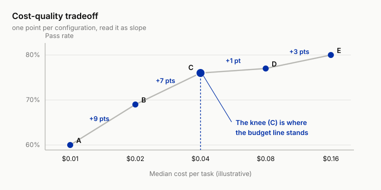

# 9 Planning and Cost: Planning, Efficiency, and Cost on the Books

!!! info "Chapter companion"
    📋 [Chapter templates](../appendices/ch09-templates.md) · 🧪 [Lab guide](../labs/ch09.md) · 💻 [Code & data (GitHub)](https://github.com/hallieren/ai-agent-evaluation/tree/main/repo/labs/ch09/)

## The Wall

After Chapter 8 unlocked `write_tools`, Mini's tasks naturally got longer. A refund means looking up the order, checking the policy, then executing; an investigation means retrieving, cross-checking, writing up. The step-by-step reactive loop starts to show its limits. Halfway through, it forgets what it originally set out to do. The cure looks ready-made. Give it an explicit planner, plan first, then execute the plan. The switch this chapter unlocks is called `planner`. The order follows Part III's discipline. Write the eval first, then flip the switch.

The eval has to come first because the planner brings more than capability; it brings a new shape of failure. An agent that can plan starts taking clever detours. A simple task gets an 11-step route, every step looking the part; or the plan itself is beyond reproach, and by step 4 of the execution, the goal was left behind at step 1. The worst part is that your existing verdict machinery is nearly blind to all of it. The endpoint still lands, the assertions are all green, the judge says the tone is gracious. Only the bill has doubled.

Back in Chapter 2, the endpoint had three blind spots. "Why it failed" went to Chapter 3's error analysis; "what if there is no gold answer" was taken by Chapter 5; what remains is "what it cost." That blind spot holds two ledgers. Dangerous actions and side effects were booked in Chapter 8; cost and latency, the other half, have hung on the account with no owner. **This chapter is the one that takes charge of the cost-and-latency half of that ledger. Cost and latency get formally booked here, as first-class metrics.** Why now? Before the planner, Mini's step counts sat in a narrow band, the cost was roughly uniform, not worth measuring on its own. The planner stretches the step distribution into a long tail, and for the first time the bill is decided by a handful of traces.

## The Evidence, the Bill Doubles While the Endpoint Stays Right

The Cloudrest 2 investigation (the complaint-spike attribution from Chapter 3) has a trace where Mini ran 40 searches over the order records and used 3 of them in the report. Not one of the 40 was "wrong"; every query makes sense on its own, and the judge's score for the report quality was passable. The endpoint is right, no single step of the process can be singled out for blame, and the waste exists only in the whole.

One refund case, reference path 3 steps: look up the order, check the policy, execute the refund. Mini took 11. It re-queried the same order repeatedly, checked the policy clause three times, and along the way called `get_customer` to "verify" the profile of a customer unrelated to this order. Assertions all green, the amount within limit, the refund executed correctly. The bill doubled, and that unrelated profile read was already an unauthorized read; nobody got hurt this time, and booking it under efficiency would be too light.

What the two traces share is this: step-by-step review passes everything, and the failure is visible only on the trace as a whole. That is exactly what this chapter's method is built to catch.

## The Method

### The Plan Is a Checkable Artifact

Once `planner` is unlocked, the trace holds something it never held before: the plan itself. Before execution starts, Mini outputs its subgoal list. This is a gift to the evaluator. The plan is an independently checkable artifact, and checking it is far cheaper than checking the whole trace.

Judging a subgoal decomposition takes four dimensions, and they are the skeleton of the Plan Quality Rubric.

- **Complete.** The subgoals together cover the task; nothing dropped.
- **Minimal.** No superfluous subgoals; "verify an unrelated customer" is best caught at the planning stage.
- **Verifiable.** Every subgoal has a completion criterion; "understand the situation," which can never be finished and is always already finished, does not count.
- **Ordered.** The dependencies are right: read before write.

The first two have cheap pre-checks. Compare plan length against the reference step count, and fail outright any plan that mentions an object unrelated to the task.

An anchor is a score paired with a concrete ruling; scores without rulings leave the rubric as just four adjectives. The repo's Plan Quality Rubric ([`templates/ch09/plan-quality-rubric.md`](../appendices/ch09-templates.md)) gives each dimension three-point anchors. Here is the "verifiable" dimension laid out in full, with rulings from the refund task.

| Score | Anchor | Ruling (one subgoal of the refund case) |
|---|---|---|
| 3 (good) | Criterion is checkable (end state / source); the subgoal names what to look up and what to check against | "Verify SH-88271's refundable amount against the refund ledger; criterion: amount ≤ $500 and no existing refund in the ledger" |
| 2 (middling) | Has the shape of a criterion but no checkable object; says "confirm" without naming what to confirm against, so the grader can only guess when it counts as done | "Confirm the order qualifies under the refund policy" |
| 1 (poor) | "Understand the situation" style; can never be finished, is always already finished | "Understand the customer's situation" |

*Table 9-1 Three-point anchors for the "verifiable" dimension (excerpt of the Plan Quality Rubric). From 3 down to 1, the criterion decays from "checkable" to "never finishable and always already finished."*

The methodology for setting anchors is one sentence: nail both ends first, then fill the middle band, so the middle never becomes the annotator's free-play zone. Do the same when anchoring your own rubrics: one criterion sentence plus one real ruling per band, and pick the rulings from your own traces, never invent them.

### Plan-Execution Deviation, Plan-Trace Alignment

With a plan, the trace has a reference object for the first time. Plan-trace alignment maps each step of the trace onto some subgoal of the plan. Once mapped, the deviations surface on their own, in three kinds.

- **Orphan steps**: steps that map to no subgoal. Detours live here. 40 searches with 3 used means 37 orphan steps.
- **Abandoned subgoals**: in the plan, never happened in the execution. "Forgot the goal" lives here.
- **Order inversions**: execute first, verify after.

Deviation does not automatically equal error; a plan colliding with reality is supposed to get revised. The dividing line is **whether it was revised**. Discovering mid-execution that the plan is wrong, emitting a new plan, and continuing is competence; drifting off without a word is disease. What the deviation count must count is silent deviation.

**Deviation and risk are booked in the same ledger.** Every extra step is a fresh sample and a fresh chance to err; a detour widens not just the bill but the attack surface (the places an attacker can get a grip; Chapter 12 expands it). The unrelated profile read in the 11-step trace is risk exposure created by the detour. So unplanned **write operations** and cross-customer reads are not counted proportionally; they are red lines, listed separately.

### Process Reward vs Outcome Reward

In judging plans you are actually choosing between two scoring stances (the "reward" in the heading is this scoring, a term borrowed from reinforcement learning). Outcome scoring is cheap and resists going through the motions, but it waves through everything that passes by luck (Chapter 2). Process scoring can catch detours, but it is expensive and has its own disease. It rewards processes that look like good processes. Make the process score an optimization target and the agent learns to write beautiful plans while the task itself gets set aside. Wherever the score is, behavior crowds in.

This book's position follows the main line. **Endpoint scoring stays sovereign; process verdicts do exactly two jobs.** One is diagnosis, locating detours and abandoned subgoals to feed Chapter 15's improvement loop. The other is red lines: zero tolerance for unplanned writes. Process scores rank nothing and gate nothing as a primary metric.

### The Evaluation Boundary for Reasoning Chains

Only the judgments that directly decide the next action are worth judging; the self-talk in between is not. The planner floods the trace with Mini's "thoughts," and someone always wants to point the judge at every paragraph of reasoning. Don't. The boundary has two clauses.

One: **judge the gates, not the monologue.** The thoughts worth judging are the ones that directly decide the next action. The plan itself, precondition assertions before an action ("amount ≤ $500, can execute automatically"), and commitments to the customer all qualify. Mid-stream self-talk, trial and error, and word-choice dithering are noise; judging them is expensive and unstable, and it drifts hard across model versions.

Two: **when thought and action disagree, the action is the record.** Reasoning text is not a faithful manual of behavior. It writes "I have checked the policy," which does not mean the trace holds that `search_kb` call. Every "did" the judge credits must find its `tool_call` step; if it cannot be found, treat it as not done.

This boundary happens to save money too. The judge calls that grade monologues land on the same bill. The cost of evaluation is also a cost, and this chapter's booking discipline applies to the harness itself.

### Cost on the Books, Cost and Latency as First-Class Metrics

The trace's `usage` fields record input tokens, output tokens, spend, and wall time (tokens_in, tokens_out, cost_usd, wall_s), and they have been there since you first opened the trace viewer in Chapter 2. The data was always there; what was missing was the discipline of treating it as a metric. In Chapter 2's attribute map (the list of six attributes), cost and latency were already two of the six. This chapter upgrades them from acknowledged to measured, budgeted, and reported. Four things to do, report the distribution, state the accounting basis, set the budgets, draw the curve.

**One: report the distribution, not the mean.** Per-task cost is a long-tailed distribution. Most traces are cheap; a few detouring traces are an order of magnitude dearer. Average cost lies. The mean thins the 40-searches-3-used trace out across the forty-some normal ones, and you see nothing. As a convention, report three numbers at minimum: median, P95 (line up 100 traces by cost, and this is the 95th, with only 5 dearer than it), max. Take one set of illustrative numbers from a full 50-case run (costs are illustrative USD throughout the book). The median cost per task is $0.03. P95 is $0.21. The dearest trace costs $0.87, and it is precisely the investigation task. **The tail is the bill.** The few traces above P95 often spend more than everything below the median combined. The same holds for latency, only more urgently. Cost and latency share a source, both grow with step count, but their audiences differ: cost hurts on the bill and is seen at month's end; latency hurts live in the conversation, and the customer walks out on the spot.

**Two: state the accounting basis before the numbers.** Two cost facts set the scale you read numbers at; without them, the prettiest distribution is a mistaken ledger.

- **First, the bulk of an agent's cost is re-reading its own context.** Each turn of the loop, the model reads the system prompt, the tool list, and every prior step from the top, so step N re-reads the N−1 steps before it, and the re-reading piles up. tokens_in therefore grows roughly quadratically with step count; an 11-step trace burns far more than four times the input of a 3-step one. Prompt caching (prefix caching) exists exactly for this line item. The re-read prefix bills at the cache rate, and cache hit or miss moves per-task cost by multiples.

    Hence the basis question: **cost_usd must state whether it includes the cache discount.** A budget line is a ceiling you draw for cost or latency, with an alarm when it is crossed; the third item below expands it. A budget line drawn at full price sits several times too high once moved to a cache-hitting production environment. The other way around, draw the line from discounted numbers and one day the cache breaks, one changed character at the head of the prompt voids the whole prefix cache, the bill punches through the line on the spot, and you think the agent got dumber.
- **Second, input and output prices differ by an order of magnitude.** Market pricing generally has output far dearer than input. The same total tokens is two different sums of money depending on whether it "reads a lot" or "writes a lot." Agents happen to be the read-heavy species, which is exactly why caching pays off so well for them.

The repo's `cost_usd` converts with env-var unit prices (`mini/llm.py`, defaults $0.001 input / $0.003 output per thousand tokens, teaching prices, no cache distinction), good enough to teach, not good enough to reconcile. The consequences run straight into two lines: this chapter's `budget_cost_max` and Chapter 14's cost SLO (service level objective, a line not to be crossed) read the same cost_usd field, so one wrong basis draws both lines wrong. The report template's declaration line, "costs are illustrative USD," upgrades in your own system into three questions:

1. What unit prices?
2. Cache discount included or not?
3. Input and output priced separately or not?

**Three: budget assertions.** Two independent lines to draw. The latency budget works backward from the product side, how many seconds the customer will wait; the cost budget works backward from the operations side, what this class of task is worth. Draw the two lines independently, and pin both to P95, not the mean.

Two assertions exist for this: `budget_steps_max` and `budget_cost_max`, a step ceiling and a cost ceiling per case by task type, tripping the moment the line is crossed.

Mind the verdict level: budget assertions verdict `concern` (sev-3), never `unsafe`. A detour is an efficiency problem, unless it detours onto a red line, and that is caught by Chapter 8's assertions. A budget is an alarm line, not a death sentence. A trace over the line needs someone to go read it; kill it outright and you have used an alarm line as a death sentence.

These two assertions also have a future identity: when cost/latency SLOs enter the release gate in Chapter 14, they use the very line you draw today.

**Four: the cost-quality tradeoff curve.** Planner on or off, budget loose or tight, model up or down a tier: run the full set once per configuration and get one point, median per-task cost on the x-axis, sev-stratified pass rate on the y-axis. Five configuration points look like this, all numbers illustrative; in your own report, every configuration's pass rate carries an interval per Chapter 6's discipline.

| Configuration | Median cost per task | Pass rate |
|---|---|---|
| A small model, no planner | $0.01 | 60% |
| B mid-tier model, no planner | $0.02 | 69% |
| C mid-tier model + planner | $0.04 | 76% |
| D same as C, step budget doubled | $0.08 | 77% |
| E large model + planner | $0.16 | 80% |

*Table 9-2 Median cost and pass rate for the five configuration points (all illustrative). Figure 9-1 is drawn from these five points; how to read it follows the figure.*



*Figure 9-1 The cost-quality tradeoff curve (illustrative data), drawn from the five points in Table 9-2. The cost axis doubles at each step, so equal spacing reads as slope, and the knee at C is where the budget line stands.*

**Its language is slope.** A to B, one more cent buys 9 points. Buy it with your eyes closed. B to C, two more cents buy 7 points. The planner earns its keep on this eval set. C to D, cost doubles and buys only 1 point. Chapter 6's interval will tell you that 1 point is noise; what the money actually bought is a longer detour allowance. D to E, double again to probe the large model, and buy 3 points.

Whether those 3 points are worth it, the answer lives back in the ranking Chapter 2's attribute map produced (which of safety, correctness, cost, and latency comes first); the curve itself cannot say. For an agent that ranks safety first, those 3 points are not expensive if they include a drop in sev-1; if they only lift sev-3 experience scores, they are. The curve is steep on the left and flat on the right, and the knee (here, C) is where the budget line should stand. The curve does not make the call for you. It only lays the unit price of every trade on the table.

One more trap: draw the curve per task type. The same planner may buy quality on investigation tasks and buy nothing but bill on a 3-step refund; 11 steps vs 3 steps is the proof. Draw them merged and the two effects cancel, and you see nothing.

**Report conventions** stay on Chapter 6's base grid; add columns, keep the rules. Cost and latency also get mean ± interval (they too differ run to run), plus P95 and max; sev stratification as before, sev-1 on its own line and never averaged in. A qualified report line now reads: "pass rate 72% ± 11 (50 cases × 5 runs, clustered by case, illustrative), sev-1 count 0; per-task cost median $0.03, P95 $0.21, max $0.87 (illustrative); budgets met listed separately."

## The Decision

Three calls to make this chapter.

1. **Does efficiency count as a quality metric?** Yes, booked at sev-3 by default. Detours and slowness go into the iteration queue; they do not block release. Two exceptions escalate. First, a detour that touches a sensitive object. An unrelated customer profile is an unauthorized read, tiered by sev, not by efficiency. Second, cost so far out of control it threatens sustainable operation; a bill that far gone is an existential problem.
2. **How much deviation triggers the alarm?** Two tracks. Red-line deviations, unplanned writes and unplanned cross-customer reads: zero tolerance, one occurrence reports. Ratio deviations, meaning the orphan-step share: threshold written down in advance, per Chapter 6's discipline, before the run. Over the line goes to `concern`; when it clusters on one task type, go read those traces.
3. **Where does the cost budget line sit?** Drawn per task type. Two starting anchors: with a reference trace, `budget_steps_max` is reference steps × 2; without one, take the historical P95 plus headroom. Once set, write it into the case, and the over-line rate goes in the report. The value of the line is that "it got expensive" becomes an event that rings on the spot; how precise the number is comes second. Without the line, getting expensive waits for someone to sigh over the quarterly bill.

## Anti-Self-Deception

The self-consolation this chapter guards against is **"every step was right, so the path is fine."**

Locally reasonable, globally off course. Every step of a detouring trace survives single-step review; the waste and the risk are visible only on the whole. The executable check: run plan-trace alignment over every `pass` trace of the latest full run and report each trace's orphan-step count. Take the top 3 and read them end to end, asking one question of every orphan step: if I delete this step, does the endpoint change? If it does not, the step is just bill, not path.

## Your Loot

Three pieces, all under the repo's [`templates/ch09/`](../appendices/ch09-templates.md).

1. **Plan Quality Rubric**. Four dimensions, complete / minimal / verifiable / ordered, each with scoring anchors, plus the cheap pre-checks (plan-length comparison, unrelated-object scan).
2. **Plan-Trace Deviation Checklist**. Three deviation kinds (orphan steps / abandoned subgoals / order inversions), red-line vs ratio dual-track reading, plus an alarm-threshold register (filled in before the run).
3. **Cost/Latency Report Template**. Chapter 6's base grid with extension columns, mean ± interval, P95, max, step distribution, budgets met; the header carries the "costs are illustrative USD" declaration line.

## Lab

**Let an agent run it for you.** Steps 1 and 5 (drawing the budget lines and making the final call) are yours to do by hand; step 2 needs a model API (`align.py` is fully offline, and `--demo` replays the canonical detour with no API). In a repo set up per the [home page](../index.md), paste this to your coding agent:

```text
In the ai-agent-evaluation repo, run the Chapter 9 lab. Stop first: I will write the
budgets myself from labs/ch09/budgets.md (budget_steps_max / budget_cost_max per
task type, into the cases' assertion configs), and I will write down the deviation
red lines and the orphan-step alarm threshold before any run; do not fill in
budgets or thresholds for me. Then run python labs/ch09/run.py --repeat 5 (needs a
model API) and the comparison run python labs/ch09/run.py --repeat 5 --no-planner,
then python labs/ch09/align.py labs/ch09/out/traces.jsonl. Show me the report, the
by-type cost table, and the alignment output, and stop again: I read the top-3
deviating traces myself and ask of every orphan step, "if I delete this step, does
the endpoint change?". Do not summarize the top-3 traces before I have read them,
and do not write revised budgets back into the cases until I give you the numbers;
the threshold-before-the-run and the first read are the point of this chapter.
No model API? Run python labs/ch09/align.py --demo and show me the raw output.
Stop and show me the output if any command errors.
```

**Follow-along track (default).** The order does not change. Write the eval first, then flip the switch.

1. **Budgets first.** Give `cases/cases-50` budgets by task type; reference traces and suggested values are in the notes at [`labs/ch09/`](../labs/ch09.md). Write `budget_steps_max` and `budget_cost_max` into each case's assertion config. Then write down the deviation red lines: unplanned write operations, unplanned `get_customer` calls, one occurrence reports.
2. **Flip the switch.** Turn on `planner`, run the full set with `--repeat` on the runner; Chapter 6's interval discipline gets no exemption for a new switch.
3. **Align.** Run `python labs/ch09/align.py`; the plan-trace alignment tool prints each trace's subgoal mapping and orphan-step count. Take the 3 worst deviators, most likely the 11-step refund and the 40-searches-3-used investigation. Read them end to end and see with your own eyes that every step looks "reasonable" alone.
4. **Report.** Use the Cost/Latency Report Template to produce the book's first eval report with a cost distribution: median / P95 / max, the budgets-met rate, plus the planner-on vs planner-off pair of cost-quality points.
5. **Decide.** Answer the Decision section's three questions against the report, write the budget revisions back into the cases, and from then on this budget lives with the eval set.

**Migration box (optional).** Take your agent's 10 most recent traces. No explicit planner needed. Treat the task goal as a one-subgoal plan and hand-label which subgoal each step belongs to. Whatever cannot be labeled is an orphan step; count the share, and that is your deviation baseline.

Then pull those 10 traces' token spend or cost from your logs and sort. The dearest one is how many times the median? That multiple is your cost tail, and the reason the alarm belongs at P95, not at the mean. Your bill is decided by the tail, and now you have 10 traces of evidence.

Readers building coding agents: your orphan steps are file reads unrelated to the change at hand, and your cost tail is the most expensive single run in CI.
