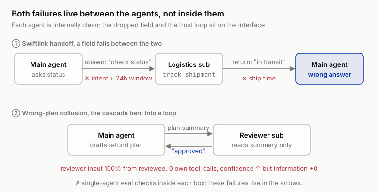
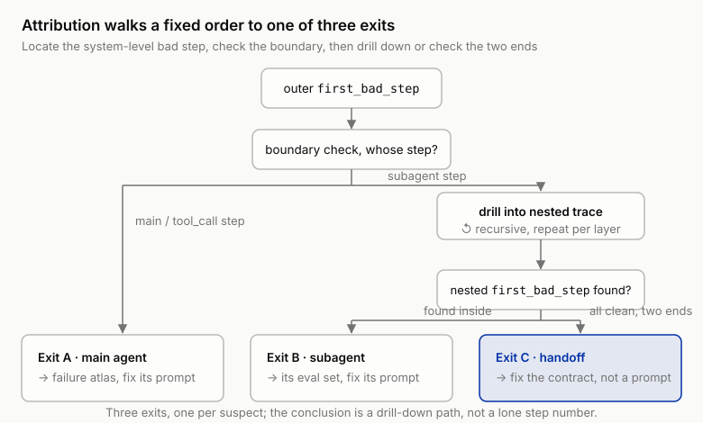

# 11 ★ Subagents: The Multi-Agent Attribution Puzzle

!!! info "Chapter companion"
    📋 [Chapter templates](../appendices/ch11-templates.md) · 🧪 [Lab guide](../labs/ch11.md) · 💻 [Code & data (GitHub)](https://github.com/hallieren/ai-agent-evaluation/tree/main/repo/labs/ch11/)

## The Wall

This is the fourth unlock. In the first three, Mini got write operations, a planner, and cross-session memory. This time it gets **its own kind**. With `subagents` unlocked, Mini can use `spawn_subagent` to spin off a subagent, hand over a subtask along with a task description, and wait for a conclusion to come back. The repo's first subagent is the Swiftlink logistics subagent, with its own exclusive tool `track_shipment`, wired into Swiftlink's tracking system.

Why does it come to this now? Because the pressure is real. Shore & Summit ships through Swiftlink, and Swiftlink has its own way of doing things, its own tracking-number scheme, status codes, and delivery-window rules. Stuff all that integration knowledge into Mini's prompt and it lugs a logistics manual into every refund question, while the retry logic for failed lookups keeps piling up. The standard engineering answer surfaces on its own, split it out. Give a dedicated subagent `track_shipment` and all the Swiftlink knowledge; the main agent just asks and uses. Clean responsibilities, a lighter context, and everyone who sees the architecture diagram nods.

Then you ran the full eval. **The end-to-end pass rate went down.**

The way you investigated was natural too, everyone checked their own side. The logistics subagent's maintainer sampled its call records; every `track_shipment` queried the right thing, the return format was tidy, not one hallucination. The main agent's side ran its own review; policy citations correct, tone appropriate, not one commitment red line touched. At the postmortem, both sides put their evidence on the table and reached the same sentence, **it wasn't me**.

The trouble is that they may both be right. In the single-agent era, the "system" was that agent; the system's verdict and the single agent's verdict were the same thing, and you never needed to tell them apart. The moment a second agent appears, those two things split, and your eval apparatus is still living in the world where system = agent. The failure really exists, yet no single agent will claim it; the attribution tools have gone dull too. `first_bad_step` (the first step where things went wrong) used to point at a step, and now a "step" can be another agent's entire lifetime.

This wall is called **the multi-agent attribution puzzle**, something went wrong, whose fault is it? This chapter's Lab keeps the fixed order of the last few chapters, first write the handoff contract and the system-level cases, then flip the switch. This time you will be especially glad for that order.

## The Evidence, Two System-Level Failures, Zero Single Agents Owning Up

**The Swiftlink handoff.** A customer asks, the order has already shipped, can the delivery address still be changed? The policy ledger (Shore & Summit's table of policy rules) is clear, within 24 hours of shipment contact Swiftlink to intercept, after that no changes. Mini spawns the logistics subagent with a one-sentence task description: "Check the shipment status of this order." The subagent dutifully calls `track_shipment` and returns: "In transit, expected to arrive the day after tomorrow." No mention of the ship time, because nobody asked it. The main agent holds "in transit" up against the policy and tells the customer the order has shipped, no changes possible. In fact it shipped less than 24 hours ago and the intercept window is open. Sev-2, wrong policy answer. Audit them one at a time and the subagent answered what it was asked, answered it all correctly; the main agent, given the information it received, applied the policy soundly. What got lost lives between them, **the address-change intent and the 24-hour window were never handed over; the ship time was never handed back.**

**Wrong-plan collusion.** To put one more layer of insurance on refunds, the team added a reviewer subagent; the main agent drafts a refund plan, submits it for review, and executes only on approval. On one case, the customer wants to return a custom-made item, and custom-made items are the policy's explicit exclusion. The main agent never checked the item's attributes, and the plan summary read: "Standard item, within 30 days, amount under $500, recommend a full refund." That summary was the entirety of what the reviewer subagent received; it never went to look up the order itself. On the summary alone, the conclusion is airtight, compliant, approved. The main agent got "review passed" and its confidence went up rather than down, after all someone had double-checked. The refund executed, sev-1. Reading the trace afterwards, the reviewer subagent's reasoning is strictly correct; **it is the material it was given that was wrong**. The two agents treated each other as independent evidence, and neither caught the other's error. The reviewer's input came 100% from the party under review; the second signature added no information, only confidence.



*Figure 11-1 The chapter's two failures, both between the agents. In the Swiftlink handoff the outbound spawn drops the address-change intent and the 24-hour window, and the return leg drops the ship time, so each agent is right about what it was given and the main agent's wrong answer traces to neither box but to the interface between them. In the collusion loop the reviewer reads only the main agent's summary and signs off, its input entirely from the party under review, so the loop adds confidence but no independent information. A single-agent eval inspects the inside of each box and sees neither.*

## The Method

### System-Level Verdicts ≠ the Sum of the Single Agents

First, be clear about the upgrade in the unit of evaluation. Once you go multi-agent, the object under evaluation is **the system**; no individual agent is the unit of evaluation anymore. And the relation between system verdicts and single-agent verdicts breaks in both directions.

**Every single agent right, system wrong.** Both pieces of evidence have this shape. The failure lives in the **interaction**, a field dropped at the interface, trust flowing in a circle; you will not find it inside any agent's steps. A single-agent eval judges "given this input, is the output right," and it can never see "the input itself was wrong." This is the fallacy of composition, every component passing does not imply the system passes, just as every line compiling does not imply the program is correct.

**System right, single agents a mess.** The reverse holds too. A subagent returns a wrong conclusion, the main agent happens not to use it, re-checks on its own and saves the endpoint, all green. This is Chapter 2's passing by luck (the endpoint right, the process already wrong) in multi-agent form, the collaboration has already broken, only this time the endpoint has not yet caught up. And the subagent's dangerous actions and costs along the way are all buried in the nested trace; look only at the outer reply and you see nothing.

The conclusion is that end-to-end cases judge the system, and they are the only evidence of system quality; single-agent verdicts are demoted to **tools for attribution and regression (rerunning after a change to see whether anything broke)**. You need both, but which one is the criterion and which one is the tool must never flip. The two-layer architecture later in this chapter writes that sentence into an institution.

### Handoff, the Third Suspect

The handoff is the multi-agent system's interface, and in LLM systems that interface defaults to natural language. A sentence hands over the task, a paragraph brings back the conclusion, no type checking, no required-field validation, and nothing errors when something is dropped. In the Swiftlink failure, both agents were internally clean and the entire error sat on the interface. So in attribution there are always three suspects, the main agent, the subagent, and **the handoff itself**.

Handoff quality is two questions.

1. **Is the handed-over context complete?** Does the task description the subagent receives contain every constraint the task needs, not just "what to look up," but "looked up for what," "under what time window," "what is already known."
2. **Was the returned conclusion used correctly?** Does the main agent understand the conclusion's coverage and confidence, did "I didn't find it" get used as "it doesn't exist," did an inference get used as a fact?

The fix is to write the verbal interface into a **handoff contract**, three parts in all.

- **Required fields**, the task goal (intent included), constraints and time windows, known facts.
- **Return fields**, the conclusion, the evidence (which tool call supports it), the coverage (what was checked, what was not).
- **Confidence labels**, every conclusion marked "verified / inferred / unknown." Is "expected to arrive the day after tomorrow" the Swiftlink system's own words, or the subagent's estimate? The main agent must be able to tell.

The contract's first dividend is that the handoff becomes **checkable**. A spawn missing required fields, a return missing confidence labels, both are things deterministic checks can catch, no judge required, Chapter 5's ladder walks the same way here. Look back at the Swiftlink case, had the contract existed, the required field "customer intent: address change; window: 24 hours after shipment" would have forced the subagent to bring the ship time back, and this failure never reaches the customer.

### Cascades and the Attribution of Responsibility

The technical precondition for attribution was planted in the trace schema long ago, a subagent's complete trace nests inside one step of the main trace, shaped like `{"type": "subagent", "name": "…", "trace": {…}}`. The slicing rides on it. The attribution procedure is three steps, in fixed order.

1. **Locate at the system level.** Treat each nested trace as one step, run Chapter 3's discipline over the outer trace, and find the system-level `first_bad_step`, the first step where things go wrong; the loudest step is usually downstream, do not be led away by it.
2. **Boundary check.** See whose boundary the step falls in. On the main agent's own model or tool_call step (a step where it thought, or a step where it called a tool itself), the main agent's fault, into its failure mode atlas; on a `subagent` step, drill down.
3. **Drill down and check the two ends.** Enter the nested trace and do the same thing recursively. A `first_bad_step` inside, the subagent's fault; every step inside correct, look up at the two ends, what the spawn task description left out, and how the returned conclusion got used. Problems at the two ends go down under the handoff's name, fix the contract, do not go touching either agent's prompt.



*Figure 11-2 The attribution procedure as a decision tree, three exits, one per suspect. Locate the outer `first_bad_step`, check whose boundary it falls in, and either blame the main agent (Exit A), or drill into the nested trace and recurse, or find the nested trace clean and check the two handoff ends (Exit C). The drill-down exit is recursive, so a subagent that spawned its own subagent just repeats the walk, and the conclusion becomes a drill-down path rather than a single step number. Only Exit C fixes the contract instead of a prompt.*

The Swiftlink case's attribution lands exactly on step 3's two ends, the first bad step is the spawn step's task description itself. If the postmortem only allows "everyone debugs their own module," this third suspect is forever absent, and everyone is sincerely innocent.

**Cascading** is the other half of why attribution is hard, a small upstream error gets amplified downstream as fact. In Chapter 3's Cloudrest 2 investigation (the attribution of the tent waterproofing complaints), one unverified spoken paraphrase contaminated a whole retrieval chain; multi-agent lets the same mechanism happen across agents, one paraphrase from the main agent is the subagent's entire world.

Collusion is the cascade bent into a loop, the error goes around the circle and comes back plated with "reviewed." The defense is structural, **the reviewer must have an independent source of information**, go look up the order itself, not just read the reviewee's summary. A reviewer subagent's value is one more independent evidence chain. This too is checkable, open the reviewer subagent's nested trace and count its own tool_calls; an "approved" with zero tool calls should itself be ruled a violation.

### More Than One Topology, Parallel, Peer, and Recursive

Everything so far has run on the simplest topology, one main agent, serially spawning one subagent, waiting for it to return. This serial main-sub chain is the chapter's teaching spine, because it strips the attribution problem to its cleanest, two participants, one trip out and one trip back, two handoff endpoints. But real systems grow other shapes, and every change of shape swaps out the attribution tooling itself. Your own Swiftlink logistics subagent runs on the simplest one, the serial main-sub chain; the three shapes below can be filed as impressions for now and worked through when you need them. Three shapes, three new troubles, a quick tour first, then one at a time:

| Topology | New trouble | Patch |
|---|---|---|
| Parallel spawning | Races the differ cannot see | Event-ordering check |
| Peer collaboration | Attribution loses its anchor | A replayable message bus |
| Recursive spawning | Drill-down deepens layer by layer | Write conclusions as drill-down paths |

**Parallel spawning, the race the differ cannot see.** The main agent spawns two subagents to work at once, one checks logistics, one checks policy, twice as fast, and a new crack opens, two subagents writing state at the same time. A-writes-then-B and B-writes-then-A are two different world end states. And the interleaving order is probabilistic, run the same case twice, the order can differ, and the verdict flips with it. Chapter 6's flip rate gains a purely **structural** source here, one you cannot pin on model sampling this time, and no prompt edit will remove.

Chapter 8's differ (the tool that compares the sandbox's state before and after a run) is not enough here for the first time. It compares the sandbox's before with its after, what the world looked like before the case ran and after it finished, differences checked line by line against expectations. It knows nothing about **what happened in between**. Two writes interleave and overwrite each other, and as long as the final state happens to land on the expectation, the differ shows green; next run, a different interleaving, same code, same case, and the end state is wrong. The differ judges outcomes, races live in the process.

The patch is **event ordering**. Record not only the end state but each write's initiator (which agent), target object, and position in time. The material is already in the traces, the `tool_call` steps in every nested trace carry their order; flatten all the nested traces' writes onto one timeline and the race shows itself. The criterion is deterministic, no judge required, **same target object, two different initiators, written one after the other within one task, all three conditions met means flag it**. What this check hunts are the runs that **got lucky this time**, Chapter 2's passing by luck in its parallel-topology form, and this luck comes with bad news attached, it does not reproduce, and next time it may not hold. The companion discipline is still Chapter 6's, race-class failures must be run several times to be measurable, one all-green run only says this run's interleaving happened to be safe.

**Orchestrator versus peer collaboration, the attribution anchor changes.** The Swiftlink failure attributed cleanly because it was orchestrator-shaped, one decision center, clear delegation boundaries, the subagent's input 100% from the main agent, its output 100% back to the main agent. Attribution had an anchor to drop, the outer trace is the mainline, nested traces are branches, `first_bad_step` walks the mainline, and drilling down happens when you hit a `subagent` step.

Peer collaboration tears that anchor out. Several agents sit level, messaging each other, no single mainline trace, and one message can draw three replies. The concept "the first thing that went wrong" survives; the move "walk the mainline" is gone. What you now hunt is **the first bad message**, and messages are scattered across parallel traces. The unit of attribution moves from "step" to "message," and the locating move from "read one trace" to "flatten every message onto a timeline and find the first one that carried the error into the system." Event ordering is promoted here from a supplementary check to attribution's precondition.

Hence a plain piece of engineering advice, **use an orchestrator when you can, not peers**. The reason has nothing to do with which topology is stronger, peer topology raises attribution cost by an order of magnitude, and attribution cost is paid again on every failure. If you genuinely need peers, say several agents in long-run negotiation with no natural delegation hierarchy, then first make the message bus replayable; otherwise your eval apparatus cannot even answer "which message arrived first," and attribution has nowhere to start.

**Subagents spawning grandchild agents, recursive attribution.** A subagent can spawn too. The trace schema is naturally friendly to this, nesting is recursive, and `{"type": "subagent", "trace": {…}}` can hold `subagent` steps inside. The attribution procedure recurses just as naturally, not a word of the three steps changes, only the "drill down" move repeats.

Outer `first_bad_step` → lands on a `subagent` step → enter the first nesting, find `first_bad_step` again → lands on a `subagent` step again → enter the second layer → … until some layer's `first_bad_step` lands on a real model or tool_call step (that layer's agent's fault), or some layer is clean throughout (look up and check that layer's two ends, the handoff's fault).

The attribution conclusion accordingly stops being a step number and becomes a **drill-down path**, outer step 7 → logistics subagent step 4 → the grandchild it spawned, step 2. The postmortem template must record the whole path, the endpoint alone is not enough, because the fix may land on any handoff segment along that path, and every added layer of nesting adds two more handoff ends (the outbound and the return leg), so the chances of dropped context double with depth.

So the report should carry a "maximum nesting depth" column, read side by side with the next section's three cost columns; depth is a cost variable and an attribution-cost variable at once. A team that cannot answer "how deep does our nesting go" cannot answer "how many drill-downs will this failure take" either.

Three topology variants, and the skeleton of the attribution procedure never moved, still locate first, then judge the boundary, then drill down or check the two ends; what changes is the kit, parallel adds event ordering, peer makes the message bus replayable, recursive writes the conclusion as a drill-down path. The serial main-sub chain earns its place as the spine precisely because that skeleton shows clearest on it, and the other topologies use the same one.

### The Two-Layer Eval Architecture, Single-Agent Evals Plus System Evals

Land the division of labor above as architecture, two layers, neither dispensable.

**The single-agent layer.** Every subagent has its own eval set and its own bar, with inputs **constructed directly, never through the main agent**. The logistics subagent's set is a batch of tracking numbers plus known sandbox states, judging whether `track_shipment` queries accurately, whether the return format holds steady, whether it fabricates when nothing is found, nearly all of it assertable. The single-agent layer's virtues are cheap, precise, fast to regress. The subagent's prompt changed, run the single-agent layer first, and whether it got worse is plain at a glance, no need to drag the whole system along.

**The system layer.** End-to-end cases, from customer input to final reply, however many subagents get spawned along the way, judging the system's endpoint, side effects, and cost, with criteria from Chapter 2's spec. The system layer is **the only layer that can see interaction failures**; the Swiftlink handoff and the collusion, ten thousand single-agent cases will never reproduce them.

The discipline in one sentence, **neither substitutes for the other**. Single-agent layer only, and you are wholesaling the fallacy of composition; system layer only, and every failure costs a manual three-layer drill-down, attribution eating your entire iteration budget. The two cooperate like this, the system layer catches the failure → the attribution procedure slices it → fix → the failure enters the matching layer's eval set. Handoff-class failures enter the system layer, with the contract check updated in the same motion, this class has no other home to go to.

### Coordination Overhead on the Books

Chapter 9 made cost a first-class metric; multi-agent changes the bill's structure. Two line items are new.

**Communication round trips.** Every `spawn_subagent` is one full round trip, the task description, the subagent's whole model loop, the conclusion coming back. Every token the subagent burns hides inside the nested trace; a report that counts only the outer usage will badly underreport a multi-agent system's cost. The accounting basis must change, **system cost = outer usage + the sum of every nested trace's usage**, reported in three columns, "main agent / subagents / round trips."

What that basis looks like, the repo's trace slicing tool prints it directly. Below are measured values from one real-model run of three system-level cases. Read the table for three things only, how much the subagent column takes, how many round trips, and whether the three rows can be compared with each other; each is taken up after the table.

**Table 11-1 The three multi-agent cost columns (one measured run)**

| System-level case | Main agent (in / out) | Subagent (in / out) | Round trips | Total tokens | Cost |
|---|---|---|---|---|---|
| `handoff-01` address change on a shipped order | 11,732 / 1,360 | 945 / 510 | 1 | 14,547 | $0.0183 |
| `system-03` logistics query | 3,840 / 570 | 928 / 479 | 1 | 5,817 | $0.0079 |
| `collusion-01` custom-item refund | 12,774 / 2,423 | 0 / 0 | 0 | 15,197 | $0.0200 |

*(Token counts are measured values from one real-model run of the repo; `python labs/ch11/split.py labs/ch11/out/traces.jsonl` reproduces the format; cost converted at illustrative USD rates.)*

Three things are worth staring at.

**First, the subagent column is the underreported part.** In `handoff-01` the subagent burns 1,455 tokens, 10% of system cost; in `system-03` it is 24%. A cost report that counts only the outer usage will steadily call this system ten to twenty-odd percent cheaper than it is, and the finer you split, the more leaks.

**Second, round trips are a real expense column.** It records how many full round trips this trace paid for coordination. Same query, and when the round trips go from 1 to 3 the bill's structure changes. The main agent reads every returned conclusion back into context, and the next round's input tokens rise with it; coordination overhead carries a slope, more rounds, and each round costs more.

**Third, do not read this table as a controlled before/after of splitting.** The `collusion-01` row's main agent never delegated in this run, 0 spawns, and with them the collusion never happened either. Whether it spawns and whether it errs are both probabilistic, and Chapter 6's discipline applies to multi-agent unchanged. Its main agent tokens are also the highest, so it looks like "not splitting costs more," but these are three different cases, and that conclusion cannot be drawn from them.

**The real before/after of splitting has exactly one method, the same case, run once with `subagents` off and once with it on** (Lab step 5). Along the way you will notice it is not only a cost comparison, turn the subagent off and `track_shipment` goes with it, capability disappears too. The splitting ledger has always had two columns, cost and capability.

Close with Chapter 6's rule as usual, the above is **one run's** numbers. Tokens vary run to run just as verdicts do; costs entering a report must carry an interval (mean ± interval, plus P95, Chapter 9's report template applies as is); this table exists to show **structure**, the proportion among the three columns, and cannot serve as a precise bill.

**Duplicated work.** The main agent looked the order up right before the spawn, and the subagent's first act on landing is to look up the same order, each queries once, neither knows the other did. The contract's required field "known facts" is thereby also a cost tool, hand over what has been looked up and the duplicate retrieval is saved. Chapter 9's budget assertions apply as is, only running on the system-level aggregate basis. Is the split actually worth it, the responsibilities are cleaner, but the bill? That ledger only becomes visible after the split. Compute the ledger first, then discuss architectural aesthetics.

### Sidebar, Cross-Checking Against the MAST Taxonomy

This section does not affect the steps that follow; if you are short on time, skip to The Decision. This book is not the only one counting multi-agent failures. An empirical study out of Berkeley, "Why Do Multi-Agent LLM Systems Fail?", read failure traces from a large number of multi-agent systems and distilled a public taxonomy, **MAST** (Multi-Agent System Failure Taxonomy). It sorts multi-agent failures into three top categories, **specification and system design**, **inter-agent misalignment**, and **task verification and termination**, each subdivided into concrete failure modes.

The reason to cross-check is practical. This chapter's concepts grew out of one world, Shore & Summit; MAST was tallied from other people's systems. Where the two line up, this wall is not yours alone; where a cell does not line up, that is a blind spot you should go fill. The cross-check stays at the **category** level, no item-by-item matching.

**Table 11-2 This chapter's concepts ↔ MAST's three categories**

| This chapter's concept | MAST category |
|---|---|
| Missing handoff required fields (the Swiftlink case: intent and window never handed over) | inter-agent misalignment |
| Cascade: one paraphrase from the main agent becomes the subagent's entire world | inter-agent misalignment |
| Wrong-plan collusion: the reviewer's input 100% from the party under review | task verification and termination |
| The "zero-tool-call approval is a violation" criterion | task verification and termination |
| Wiring in a subagent with no single-agent eval set, no signed handoff contract | specification and system design |
| Topology choice: parallel races, peer collaboration without an attribution anchor | specification and system design |

Two readings. **One**, this chapter's two canonical failures land squarely in MAST's first two categories, and neither is "some agent got dumber"; the external taxonomy and this chapter's claim confirm each other, multi-agent failure concentrates in **interaction and verification**, single-agent capability is not where things mainly break. **Two**, the cross-check's use is shared vocabulary, and it does not replace your atlas. MAST hands you a checklist for whole-category blind spots; Chapter 3's failure mode atlas must still grow out of your own traces, it records how your system actually breaks, and no external taxonomy can supply that.

## The Decision

This chapter makes two calls, both written into the spec and the postmortem process.

1. **Write the attribution procedure into the institution.** When something breaks, walk the fixed order, outer `first_bad_step` → boundary check → drill down or check the two ends. Put it in the postmortem template, and explicitly ban the default "everyone debugs their own module," the default that systematically loses the third suspect. Every system-level failure must state an attribution conclusion, main / sub / handoff, pick one (or a combination), plus which layer's eval set it enters.
2. **Two layers, two separate bars.** The system bar = the spec's sev-tiered standard, the sole release criterion (sev-1 listed separately, never averaged in, the book-wide discipline holds). The single-agent bar = each subagent's eval-set pass standard + the handoff contract check, and its status is **admission requirement**. A new subagent with no single-agent eval set of its own and no signed handoff contract does not get wired into the system, this is eval-before-build in its multi-agent form. State just as explicitly, passing every single-agent bar is no grounds for releasing the system.

## Anti-Self-Deception

The self-soothing this chapter guards against is the sentence **"every agent passes its own tests, so the system is fine."**

The sentence is logically equivalent to "every part is up to spec, so the airplane will fly," the assembly itself was never tested. The executable check has two steps. First count the end-to-end cases in your eval set; zero, and the sentence cannot even be tested. Then pull the last 10 system-level failures and check every agent's single-agent verdicts on each, and count the "system failures where every single agent was green." That number is the size of the failure class that lives only in the interaction, the one your single-agent evals will never see.

## Your Loot

Two items, both under the repo's [`templates/ch11/`](../appendices/ch11-templates.md).

1. **The Multi-Agent Attribution Decision Tree**, outer `first_bad_step` → boundary check → drill down / check the two ends, one exit per suspect, each exit annotated "which layer's eval set this failure enters, what to fix (prompt / contract / architecture)." The drill-down exit is marked "recursive", nesting inside nesting, walk it again as is, and write the conclusion as a drill-down path, not a lone step number. Attached, a parallel-topology event-ordering check card (same target object, two different initiators, written one after the other → flag), and a one-line "maximum nesting depth" blank.
2. **The Handoff Quality Checklist**, three blocks, required fields / return fields / confidence labels, plus two hard checks, the independence check (does a reviewer-type subagent's input come 100% from the party under review, does its nested trace hold tool calls of its own) and the duplicated-work check (do known facts travel with the task).

## Lab

**Let an agent run it for you.** Steps 1 and 3 (filling the contract, producing the attribution conclusion) are yours to do by hand; `handoff-demo.py` and `split.py` are fully offline, and only `run.py` needs a model API. In a repo set up per the [home page](../index.md), paste this to your coding agent:

```text
In the ai-agent-evaluation repo, run the Chapter 11 lab. Stop first: I will fill in the
handoff contract myself (templates/ch11/handoff-quality-checklist.md); do not fill it in
for me. Then run python labs/ch11/handoff-demo.py and
python labs/ch11/split.py labs/ch11/handoff-demo.jsonl, show me the sliced output as is
(outer steps, the nested subagent trace, the spawn task description and return, the
three cost columns), and stop again: where the outer first_bad_step lands, and whether
the blame is main / sub / handoff, I walk the decision tree myself. Do not open
labs/ch11/reference.md, and do not summarize that failure before I state my attribution
conclusion. After I have, put the contract's required fields into the task description
and rerun the same case, so I can watch the failure get caught at the spawn step. If I
have a model API configured, also run python labs/ch11/run.py --repeat 3. If any
command errors, stop and show me the output.
```

**Follow-along track (default).** Same order as always, eval first, then flip the switch.

1. **Write the contract.** Use [`templates/ch11/`](../appendices/ch11-templates.md) to fill in a handoff contract for the Swiftlink logistics subagent, required fields (customer intent, time constraint, known facts), return fields (status, ship time, coverage), confidence labels. Then write the system-level case, customer wants an address change, order shipped but under 24 hours, expected endpoint "correctly tell the customer Swiftlink can intercept."
2. **Flip the switch.** Unlock `subagents` and run `python labs/ch11/run.py` in full. End-to-end failures will show up, and the repo has the Swiftlink handoff failure's complete trace ready.
3. **Attribute.** Open that failure with the trace slicing tool; the outer step list holds one `subagent` step, nesting the logistics subagent's complete trace. Walk the decision tree, find the outer `first_bad_step` first, then drill into the nested trace, and last check the spawn and return ends. Produce a one-page attribution conclusion, whose fault, which steps are the evidence, which layer's eval set the failure enters, and only then check it against the repo's reference answer.
4. **Verify the fix.** Turn on the contract check and rerun the same case, and watch this failure get caught right at the spawn step. The contract you wrote in step 1 is its fix.
5. **Do the coordination-overhead ledger.** Run `python labs/ch11/split.py labs/ch11/out/traces.jsonl`; besides the nested traces and the two handoff ends, it prints the three cost columns, and Table 11-1 is this command's output. Then do one real before/after of splitting, pick one system-level case and run it with `subagents` off and on, two rows side by side. You are comparing more than money, turn the subagent off and `track_shipment` disappears with it. Cost and capability read together, that is what the splitting ledger should look like.

**Migration box (optional).** Before your system gains a second agent, put three things on the table. A filled-in handoff contract (even if that "second agent" is just a wrapped retrieval chain); 3 end-to-end cases only the system layer can judge; and if the second agent is a review role, one independence check on top. Readers building coding agents, ask yourself, does the code-review subagent only read the diff summary, or can it run the tests itself? Readers building research agents, ask yourself, how many times has the retrieval subagent's "not found" been used as "does not exist" in the main flow? The answers to those two questions are where your first handoff failure will happen.
