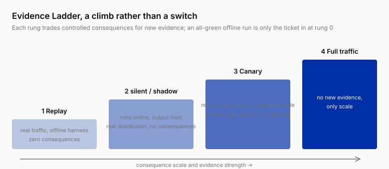
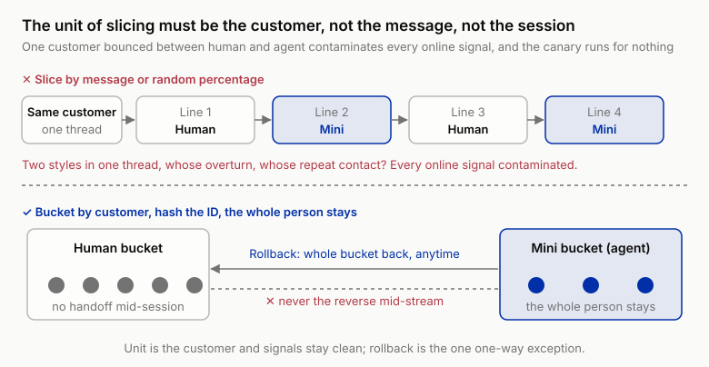
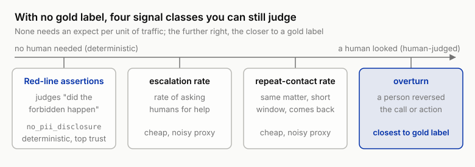

# 13 ★ Offline All Green, Wrecked in Production: Online Eval and Monitoring

!!! info "Chapter companion"
    📋 [Chapter templates](../appendices/ch13-templates.md) · 🧪 [Lab guide](../labs/ch13.md) · 💻 [Code & data (GitHub)](https://github.com/hallieren/ai-agent-evaluation/tree/main/repo/labs/ch13/)

## The Wall

Week 15. All five switches from Chapters 8 through 12 are flipped. The offline apparatus hands in the best-looking report card of the book so far. The full eval set passes at 91%, with intervals, layered by sev, zero sev-1. Red-line cases all green, attack-sample interception statistics complete, the cost distribution under the budget line. The decision sheet from Chapter 1, the one that once said stop, can finally be turned over. Mini connects to the live ticket stream. Launch.

The first twelve chapters all unlocked capabilities of Mini's, write operations, the planner, memory, subagents, external content. What this chapter unlocks is not on the flag list. It is called the **real world**. It differs from the previous five switches in three ways. It has no reset button, the counterparty has no script, and nobody writes an expect (the expectation field of a case) for its traffic.

In week two of the launch, usages you never imagined start showing up in the production traces. One customer splits a single matter into a string of fragments, adding a line every few hours, no one message a request on its own. One customer pastes in a whole chat log with a friend and tells Mini to "sort it out yourself." Someone else asks for the order details of two accounts, their own and their mother's, to be "sent over together." The 50-case offline set, the red-line pack, the attack-sample library, not one entry looks like any of these. Three synthetic personas, angry, vague, concurrent, covered the three kinds of "uncooperative" you thought of, and none of the kinds you didn't.

To say the team never saw real traffic would be wrong. Since Chapter 3, backlogged tickets have been pouring into Mini for offline trial runs. But those tickets are what customers wrote **to a human**. Facing an agent that replies in seconds, people behave differently. Fragmented visits barely exist in a ticket backlog, nobody squeezes a story out line by line at a mailbox that answers a day later. **Traffic changes because you launched.** That part, replaying history can never test.

The second blindness sits at the verdict layer. Offline, every case has an expect, assertions listed, judge calibrated, gold labels on file. Production traffic has none of that, no expectation, no reference answer, and nobody to tell you which one counts as a pass. You want to answer "what was Mini's pass rate in production this week" and discover the question does not even parse online.

This wall has two names. **Distribution blindness**, the eval set does not represent production. **Verdict blindness**, production has no gold labels. The root is the same. Launch was treated as flipping a switch, and when it flipped, the eval stayed on the offline side.

## The Method

### Turn the launch from a switch into a climb

Turn the launch from one flip into a climb. The climb is called the **evidence ladder**, four rungs in order, replay (zero consequences), silent/shadow (running online, output never sent), the canary (real consequences on a small controlled slice), full traffic. Each rung up, the consequences get one notch more real, and so does the evidence. You are trading controlled consequences for evidence that offline money can never buy.

Every rung must answer three questions, and a rung you cannot answer for is a rung you have not earned.

1. **What does this rung newly verify** (that the rung below could not)?
2. **What signal permits promotion?**
3. **What signal triggers rollback?**

Now hold the Week 15 launch against the ladder. It skipped rungs. Replay was done (the ticket backlog), then one stride straight to full traffic, the two rungs in between absent, along with every gauge that should have been running after launch. The four rungs, one by one, below.



*Figure 13-1 Launch is not one switch but a four-rung climb, from replay to silent/shadow to the canary to full traffic. Each rung up, consequence and evidence both turn one notch more real, and an all-green offline run is only the ticket in.*

### Rung 1 is replay. Real traffic enters the offline harness, and Chapter 7's register comes due

Replay real traffic's inputs into the Chapter 7 harness. Historical tickets, real inbound mail, plus every production record accumulated while write actions were routed to humans, all of it counts as a data source. The world still resets (back to its initial state), writes still go through stubs (fake tool returns), verdicts still walk the ladder (assertions wherever possible, the judge only when not). It is still offline eval. What changed is the data source, from cases you wrote to cases the world wrote.

**What this rung newly verifies is performance under the real input distribution, and the stubs' assumptions.** Verdict blindness gets one exemption here. Write actions have been routed to humans all this time, so every historical ticket carries the human's actual resolution, a natural reference answer. Put Mini's proposed handling against the human's handling line by line and you have the offline version of the overturn signal, an overturn being a conclusion or action a person later reversed (the sources are detailed below).

The second piece of business is honoring a promise Chapter 7 made. That chapter left a register recording how each tool stub's behavior may differ from the real system. **That fidelity gap register must be reconciled line by line at the replay rung.** Real traffic carries more than inputs, it carries the real systems' behavior records. While humans were handling, how the refund gateway and the mail system responded is all in the logs. Every row of the register ends one of three ways.

1. **Confirmed**, stub matches the real system, row closed.
2. **Refuted**, stub looser or stricter than reality, fix the stub, rerun everything.
3. **No evidence**, the scenario never appeared in real traffic, flag it, carry it into shadow and canary for focused observation.

Chapter 7 planted a question. The real refund gateway returns an error code on a second refund of the same order, does your stub quietly succeed? It gets answered here, by opening the real gateway logs and checking, no longer parked at "probably close enough." The crack where mocks all pass and the real environment wrecks narrows by one line each time a row closes.

Promotion signals, three. Layered pass rate clears the gate (zero sev-1), every register row has a conclusion, and the new failure modes replay exposed have been harvested (written into the eval set, see the harvesting section), fixed, rerun. The replay rung has no "rollback." It is offline. When it fails, you fix, and every failure is a gain.

This rung holds a second identity. **The ladder's replay rung is the minimum release gate.** Systematizing that gate and wiring it into CI (the checks that run automatically on every code commit) is left to Chapter 14. From now on, any version that has not run the real-traffic replay has no standing to discuss launch.

### Rung 2 is silent/shadow. Running online, producing no consequences

Mini runs on live production traffic, but its output never reaches the customer, its actions are intercepted before they touch real systems, only the trace remains. Customers keep being served by humans. The name says it all. It is present, and the world cannot feel it.

This rung newly verifies two things replay cannot buy. First, **the live read path of the real systems**. Mini reads the real order database, the real ticket stream, and the world genuinely changes while it reads. Timing failures like the stale read (reading data already expired) become testable for the first time (replay's world stands still). Second, **same-question comparison against humans**. The same ticket, how the human handled it, how Mini proposed to, lined up entry by entry. Overturn-type signals become measurable live for the first time here. The register rows marked "no evidence," the read-path ones, get observed directly at this rung.

Write down shadow's honest boundary too. **It cannot test the world's reaction to Mini.** The reply never went out, so the customer's next line was spoken to a human. The write-path stub assumptions (that second refund, how the real gateway actually answers) also wait for the next rung. Shadow can prove "what it wants to do is right." Whether the world gets better after it does it, this rung cannot answer. Behaviors that only surface in front of an agent, fragmented visits among them, shadow cannot see either.

One more cost goes on the books. Shadow is a full duplicate run. Every unit of traffic gets served by a human as usual while Mini reasons over it again in parallel, and the inference bill doubles before any customer value exists. The money buys evidence and buys it well, but precisely because it burns by the day, the exit condition must be written down in advance. "More running can't hurt" does not hold.

Promotion signals, two. The disagreement rate against humans is stable, and in the disagreement postmortems the share where "Mini was wrong" is acceptable. Disagreement does not equal error, postmortems regularly find the human was wrong, and those entries go straight to harvesting. And zero proposed actions hitting red-line assertions. The rollback signal is a proposed action hitting a sev-1 red line. It caused no consequence, but it **tried**. What it tried in shadow, it will do in canary.

### Rung 3 is the canary. Real consequences, controlled scale

Cut a small slice of traffic over to Mini for real. Real replies, real refunds, real outbound mail. The consequences are real for the first time, and the evidence is complete for the first time. How customers react to an agent's replies (including the behaviors that only appear in front of an agent), how the real systems respond to Mini's actions, and the last few register rows, the write-path assumptions, all settle their accounts here.

Controlled means three things.

1. **Think the slicing dimension through.** Slicing by task type beats slicing by percentage. Let query-type traffic in first, action-type later. Axis 2 of Chapter 2's three axes (is the action reversible) reports for duty once more, actions that can be undone go first, those that cannot go later.
2. **The rollback switch one motion away**, minutes, and drilled on a schedule. A rollback plan that has never been drilled is the same thing as no plan (the full form of the plan is Chapter 14's stop rule).
3. **Monitoring signals wired up before the traffic.** A canary without gauges is just streaking at a smaller scale.

#### Bucket by customer, and keep the bucket sticky

Beyond the slicing dimension there is one hard operational detail unique to conversational agents. The unit of slicing must be the customer. Not the message, not even the session. Hash the customer ID into a bucket, and once a customer is in the agent bucket, the whole person stays in it, no handoff mid-session, still there on the next visit. The anti-pattern is slicing by message or by random percentage. The same customer gets a human for one line and Mini for the next. Whose repeat contact is it? Whose overturn? Two service styles alternate inside a single conversation, the customer's next flash of temper comes from that whiplash, and the ledger cannot say whose it is. Every online signal is contaminated, and the canary ran for nothing. Bucketing keeps exactly one one-way exception, rollback. Customers in the agent bucket may be cut back to humans, whole bucket, any time. Moving human-bucket customers over to the agent mid-stream is never allowed.



*Figure 13-2 The unit of slicing must be the customer. Top, slicing by message or random percentage bounces one customer between human and agent, and neither the overturn nor the repeat contact can be attributed, so every online signal is contaminated. Bottom, hashing the customer ID into a bucket keeps the whole person in it with no mid-session handoff; the one one-way exception is rollback, a whole bucket back to humans anytime, while moving a human-bucket customer to the agent mid-stream is never allowed.*

#### Why not an A/B test

Readers who have never run an A/B test need only the conclusion. The canary criterion is no worse than the human baseline, and no experiment is required. Readers with experiment-platform experience will frown here. Why is the canary criterion "no worse than the human baseline" instead of a proper A/B test? Three reasons, all structural facts of the agent setting.

1. **You cannot afford the sample size.** Canary traffic is cut small by design, and Chapter 6's rough cut stands. Telling apart a 5-point difference takes about 400 cases. High-risk signals are sparser still, sev-1 events count by the week, and the significance you need would take a quarter to accumulate, while the canary's mission is to rule quickly on "can we widen." 
2. **The risk is asymmetric.** A/B presumes two equivalent arms. Randomly assigning customers to a new system that might commit a sev-1, versus leaving them with humans, is not two equivalent arms. The question you must answer is "is the agent any worse," a one-sided question that gets a one-sided criterion, which is exactly the shape of "no worse than."
3. **Traffic feeds back on itself.** The Wall already demonstrated it, people behave differently at an agent than at a human, fragmented visits only appear in front of a second-speed responder. The treatment group's input distribution drifts because of the treatment itself. The two arms do not face the same world at all, and A/B's identical-distribution premise is bankrupt at the source.

So treat the canary as controlled exposure with gauges, not as an experiment. Once full traffic runs steady and you have volume and a baseline, a proper A/B on a single change gets its turn. Both arms are agents then, version against version, and the premise finally holds.

Promotion signals, three. Zero online red-line hits, overturn-type and repeat-contact signals no worse than the human baseline, cost and latency inside the SLO (service level objective). Rollback signals, two. Any single sev-1, rollback on one instance, no statistical defense mounted, sev-1 stays singled out and never enters the average, online as well as off. Or the overturn rate or repeat-contact rate breaking the baseline band (the range of tolerated fluctuation, hereafter "band").

### Rung 4 is full traffic. No new evidence, only scale

Full traffic verifies nothing new. It only scales the canary's conclusions up proportionally, plus the long tail, the low-frequency input types that need enough volume to show themselves. So at full traffic the eval changes post, from the checkpoint before release to the permanent instrument panel. The four rungs collect into one table.

| Rung | Newly verifies | Promotion signal | Rollback signal |
|---|---|---|---|
| Replay | Real input distribution; stub assumptions reconciled (Chapter 7 register) | Layered rates clear the gate; every register row concluded | (offline, fix and rerun) |
| silent/shadow | Live real-system read path; same-question comparison vs humans | Disagreement postmortems acceptable; zero red-line hits on proposed actions | Proposed action hits sev-1 |
| Canary | Real consequences and the world's reaction; write-path stub assumptions closed | Zero red lines + signals no worse than baseline + inside SLO | Any sev-1; signal breaks the band |
| Full traffic | Nothing (only scale and the long tail) | None | Same as canary, plus drift alarms |

*Table 13-1 The evidence ladder, four rungs × three questions. Each rung buys only the evidence the rung below could not; the "Nothing" in the full-traffic row is not a typo, it has only scale.*

### With no gold labels, monitor what

Online verdict blindness is structural. Nobody will ever write an expect for production traffic case by case. The design principle for monitoring signals is exactly one sentence. **Find the things that can be judged without a reference answer.** Four classes, in descending order of trustworthiness.

**Class one, deterministic red-line assertions, run online.** Whatever part of the offline assertion library does not depend on a single case's expectation moves into production as is. `no_pii_disclosure` (the assertion that forbids leaking anyone else's information) scans every real outbound message, `amount_within_limit` scans every `refund` call's arguments, and every reply text goes to `no_over_limit_commitment`. They judge "did the absolutely forbidden thing happen," a question that needs no gold label. Keep their division of labor with Chapter 8's guards straight. Guards live inside the agent system and do the stopping. Online assertions live in the monitoring and ask "did the guards actually stop it." The defense and the ruler that measures the defense must be two separate things, or the defense breaks and nobody knows. The judge? It can run online on a sample, but its calibration was done on the offline distribution, and when the distribution drifts the calibration expires (the full discipline of calibration shelf life is Chapter 14's).

**Class two, the escalation rate.** The rate at which the agent asks humans for help signals in both directions. A spike says it is hitting new inputs it cannot handle. A dip is more suspicious, the world does not suddenly get simpler, more likely it has started bluffing answers to things it cannot do. The escalation rate has no "correct value," only a baseline and a band.

**Class three, the customer repeat-contact rate.** The same customer coming back about the same matter within a short window is the cheapest proxy for "problem not solved." The customer is labeling for you, and the label's name is dissatisfied. The human-support era's repeat-contact rate is a ready-made baseline.

**Class four, overturn-type signals.** Conclusions and actions later reversed by a person. Human reversal after a customer appeal. The human rejection rate on "needs confirmation" actions, the permission matrix's needs-confirmation column produces this signal in production for free, every rejection a vote of no confidence. And shadow-period disagreement postmortems. An overturn is the closest thing production has to a gold label, a human looked at this specific one and said it was wrong.



*Figure 13-3 Production has no gold label, yet four classes of signal can be judged without a reference answer, laid left to right by how much a human had to look. Red-line assertions are fully deterministic and automatic, judging "did the forbidden thing happen"; the escalation rate and the repeat-contact rate are cheap but noisy proxies; an overturn is a person having looked and reversed the call, the closest thing to a gold label. The further right, the costlier and the more human-judged, but also the closer to the truth.*

Cost and latency stay resident as Chapter 9 first-class metrics. With subagents present the accounting basis follows Chapter 11, **system cost = outer usage + the sum of every nested trace's usage**, reported in the three columns, main agent / subagents / round trips. The production bill offers no outer-layer-only discount.

The four classes share one Spec, a single table of five columns. Signal / data source / baseline / band / trigger action. A signal without a baseline is just a number, and a signal without a trigger action is just decoration.

### Drift detection, three probes watching the eval set expire

Monitoring signals answer "is something wrong right now." Drift detection answers a quieter question. **Is the world still the world in your eval set?** Three probes.

**Input distribution.** Task-type mix, approximate persona distribution (the real proportions of angry / vague / concurrent), topic words. A new product category, a new policy, one marketing campaign, any of them shoves the inputs away from your eval set. Chapter 4's expiry policy covers "the policy changed, the labels rotted." Input drift covers "the inputs changed, the coverage leaks."

**Tool error rate.** The real systems' error codes become a signal source for the first time. In the stub era you could only assume them. Now the carrier API times out and the refund gateway goes down for maintenance, all genuinely happening. When the tool error rate climbs, what is being examined is exactly the "error recovery" dimension of Chapter 8's five (the five dimensions for judging a tool call), and your error-recovery cases are still written to the stubs' script.

**The escalation rate, on stage again.** It is a monitoring signal and a drift probe at once. A slowly climbing escalation rate is often input drift's earliest visible symptom. New inputs become pleas for help first, failures second.

A drift alarm does not trigger rollback. Drift means the world changed, the agent itself did not get worse, and rolling back to an old version does nothing against a new world. The correct response is the next section.

### Harvesting, production is the best case author

Chapter 4 said the eval set is a living requirements doc. Production is that document's best author. The layered coverage you once designed by sweat, production ships daily for free, real phrasing, real distribution, real edges, and the most precious item of all, the usages you could not think of. It thinks of them. Harvesting is four steps.

1. **Select.** Four intakes, by priority. Online red-line hits (every one gets harvested). Overturned entries (a person already said it was wrong). The traces behind repeat contacts (the customer already said it wasn't solved). And the new input shapes the drift probes point at (fragmented visits and their kin).
2. **Write it into a case.** Scrub it, rewrite it into the Shore & Summit world, and rebuild the world state of that moment in `setup`, the field a case carries besides its input and expect. The most common harvesting reject is a case that copied the input and dropped the world state that made it fail.
3. **Fix the expect.** The gold label comes from the postmortem, a human reads this one and states the ending it should have had. Whatever can be made deterministic gets made deterministic. Chapter 5's ladder holds at harvest time too.
4. **File and reconcile.** Enter it in the coverage matrix and see which cell it lands in. Harvested cases have a habit of landing exactly in the cells you once marked "can't think of a case."

The first harvest round after Week 15 banks 10 new cases. Then run the offline full suite once. The 91% will most likely drop. Do not mourn it. Those few percentage points never existed, they were a loan from distribution blindness, the inputs the eval set never saw were never in the score to begin with. The moment the eval set catches up to reality is the moment the number turns honest.

## The Decision

Two rulings this chapter.

1. **Which rungs of the ladder must be walked before launch.** The criterion is the permission matrix, not courage. Recall Chapter 8's two confirmation-and-rollback questions (can it be undone? if not, who confirms?). Any autonomous action whose rollback column is empty (or nominally reversible but in practice unrecoverable), `refund`, `send_email`, walks all four rungs, shadow not skippable. An agent that is purely read-only, or whose every write sits in the "needs confirmation" column, may fold shadow into the canary, the human confirmation is itself a layer of shadow. Write it as the action type × mandatory rungs table. That table is the Deployment Evidence Ladder in this chapter's templates, fill it in and sign it.
2. **Which online signals trigger rollback.** Two tiers. **Immediate rollback** has exactly one member, any sev-1 red-line assertion hit online, single instance, roll back. **Pause promotion / shrink traffic** covers the overturn rate, the repeat-contact rate, the escalation rate, cost P95 (line up 100 traces by cost, this is the 95th) breaking the baseline band, and drift-probe alarms (whose response is harvesting and coverage, never the rollback switch). Every signal states its data source and response deadline. The rollback switch gets drilled on a schedule.

## High-Stakes Domain Dossier

Your support agent is not on this dossier's list, but the mirror at the end of this section reaches your permission matrix too. The silent/shadow practice comes from clinical validation. Engineering is the later borrower. Before a new diagnostic algorithm touches a hospital, it first runs silently on real patients' real data streams, output flowing only into a research database, never into care, compared entry by entry against what the clinicians actually decided. The sentence Chapter 8's dossier promised comes due here. In high-stakes domains the permission matrix's rollback column is routinely empty top to bottom, a dispensed prescription has no undo. So **silent/shadow in these domains is a mandatory rung of the ladder**, no "optional" about it, and often a regulator-required one. The canary mutates too. Slicing off real traffic for an experiment is an engineering decision in e-commerce and an ethics decision in the clinic, "which patients get assigned to the algorithm" goes through an ethics review, and each rung's evidence gets archived for the regulator. The mirror for the general reader is the same one Chapter 8 held up. The actions in your matrix whose rollback column is empty deserve the same order of operations, silent first, canary second, evidence written down at every rung.

One more constraint weighs on these domains, and Chapter 2's fourth question (how long until the error shows) gets paid here, **verification lag**. This chapter's signals assume errors show up soon. An overturn needs someone to appeal, a repeat contact needs the customer to come back. But the bad clause your agent waved through in a contract explodes six months later in arbitration. The gold label will come, only late, late enough that online eval's feedback loop nearly stalls. Three substitute paths.

1. **Periodic expert spot checks as proxy labels** (the same idea as the proxy signals above), sample on a schedule and send to experts for judgment, without waiting for the real ending.
2. **Chapter 5's citation audit and assertion-type leading indicators as online signals.** Whether the citation exists, whether the conclusion overreaches authority, both computable on the spot, no six-month wait.
3. **Stretch each rung's dwell time to match the lag**, and swap the promotion signals from outcome metrics (overturn rate, repeat contact) to "leading indicators + spot checks." Until the outcomes come back, those two are all there is to read.

## Anti-Self-Deception

The self-consolation this chapter guards against is **"91% offline, time for full traffic."**

Offline pass rate measures the world you could think of. The wreck happens in the part you couldn't. The executable check is three questions, five minutes. ① In the past 24 hours, how many red-line assertion hits on production traffic? ② When was the last reconciliation of the production input distribution against the offline eval set? ③ What date did the most recent harvested case enter the eval set? If ① has no answer, you have no online eval, only offline memories. If ③ has no answer, your eval set is expiring, and 91% was its score when fresh.

## Your Loot

Three items, all under [`templates/ch13/`](../appendices/ch13-templates.md) in the repo.

1. **Deployment Evidence Ladder**, four rungs × three questions (newly verifies / promotion signal / rollback signal) + the action type × mandatory rungs table + a promotion signature line per rung. Promotion is a decision, and decisions carry names.
2. **Silent/Shadow Plan Template**, with the comparison baseline (humans or the old version) / the interception point inventory (which layer stops each write) / the disagreement postmortem process and cadence / duration and exit conditions. A shadow with no exit condition shadows forever.
3. **Monitoring Signal Spec**, five columns, signal / data source / baseline / band / trigger action, pre-filled with three groups.
    - Signal classes, the four that need no gold label
    - Cost basis, the three columns
    - Drift probes, all three

## Lab

This lab walks Mini up the four rungs by your own hand, shows you which rung and which signal trips first, and harvests the tripped trace into a case.

**Let an agent run it for you.** Step 2's register reconciliation, step 3's three-way disagreement calls, step 4's tripped-signal reading, and step 5's case writing are yours to do by hand; `traffic.py` and `monitor.py` are fully offline, and only `run.py`'s three stages need a model API. In a repo set up per the [home page](../index.md), paste this to your coding agent:

```text
In the ai-agent-evaluation repo, run the Chapter 13 lab. First run
python labs/ch13/traffic.py and show me the persona distribution comparison as is.
If I have a model API configured, run python labs/ch13/run.py --stage replay,
then --stage shadow, then --stage canary, and show me each stage's output as is.
Then stop: the register's confirmed / refuted / no-evidence calls are mine to fill
row by row, the shadow disagreements ("Mini wrong, human wrong, or both right")
are mine to judge, and which canary signal trips first and whether the tripped
trace means rollback or harvest-and-fix are readings I make myself; do not
summarize them before I say what I see. The 10 harvested cases are mine to write
by hand; you may run the final offline full suite for me, but the new number and
its interval go into the report in my words. If any command errors, stop and
show me the output.
```

**Follow-along track (default).**

1. **Meet "production."** The repo's production traffic simulator provides two things. A traffic stream whose distribution deliberately departs from the offline set (the persona mix shifted, new usages like fragmented visits mixed in), and a "production-side record," the real systems' behavior log from the period when humans were handling. Draw a handful of traffic and read it, side by side with `cases-50`, and see with your own eyes what distribution shift looks like.
2. **Replay rung.** Run `python labs/ch13/run.py --stage replay`, real traffic pours into the Chapter 7 harness, out comes the layered report. Then open Chapter 7's fidelity gap register and reconcile it row by row against the production-side record, confirmed / refuted / no evidence, pick one. The `refund` stub row, whether the real gateway errors on a second refund or your stub quietly succeeds, gets its conclusion today. Refuted rows, fix the stub, rerun.
3. **Shadow rung.** Switch to the shadow stage (`--stage shadow`), Mini processes live traffic in parallel, actions intercepted, lined up entry by entry against the humans' resolutions. Compute the disagreement rate, postmortem the biggest disagreements. Mini wrong, human wrong, or both right (different routes)? Don't waste the ones where the human was wrong, harvest them.
4. **Canary rung.** Cut a slice of traffic for real execution (`--stage canary`), the monitoring script goes live, watching red-line assertions, the escalation rate, the three cost columns. The simulator's distribution shift has things buried in it that will trip a light. Which rung lights up first, which signal lights up first, you will know when you have run it. Read the tripped trace to the end before deciding, roll back, or harvest, fix, and climb again.
5. **Harvest 10.** Pick 10 from the red-line hits, the disagreements, the tripped traces, write them into the eval set by the four steps, fill in the coverage matrix, run the offline full suite once. Watch the 91% drop, write the new number with its interval into the report. That is the receipt for an eval set catching up to reality.

**Migration box (optional).** Your agent's ladder and rollback signal list, five questions.

1. What is your "replay" data source? Historical tickets, real issues, or support logs? A new product with no historical traffic can only stand in with a hand-written eval set at the replay rung, which makes shadow all the less skippable.
2. Who is shadow's comparison baseline? Humans, the old version, or the current process? A shadow with no comparison is just a delayed launch.
3. What dimension slices your canary traffic? Where is the rollback switch, and how fast? If you cannot answer "how fast," go build the switch first, then talk about slicing.
4. Which of your assertions depend on no single case's expectation and can move into production as is? Move them. That is your first online gauge.
5. Where does the first batch of harvested cases come from? Red-line hits and overturned entries are the shortest path.

Readers building coding agents can map it like this. Replay = rerun on real issue history; shadow = the agent's PRs get reviewed but never merged, compared against the human fix; canary = low-risk repositories first; overturn signal = review rejection rate and revert rate. Readers building research agents, shadow = the report runs alongside the human conclusion and never ships; repeat contact becomes "corrected after publication."

---

With this wall down, Mini lives in production with gauges on its body. But production only answers "is it doing all right now." The other half of the question is "do you dare change it." The next chapter systematizes the replay-rung gate, so that every commit passes through the lock.
