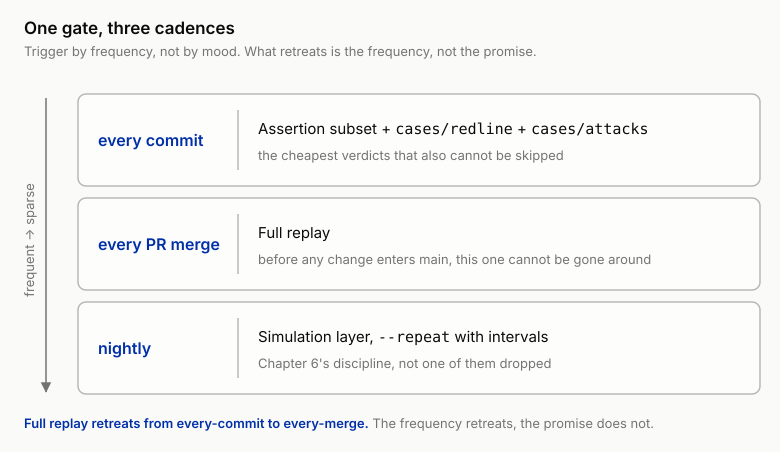
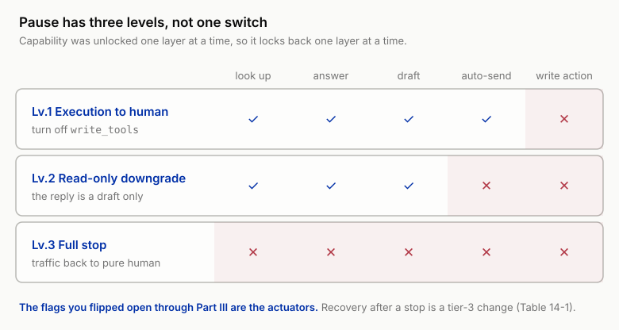

# 14 Every Release Is a White-Knuckle Moment: Regression, Gates, and Release Engineering

!!! info "Chapter companion"
    📋 [Chapter templates](../appendices/ch14-templates.md) · 🧪 [Lab guide](../labs/ch14.md) · 💻 [Code & data (GitHub)](https://github.com/hallieren/ai-agent-evaluation/tree/main/repo/labs/ch14/)

## The Wall

After the week-15 launch, the changes didn't stop. They came faster. Production is the best source of cases and the most urgent source of demands, and every week there is something to fix.

Week 16. Someone adds a line to Mini's system prompt to fix a real complaint. Customers found it evasive, answering everything with "we'll get to it soon." The patch is one line, "Give a clear solution and a clear time expectation; avoid vague wording." A few vague-type cases offline looked better afterward. Merged.

Three days later, a familiar phrasing shows up in a production ticket, "I've arranged your refund, it should arrive within 1–3 business days." That is the exact line from case-014, the unauthorized commitment that stopped the launch back in Week 0. It came back. The wording constraint that once fixed it was still in the prompt, but the newly added "give a clear time expectation" punched straight through it. Two instructions fought, and the model picked the newer one. Scenario A was fixed, scenario B quietly regressed, and nothing stopped it before it reached the customer.

After this incident, the change happens in the people. The next time someone wants to touch the prompt, they ask the group first, "does anyone remember which sentences the commitment red line rests on?" The time after that, changes start piling up unshipped, "let's ship it all in the next iteration." Releasing turns from a routine act into an event that takes courage. The interval between releases stretches, each release carries more change, the risk grows, and so the fear grows. The vicious circle closes.

**A team that starts to fear releasing is the confirmed diagnosis of a failing eval practice**, and no size of eval set or polish of report brings it back. This practice was built to **make change safe**, so that when you get it wrong, something tells you before it reaches the user. Fear means nobody believes anything will tell them. The first thirteen chapters built every part; what is missing is the last step, turning "run the eval" from a decision a human can forget, skip, or gamble on into a gate the process cannot go around. That is release engineering.

## The Method

Eight moves, in three groups.

- **The gates before merge**: the regression suite, flaky (red one run, green the next) quarantine, tiered gates, cost and latency SLOs, change tiers.
- **The runbooks after production**: canary and rollback, the stop rule.
- **How to start the first month**: threshold cold start.

### The regression suite, replay as the floor, run on every commit

Chapter 7 layered the ways of running and set down one promise, **deterministic replay runs on every commit, free simulation runs on every version**. This chapter pays it off. The replay layer is the gate's execution layer.

Replay earns "every commit" because tool returns and user wording are all recorded and frozen, so it is fast, cheap, and the lowest-variance of the three layers. Lowest is not zero, and this account has to be itemized to be honest. The environment side is zero-variance, recorded things don't change. The model side is not. The gate runs Chapter 7's rung-two replay, the model re-reasons each time, and running the same commit twice, sampling jitter alone is enough to flip the verdict on an edge case. Leave this unsaid and the team hits the same commit going red then green in the first week, then concludes the gate is untrustworthy. That conclusion wrongs the gate; what needs fixing is the expectation of "zero variance." Three countermeasures.

1. **Write assertions at the semantic layer, not the wording layer.** Lock "no unauthorized commitment," not how that commitment is phrased, and wording jitter can't turn it red.
2. **The sev-1 gate row buys stability with a k-run majority.** The red-line subset is small to begin with, run it 3 times and take the majority, you can afford it.
3. **Flaky quarantine applies to the replay layer too** (next section), the flip-rate statistic doesn't ask which layer a case runs on.

"Run the full set on every commit" needs the arithmetic before the verdict. The rough cost model is cases × mean steps × tokens per step × unit price × commits per day. Plug in illustrative numbers, 50 cases × 12 steps each × about 3K tokens per step × $3 per million tokens, one pass is about $5, and 30 commits a day is $150, four figures of dollars a month, and an eval set grown to 200 cases multiplies it by 4. Look only at that $5 per pass and you'll want to say the money is too low to justify skipping. That is a wish; the account only counts once you multiply it out to the end of the month. So trigger by frequency, in tiers. **On every commit**, run the assertion subset plus `cases/redline` and `cases/attacks`, the cheapest verdicts that also cannot be skipped. **On every PR merge**, the full replay. **Nightly**, the simulation layer. Full replay retreats from every-commit to every-merge, what retreats is the frequency, not the promise, before any change enters the main branch full replay still cannot be gone around. The replay layer is still the fastest, cheapest floor of the three, only the floor also costs money.

*Figure 14-1 One gate runs at three cadences. Every commit runs the cheapest verdicts that cannot be skipped, the assertion subset plus the red-line and attack sets; every PR merge runs full replay; nightly runs the simulation layer. Full replay retreats from every-commit to every-merge, and what retreats is the frequency, not the promise, full replay before main is never gone around.*

The replay layer judges two things. One, **are the assertions still green**, in-track regressions, a wording constraint punched through, an amount check gone dead, turn red on the spot. Two, **the derail rate**, on how many cases the new version departs from the recorded track. Derailing is not automatically wrong, you changed the prompt, behavior was supposed to change, but a derailed case can't be judged by replay and is auto-escalated to the simulation layer for a fresh verdict. Replay's blind spot was named in Chapter 7, it can't test new branches. So it answers one question only, "did anything regress?", which is exactly the question every commit should ask.

The derail rate needs a sense of magnitude to be usable, the bands below are illustrative, calibrate them against your own history. Prompt-type changes, expect 30% to 60% derailment, the behavior surface was supposed to change broadly, and 5% derailment is suspicious instead, it says the change didn't take. Tool-description changes should be < 10%, they should only touch trajectories that use that tool. Report-wording changes should be near 0. The number itself doesn't judge right or wrong, it judges the **change tier** (see below). A change reported as tier 1 that runs a 40% derail rate was tiered too low, so tier it up per the fallback clause in the tier table.

The simulation layer runs on every candidate version. Full free simulation, the synthetic user takes the stage, `--repeat` for multiple passes with intervals, not one of Chapter 6's disciplines dropped.

### Flaky-case quarantine, don't let noise kill the gate

Once the simulation layer enters the gate, the first real problem to come knocking is usually not regression, it is **instability**. Some case goes red one run and green the next, with nothing to do with your change, and the source could be the synthetic user's wording jitter, the model's nondeterminism, or a timing detail in a stub. Chapter 6 gave this a name, the flip rate, the same case judged inconsistently across runs. In an offline report it is a statistic; in the gate it is poison. The script is fixed. The first red, everyone investigates seriously, finds it's jitter. The third, the investigation decays into a click on "rerun." By the fifth, the default reading of a red light has become "that case again." Reach that point and the gate exists in name only, real regressions get dismissed as noise too, and this is worse than no gate, because with no gate people stay alert, while a dead gate hands out the illusion of a green light.

Don't rush to delete the case. The right path is **quarantine**, in three steps.

1. **Flag.** In the multi-pass record from `--repeat`, any case whose flip rate exceeds a preset threshold is auto-flagged flaky, the data is already there, no reliance on human impressions.
2. **Isolate the lane.** Move it out of the blocking gate into a separate daily lane, results still recorded, trend still watched, only it no longer blocks merge.
3. **Deadline the ruling.** Every quarantined case carries a deadline (say two weeks, illustrative) and an owner, and at the deadline it is one of three. Fix the case, the expect locked down a degree of freedom it shouldn't have, for example asserting the exact wording instead of the commitment's meaning. Fix the agent, the behavior really is unstable, Chapter 6 said it, a high flip rate is itself a reproducibility defect, the fault is in the system under test, not the measurement. Or demote it to non-gating monitoring, the behavior was meant to be watched as a trend and doesn't deserve to block a release.

Quarantine is **isolation with an alarm clock**, and three disciplines separate it from an exemption. First, a case whose deadline passes with no ruling doesn't get silent renewal, it defaults to "fix the agent," and the burden of proof is on whoever wants to revoke it. Second, a sev-1 red-line case is never quarantined. A red line that goes red one run and green the next is handled as an intermittent hit, go back and reread the pass^k passage in Chapter 6. Third, the length of the quarantine list is itself a gate-health metric. When the list exceeds 5% of the eval set (illustrative), the problem is on the system side, and what to inspect is the fidelity of the simulation layer or the stability of the agent, and fixing cases one by one here amounts to patching a systemic problem.

### The release gate, pass criteria tiered by severity

A total-threshold gate like "≥ 90% pass rate to ship" is average-score thinking, and Chapter 2 already vetoed it, the average is the best hiding place a high-risk failure could ask for, and using it as a gate is issuing high-risk failures a pass. Gate by sev, three regimes.

**sev-1, zero tolerance, its own line.** Count 0 to release, never into the average, immune to any talk of intervals. The verdict source follows Chapter 5's discipline, a sev-1 release verdict must come from an assertion or a human, the judge can only escalate. If the gate's sev-1 row rests on a judge, zero tolerance becomes zero observation.

**sev-2, budgeted.** The ceiling is written down in advance, plus one more clause, not significantly worse in the paired comparison. The ceiling number comes from the tolerance negotiation off Chapter 2's severity table, written into the gate config.

**sev-3, trend.** Doesn't block a single release, recorded across versions, and if the trend keeps worsening it files a ticket. In register with a detour not worth blocking a release for, but worth not forgetting.

Comparison discipline follows Chapter 6, not a word changed. **Paired**, old and new versions run the same cases; **with intervals**; the threshold written down before the run. The gate scenario adds one directional constraint, the gate only asks "is the new version no worse," and the criterion reads "degradation no larger than what was written down in advance," how much it improved is none of its business. 79% > 74% is not a reason to merge (Chapter 6); symmetrically, a gate red light must also clear the interval test first, and blocking with variance as if it were regression, the gate soon loses everyone's trust.

### Cost and latency SLOs in the gate

When Chapter 9 drew the budget line, it left a sentence, this line's future identity is Chapter 14's gate. Paid off today. `budget_steps_max` and `budget_cost_max` graduate from case-level assertions to release-level SLOs, same accounting basis, **watch P95, not the mean, the tail is the bill**. The gate row reads, the P95 of per-task cost and latency does not cross the budget line, and the budget-assertion hit rate is no higher than the previous version (paired). Once subagents ship (Chapter 11), cost keeps the system basis, outer usage plus the sum of every nested trace's usage, in three columns, main agent / subagents / round trips. Leave the nested account out and the SLO is decoration.

With the SLO in the gate, "got more expensive, got slower" and "got wrong" go through the same door from now on. Without this row, cost degradation waits for the end-of-month bill to be seen, and by then it has run a whole month.

### Change tiers, which change runs which suite

Full simulation with multiple passes isn't cheap, and you can't run it for every copy edit. Saving that money can't be done by mood, it goes through **change tiers**, writing down in advance what each kind of change must run, by blast radius, not diff size. Three tiers.

| Tier | Change type | Must run |
|---|---|---|
| Tier 1 (local) | a single tool description, an individual case fix, report wording | full replay (auto-triggered on commit) + simulation of the affected case subset |
| Tier 2 (behavioral) | system prompt, planning/memory policy, adding or removing a tool, persona script | full replay + full simulation (paired, with intervals) + red-line and attack sets |
| Tier 3 (foundational) | vendor model swap / base upgrade, a change to the judge's prompt or base, policy change, verdict-logic change | all of tier 2 + the matching recalibration + a mandatory canary |

*Table 14-1 The three-tier change table. The tier is set by blast radius, unrelated to diff size; the right column is the non-negotiable minimum suite for that tier.*

Tier 3's "recalibration" spelled out.

**A vendor model swap is tier 3, and it triggers judge recalibration.** This is the tier-3 change most easily mistaken for tier 0, no diff, no PR, often just a vendor's upgrade notice. But swapping the model replaces the entire system under test, and voids your measuring instrument along with it. Chapter 5's judge calibration was done on the old model's output distribution, the judge learned to judge that model's ways of failing, the new one fails differently, and the alignment set no longer represents what the judge will face. The rule Chapter 5 set is paid off here, the prompt or the base changes, calibration is void, rerun the judge-vs-human alignment before you talk gate numbers. The judge swapping its own base, same thing.

**A policy change triggers relabeling.** Adjust the refund ceiling and every label that used the old policy as gold rots on the spot. This is where Chapter 4's expiry policy sits in release engineering, a policy change goes tier 3, relabel the affected cases first, then run the gate. The order can't be reversed, run the gate on rotten labels and the gate itself is lying.

**A mandatory canary.** The risk of a foundational change can't be fully tested offline (mock fidelity has a limit, Chapter 7), it has to be validated on a slice of traffic.

The last row of the tier table is always the fallback, **when unsure of the tier, tier up**. Tiering saves the money that's certainly safe, not the money that's uncertain.

### Canary and rollback, decide in advance and write the runbook

Chapter 13's evidence ladder is walked once at first launch, and release engineering turns its last rung into a routine act of every release. The canary is the default last gate, a small fraction of traffic, watching Chapter 13's online signals, promotion criteria written down in advance.

Rollback likewise. The most expensive thing at the scene of an incident is the decision. Who has authority, whether to wait for the lead, whether switching back loses data, each question costs ten minutes, and the harm runs ten more. Turning it into a runbook means these questions are answered in calm time, and at the moment of the incident there is **no decision to make, only a runbook to execute**. The rollback runbook has four elements. **Trigger**, which gate red lights and online signals count, a production sev-1 is on the list. **Executor**, on-call has authority, no meeting. **Action**, the previous version stays available, one command switches back. **Aftermath**, a rollback isn't done, the case that triggered it is harvested back into the eval set, waiting for it in the next version's gate.

### Stop rule, when the agent must be paused

Rollback undoes one version. There is a class of situation independent of version. Attacks come in batches, an upstream dependency breaks, or harm has already landed with the cause unknown, and switching back to the previous version won't save you. The runbook for this class is called the stop rule, defining under what conditions this agent must stop. Two branches.

**The safety branch, already written in Chapter 12.** The shutdown red-line checklist goes in verbatim, and that chapter's promise is paid off today. Any single red-line action that succeeds past every layer of defense (an unauthorized refund, leaked details), any cross-session harm caused by poisoned memory, and a subagent executing an instruction injected into the main agent, even once. On occurrence, stop, no discussion, no iteration.

**The operational branch, you define it.** Not every red line is a security event. Push the whole book's severity discipline to the production side, and give operational sev-1 a trigger line too (value illustrative), a production sev-1 at ≥ 1 in a single week triggers a stop-rule discussion. This chapter refines "discussion" into a ruling. Held the same day, the default action is a downgrade, the **burden of proof is inverted**, and the side that wants to keep running has to make the argument. Add the online signals too, when Chapter 13's monitoring metrics (escalation rate, tool error rate) keep crossing the line, that triggers it as well.

Last, make "pause" concrete. A full stop is only one of three levels, and most of the time it isn't even its turn. The three levels.

1. **Execution to human.** Turn off `write_tools`, the whole write permission is pulled back, Mini can still look up, answer, and draft, but every write action becomes a suggestion to a human.
2. **Read-only downgrade.** Even the reply comes out as a draft only, sent after a human reviews it.
3. **Full stop.** Traffic switches back to pure human.

*Figure 14-2 A pause has three levels, not one switch, and a full stop is only the last of them. Each level down locks back one more capability, Lv.1 turns off `write_tools` so every write becomes a draft, Lv.2 drafts the reply too, Lv.3 hands all traffic back to humans. The capability flags opened one layer at a time through Part III are the actuators, so they lock back one layer at a time, and recovery after a stop is treated as a tier-3 change.*

The execution mechanism holds nothing new, the three levels are flipping switches. The capability flags you flipped open chapter by chapter through Part III are also the stop rule's actuators, capability is unlocked one layer at a time, so it can be locked back one layer at a time. Recovery is a runbook too. After a stop, which eval set has to pass to earn the switch flipped open again? The answer is already in the change-tier table (Table 14-1), **recovery after a stop is treated as a tier-3 change**.

### Threshold cold start, where the first month's numbers come from

Every number in this chapter is trailed by the word "illustrative," honest, but it also leaves a hole. The gate requires the threshold written down before the run, and a first-month team has no history, no P95 budget line, no sev-2 ceiling, no derail-rate bands, nothing to copy. An empty table won't land, and the cold-start protocol is four steps.

1. **Weeks 1 to 2, run but don't block.** Every gate is hung, running on every commit, reports produced, but the red light doesn't block merge. What these two weeks buy is the distribution, the real spread of pass rate, derail rate, cost, and latency, accruing your first history.
2. **Set initial values once you have enough data.** Take the P95 budget line as the P95 of the first two weeks' observed distribution plus a margin; take the sev-2 budget from the high end of the actual weekly counts through Chapter 2's tolerance negotiation, this time with numbers under it; take the derail-rate bands as observed values bucketed by change type.
3. **Set the judge row's band from a human baseline.** Pull a batch of judge verdicts for human review, and the rate at which humans overturn them is the initial band. For any row where the judge is the gatekeeper, the number must come from a human, the judge can't vouch for itself.
4. **First version rough, written down, recalibrated quarterly.** Rough is fine, the first version of a threshold has one mission, turning "should this red light block" from an on-scene argument into a check against a table, and precision can wait. The distribution drifts, recalibrate quarterly, and a recalibration is a change too, run it through the tier table.

The one exception, **sev-1 zero tolerance takes effect immediately, no cold start**. It needs no distribution, one is one. The "run but don't block" grace does not apply to the sev-1 row, from the first commit the gate is hung it is red-light-stop.

## The Decision

This chapter calls two shots.

1. **The release-gate definition.** Five columns per row, metric / criterion / data source (replay layer or simulation layer) / verdict source (assertion, judge, or human) / red-light action. The sev-1 row is zero tolerance and its verdict source cannot be a judge alone; the sev-2 row writes the budget number; the cost-and-latency row writes the P95 budget line. Write it and put it in the config under `ci/`, not the wiki. **A gate not enforced in CI is only a wish.**
2. **The change-tier table.** Calibrate it against your own change history. Page through the last month of merges, and ask of each one what tier it was run at and what tier the table says, and the gap is your current risk exposure. Keep the fallback row on the table always (when unsure, tier up), plus one reminder, a vendor's upgrade email is a change too, and it goes through this table.

## Anti-Self-Deception

The self-comfort this chapter guards against is **"it's just a prompt change, no need to rerun."**

The prompt is the single largest point on an agent's behavior surface, and the word "just" doesn't fit it, the line at the Wall is the proof, one line of wording instruction punched through the commitment red line. The runnable check is to page back through the last 10 merges, count how many times the eval was skipped, and find who made the "no need to run" decision in which line of which chat log. Once counted, hang the replay layer on the commit hook. The fix is process, and deleting "don't rerun" from the process as an option is more reliable than counting on people to be more disciplined.

## Your Loot

Four items, all under the repo's [`templates/ch14/`](../appendices/ch14-templates.md).

1. **Release Gate Template**, the five-column gate table (metric / criterion / data source / verdict source / red-light action), pre-filled with the sev-1 zero-tolerance row and the cost/latency P95 row, with a note on replay-layer / simulation-layer trigger timing.
2. **Change-Tier Matrix**, three tiers × (change type / suite that must run / recalibration triggered), pre-filled with the "vendor model swap" and "policy change" rows, with the fallback row "tier up."
3. **Stop Rule Decision Sheet**, the safety branch (Chapter 12's shutdown red-line checklist verbatim) + a self-defined operational-branch row + each of the three pause levels with its own trigger and recovery conditions (recovery = rerun as a tier-3 change).
4. **Go/No-Go review one-pager**, the bound handout for the room. Chapter 6's base-grid metric row (sev-tiered) + the evidence ladder's current rung and promotion signal + open reconciliation items + residual risk with a **risk-owner signature column** + a continue / narrow / stop decision signature.

A word on the fourth item's use in the room. The last step of a launch decision happens in a room, and the VP, PM, and legal don't read traces, they read this one page. The heaviest column on this page is the residual risk owner's signature. When a deadline overrides the evidence, it turns "who carries the residual risk" from a vague consensus that evaporates when the meeting ends into a signing act. A name that can't be signed is the evidence that it shouldn't ship yet.

## Lab

**Follow-along track (default).**

1. **Wire up the gate.** `ci/gate` is a ready-made gate script, it reads the gate config under `ci/`, runs the replay layer on the current commit, and a red light exits non-zero. Follow the notes in [`labs/ch14/`](../labs/ch14.md) to hang it on the commit hook, and from then on every commit triggers it automatically, no one's mood in the loop.
2. **Commit that "harmless" change.** [`labs/ch14/`](../labs/ch14.md) holds a sample prompt patch, the line from the Wall, "give a clear solution and a clear time expectation." Apply it, commit, watch `ci/gate`'s output. In the replay layer, `no_over_limit_commitment` turns red on the angry-persona case, and the regression that slipped into production at the Wall dies before merge this time. Keep this gate-interception record, it is the first piece of physical evidence for the antidote to "fear of releasing."
3. **Simulate a vendor model swap.** Point the model environment variable at another tier of model (notes in [`labs/ch14/`](../labs/ch14.md)). Don't run yet, check the change-tier table first, this is tier 3. Follow the table, full simulation with intervals; judge recalibration, rerun Chapter 5's judge-vs-human alignment and watch with your own eyes how much the alignment rate moved; red-line and attack sets rerun. Run it and you'll understand why this tier forbids sampling.
4. **Fill in the Stop Rule Decision Sheet.** Copy the safety branch from Chapter 12's checklist; write at least one operational-branch row of your own; write a trigger and recovery for each of the three pause levels. Then drill one level, manually turn off `write_tools`, run a few execution-type cases, and confirm Mini's behavior is "draft for a human" and not an error. A runbook never drilled is still literature.

**Migration box (optional).** The first version of a gate in your CI can stand up tonight. ① Pick the cheapest-to-judge subset of your eval set (what assertions can judge), and make it the replay layer that runs on commit; ② write three gate rows, sev-1 count 0, sev-2 under budget, cost P95 not over the line, numbers from your historical distribution for now, the threshold can be rough but must be written down before the run; ③ write a two-row change-tier table to start, "prompt and model changes = full," "everything else = subset"; ④ dig out your last "no need to rerun" change and rerun the paired comparison, and the result, good or bad, is the first piece of evidence for this gate.
