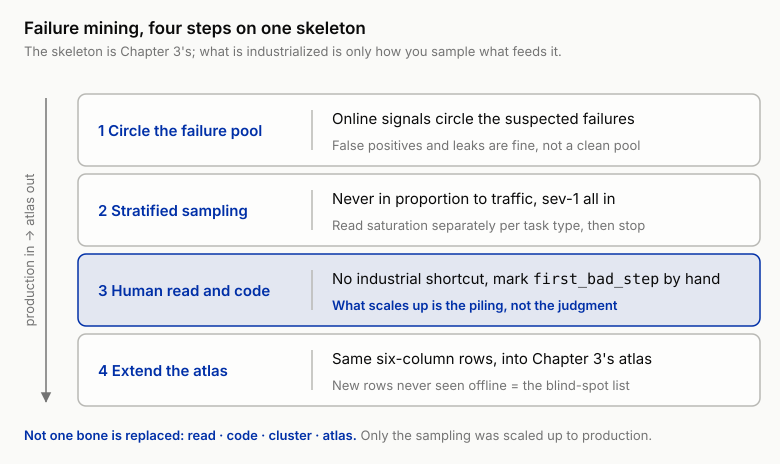
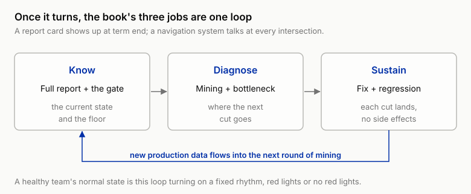

# 15 Wiring Eval Back Into Improvement: From Failure Mining to Targeted Optimization

!!! info "Chapter companion"
    📋 [Chapter templates](../appendices/ch15-templates.md) · 🧪 [Lab guide](../labs/ch15.md) · 💻 [Code & data (GitHub)](https://github.com/hallieren/ai-agent-evaluation/tree/main/repo/labs/ch15/)

## The Wall

By the end of Chapter 14 what you hold is a textbook setup. Traces all land in storage, monitoring signals are online, the eval set is maintained in tiers, verdicts are automated, and a CI gate stands watch over every release. From week 16, Shore & Summit's dashboard starts going red anyway. The escalation rate lifts, the tool error rate climbs, and new failures harvested into the eval set arrive batch after batch.

The team reacts the way every team reacts, by editing the prompt. Whoever was stung by a failure screenshot most recently gets a sentence added in that direction; run the gate, green, merge. Next week the dashboard is still red, only the red has moved. The gate is doing its job. It stopped things from getting worse, and it cannot answer how to get better.

So the conversation in the room turns strange. The data has never been this complete, and the decisions have never been this blind. The dashboard says "getting worse," it does not say where to change. The pass rate says how often it goes wrong, it does not say which component is manufacturing the errors. Editing the prompt becomes the default move for one reason only, it is the closest thing to hand. The evidence never pointed at it.

This wall has a precise name, **you have measurement of everything and no road from measurement to action**. Data is not navigation. This chapter builds that road, and closes the book's loop on the way. What eval has been doing all along is navigation; the report card was always a by-product.

## The Method

### Retreat from metrics back to traces, failure mining

You learned the answer in Chapter 3. When intuition can't carry it, retreat to reading traces one by one, code them, cluster them, build the failure mode atlas. What can't carry it now has changed from intuition to metrics; the retreat is unchanged. Back then the object was 60 pregenerated traces, and 20 read got you close to saturation. Production pushes the same act to industrial scale, and three things change. One, **volume**, hundreds or thousands a day, nobody can read them. Two, **dirt**, no case definitions, no gold labels, and you can't even say for sure which ones count as failures. Three, **uninvited**, you don't design the distribution, and new modes drift in with real users.

Failure mining is the industrialized version of Chapter 3's error analysis on production data. Not one bone of the skeleton is replaced, it is still read, code, cluster, atlas; what changes is only how you sample what gets fed into the skeleton. Four steps in all.

**Step 1, circle the failure pool.** Production has no gold labels, so "suspected failure" is circled by online signals. The monitoring signals accumulated in Chapter 13 pay off here, escalation, negative user feedback and restatement, assertion hits, judge escalations, and the cost tail over budget (Chapter 13's four no-gold-label signal classes are all in here, with judge escalations and the cost tail added). The pool has false positives and leaks, and that is fine, mining digs for the structure of failure, so the pool needs to be neither clean nor complete.

**Step 2, stratified sampling.** Never sample in proportion to traffic. Lookup-type tasks are the bulk of traffic and the simplest, and a proportional batch drowns in them. Stratify by signal severity and task type; sev-1 signals all enter the pool, they were counted on their own line to begin with and are never sampled. Every other stratum draws until Chapter 3's saturation criterion says stop, with the curve read separately per task type.

**Step 3, human reading and coding.** This step has no industrial shortcut. Read every drawn trace under Chapter 3's coding discipline. Read forward, ask "given what it had at this step, was this action reasonable," mark `first_bad_step`, write the behavioral description. A clustering script can pre-sort similar descriptions into piles, but the naming and the criterion have to be written by a person. What gets industrialized is the sampling and the piling; the judgment stays in human hands.

Take apart your own black box while you're at it. This book has spent its length taking apart other people's black boxes, and your own script does not get an exemption. There is no machine learning anywhere in the clustering script under [`labs/ch15/`](../labs/ch15.md). It piles by the `failure_mode` field on the verdict record, falling back to the first keyword of `notes` when the field is missing. One hardcoded rule mines for "fuzzy search instead of exact lookup," an order ID and a `search_orders` call both present in the trace is a hit. The resulting piles are then checked against the offline atlas's mode list, with anything not on the list flagged a new-mode candidate. That is all of it.

The ceiling of rule-based piling is written in plain sight too, it only tidies what you have already named, and the genuinely new modes come from that one hardcoded rule and from human eyes. At production scale you can swap in embedding (semantic vector) similarity or LLM-assisted piling, and what you swap out is only the labor of pre-sorting, the naming and the criterion are still written by a person.

**Step 4, extend the atlas.** The output merges straight into Chapter 3's atlas as its production increment, keeping Chapter 3's row structure as it was, six columns, **name, definition and criterion, representative trace IDs, count, sev distribution, suspected component**, and every new row fills the same six. Old modes gain counts; the new rows never seen offline are this round's biggest haul, they are the eval set's blind-spot list, and every one of them owes Chapter 4 a batch of new cases, which is Chapter 13's harvesting loop systematized.

Shore & Summit's first round of mining dug up exactly such a row. The customer gave the order ID, and Mini still fuzzy-searched by name with `search_orders`, occasionally turning up a same-name customer's order. The offline eval set has no such mode, the handwritten cases all test "can it find it," and not one tests "the information was handed to you, do you use it."

*Figure 15-1 Failure mining runs four steps on Chapter 3's skeleton. Online signals circle the pool, stratified sampling draws it down with sev-1 all in, a person reads and codes each trace, and the output extends the same six-column atlas. Read, code, cluster, atlas is untouched; only the sampling that feeds it was scaled up to production, and the judgment stays in human hands.*

### Locating the bottleneck and the lever mapping table

The atlas answers "what does the failure look like," locating the bottleneck answers "which component is manufacturing it." Chapter 3's "suspected component" column (the one recording which component is making the error) allowed a question mark, and back then the question mark was honest. Entering the improvement cycle, the question mark must be promoted to an **experimental hypothesis**, a falsifiable statement pointing at a specific lever (falsifiable meaning the experiment's result can prove it right or wrong outright, not a sentence that fits any outcome), for example "Mini substitutes fuzzy search for exact lookup because the tool descriptions of `get_order` and `search_orders` don't draw the boundary; after the descriptions change, the count on that mode should drop significantly and no other mode should rise." If you can't write that sentence, the evidence isn't enough yet, go back and read more traces.

There are seven levers, each treating one class of failure. Read the table by finding your failure class in the second column first, then the lever to move in the first, then the cost in the third.

| Lever | Failure class it treats | Cost and blast radius |
|---|---|---|
| Edit the prompt (system instructions) | Behavior and phrasing, unauthorized commitment, answering flat when it should escalate, tone | Cheap; but globally coupled, any trajectory can be caught in it, full regression is mandatory |
| Edit the tool description | Wrong tool choice, wrong parameters, hallucinated tools | Cheap and narrow, only trajectories that use that tool are touched |
| Swap the model | Capability failures, several modes running high at once, nothing else moves them | Most expensive, the judge is fully recalibrated (Chapter 5's expiry discipline), and Chapter 14's change tiers put you on the largest suite |
| Add a confirmation gate (a row in the permission matrix) | Irreversible actions, duplicate refunds, unauthorized execution | Doesn't lower the error rate, lowers the harm; the price is human confirmation volume |
| Edit the handoff contract | Multi-agent context loss, reviewing off a summary | Medium; only the subagent path is touched |
| Fix the memory policy | Crosstalk, misremembering, cross-session contradictions | Medium; must be verified with multi-session replay |
| Fix the knowledge base or retrieved content | Grounding failures, the policy clause itself is wrong or stale, retrieved content misleads the conclusion | Cheap; touches every trajectory citing that content; triggers relabeling of the related gold labels (Chapter 4's expiry policy) |

*Table 15-1 The bottleneck-to-lever mapping table. Seven levers, each treating one class of failure; the most expensive row is swapping the model, and the handiest and most easily misused row is editing the prompt.*

You don't need to memorize this table, you have in fact met every row of it. Chapter 1's unauthorized commitment from Mini was fixed in the end with a hard constraint on commitment phrasing, that was editing the prompt. Chapter 8's second refund on SH-88271, caught after the fact by the differ (the tool that compares the sandbox's state before and after a run), was fixed by adding "order already refunded, forbidden" as a row in the permission matrix, that was the gate. Chapter 11's Swiftlink handoff dropped the address-change intent, and the fix landed on what the task description must carry, which is the handoff contract. Chapter 10's mix-up of Jamie Carter and Jaime Carter was fixed in memory writing and isolation, the memory-policy row.

Of the remaining three rows, editing the tool description is what you'll do with your own hands in this chapter's Lab; swapping the model is the most expensive and is saved for after every other lever has been tried; fixing the knowledge base gets its own passage next. Every wall the first fourteen chapters ran into has its fix occupying a row in this table. All failure mining does is turn "which wall is next" from something you learn by hitting it into something you read out of production data.

The seventh row gets its own passage because the failure it treats is the easiest to misdiagnose. Mini answers the return policy wrong, and the trajectory is impeccable, it retrieved the right entry, cited it faithfully, and kept the right tone. The error is that the policy document in the knowledge base is itself wrong, or went stale long ago with nobody updating it. None of the first six levers treats this class. Edit the prompt all you like and it will still faithfully cite the wrong clause; swap the model and what you get is the same error recited more fluently. The lever is on the retrieved content, and moving the agent does nothing. It also carries a knock-on duty. Change the knowledge base and the gold labels grounded in it rot in step, Chapter 4's expiry policy fires immediately, relabel first, then verify.

**Why fine-tuning is not in the table.** The careful reader will look for it. Because fine-tuning turns you from an evaluator into a model producer, crossing the boundary of this book, which does not teach how to build agents. If your team really gets there, the eval-side discipline is unchanged, the fine-tuned model is a new model, treated as a Chapter 14 tier-3 change, the judge fully recalibrated, the largest suite in attendance.

The correct way to use this table is **backwards**, start from the failure mode, then look up which lever to move. Reverse the order, pick the handy lever first and then find the reason, and the table was built for nothing. The handiest lever for any team is always editing the prompt, closest to hand, no code to touch. But handy is not on target. The prompt is the global lever with the largest blast radius, and using it to fix a wrong tool choice is like fixing one broken door with the building-wide PA system, the door may not get fixed and the other residents hear about it first.

There is one more class of bottleneck that no lever currently reaches. Capability failures are often like this, and swapping the model may not hold them down either. The lever here is the **gate**, the error goes on happening and the harm is shut behind human confirmation. This is the production-side counterpart of Chapter 3's "severe but the lever is unclear, put it on the red line and watch it." A bottleneck out of reach can wait; its harm cannot.

### Targeted fixes, one lever at a time

Move one lever at a time. Change the prompt and the tool description together and if the metric moves you don't know who to thank; if it doesn't, you don't know who to blame; if one fix helps and one hurts, what you see is zero, and then you roll both back together or keep both together, compounding the error.

Before touching anything, write the hypothesis into the improvement cycle template, target mode, which lever, which count is expected to drop, what result counts as failure, every field filled. The rejection rule is written before the run. Chapter 6's discipline holds on the improvement side too. Do it the other way, set the standard after the run, and any result can be called "fixed."

### Regression verification, it got fixed and nothing else broke

Verification is a two-part question, and one part short doesn't count.

**Did it get fixed?** Look at the count on the target failure mode, paired, 5 passes, with intervals, Chapter 6 copied over intact. Don't look at the overall pass rate. The target mode may be only a few points of the full set, its rise and fall gets drowned by other things, and the overall pass rate is neither sensitive nor loyal to this fix, even when it rises, the credit may belong to some other change and not to this cut.

**Did it break anything else?** Run the full regression, which Chapter 14's gate requires anyway, report by sev tier, sev-1 on its own line. Global levers (prompt, model) map to the largest suite in the change-tier table already, and now you know why. However large the blast radius, that is how wide the regression has to be.

Both parts pass, merge, update the count on that atlas row, move to the next bottleneck. Either part fails, roll back, change the hypothesis. This is a normal step in the cycle, and the second-ranked hypothesis in the template was waiting for it.

### Guarding against fixing through the eval set, the shape Goodhart takes in the improvement loop

The improvement cycle has a quiet side effect, every round optimizes against the same eval set on purpose. Once a metric becomes a target, it starts to degrade. That is what Goodhart's law says. Nobody has to cheat, the cycle itself is an overfitting machine. What you fix is the failures the suite contains, and what you verify with is the same batch of cases. A few rounds in, what the agent has learned may be only "get this set of cases past," and the order it should have looked up it still looks up wrong. The score climbs steadily. The production dashboard doesn't move.

This disease hides better than a false improvement. Chapter 6's variance check guards against "the improvement doesn't exist"; it cannot guard against "the improvement is real, and exists only on the suite." You need both guards, and neither substitutes for the other. Guarding against fixing through the suite rests on two disciplines.

**A holdout subset, never entering the optimization loop.** When harvesting cases into the set, carve out a subset at a fixed ratio (say 1 in every 5, illustrative). No improvement cycle may look at its case-by-case results, still less fix against it. It reports one tiered number at the version level, nothing more. Suite score up, holdout flat, and overfitting is confirmed, you fixed through the eval set and the agent did not get fixed.

**The first-run score of newly harvested cases is a one-time metric.** The score a batch of newly harvested cases produces on its first run is the only reading in its life that was never optimized against, so record it on its own line. Once the first run is over, the batch joins the suite and joins the loop, and from then on it can measure "did it get fixed" and can never again measure "how well does it generalize." The time series of first-run scores is the agent's naked report card against the real world; the day the gap between it and the suite pass rate widens is the day the suite has aged.

The outermost referee has been present all along. Chapter 13's online signals take part in no optimization loop, and the overturn rate and the repeat-contact rate will not overfit along with you. The suite says fixed, production says not fixed, believe production.

### The navigation system, where the book closes its loop

Pull the camera back. Once this cycle is turning, the book's three jobs each take their place in one loop. **Know**, the full report and the gate give you the current state and the floor. **Diagnose**, failure mining and bottleneck location tell you where the next cut goes. **Sustain**, targeted fixes and regression verification make sure every cut lands and has no side effects, and then new production data flows into the next round of mining. A report card shows up only at the end of term; a navigation system talks at every intersection. A healthy agent team's normal state is this cycle turning on a fixed rhythm, red lights or no red lights.

*Figure 15-2 Once the cycle turns, the book's three jobs sit in one loop. Know gives the current state and the floor, Diagnose says where the next cut goes, Sustain makes each cut land without side effects, and then new production data flows back into the next round of mining. A report card shows up at the end of term; a navigation system talks at every intersection.*

## The Decision

Two calls in this chapter, both written on the improvement cycle template.

1. **Which bottleneck this cycle fixes.** The criteria follow Chapter 3's three questions, how severe, how common, how clear is the lever. Order by frequency × severity, severity first; the third question now has the mapping table (Table 15-1) behind it, turning a matter of feel into a table lookup. Bottlenecks tied to sev-1 jump the queue; a high-risk mode with an unclear lever gets the gate first while the evidence keeps accumulating.
2. **How you verify it got fixed and nothing else broke.** The two-part question's rejection rule is put in writing in advance, how far the target mode's count has to drop, how the interval is computed, where the full regression's gate line sits. Write it, then start.

## Anti-Self-Deception

The comfort this chapter guards against is **"the pass rate went up, so the change was right."**

The rise may be nothing but variance, go back to Chapter 6 and reread the rejection rule. Or the target mode may not have moved at all and the rise came from elsewhere, your cut landed on nothing, and next week it comes back unchanged. The executable check is to answer two numbers before declaring the fix effective. How far did the count on the target failure mode drop (paired, with intervals)? What is the sev-1 count? Can't answer the first, and what you verified was luck; can only answer the overall pass rate, and what you're celebrating is somebody else's work.

## Your Loot

Three pieces, together the operating system of the improvement cycle (in the repo under [`templates/ch15/`](../appendices/ch15-templates.md)).

1. **Failure Mining Protocol**, containing the failure-pool signal list, the stratified sampling rules (sev-1 all in, saturation read per task type), the coding and clustering steps, and the atlas extension format (the six-column row structure, following Chapter 3).
2. **The bottleneck-to-lever mapping table**, seven levers × failure classes, with cost, blast radius, and the regression width each one implies; plus a "handy ≠ on target" self-check that asks one question, was this lever chosen by evidence, or by habit?
3. **The improvement cycle template**, one page, filling in target mode, experimental hypothesis (in falsifiable form), lever moved, pre-written rejection rule, two-part verification result, and next cycle's candidates.

## Lab

**Follow-along track (default).**

1. Circle the pool and cluster. In Chapter 13 you already harvested 10 cases; the clustering script under [`labs/ch15/`](../labs/ch15.md) pools them with newly produced suspected-failure traces from the "production traffic" simulator and pre-sorts by failure description. After stratified sampling, read and code each one by hand, the craft trained in Chapter 3, this time on dirty data.
2. Extend the atlas, reusing the six-column row structure. You will most likely dig up the row "fuzzy search by name even with the order ID given," which the offline atlas does not have.
3. Locate the bottleneck. This row has two candidate suspected components, and both are plausible. Does the system prompt fail to require "with an order ID present, exact lookup is mandatory," or is the description boundary between `get_order` and `search_orders` vague? Write both as falsifiable hypotheses and pick the one with the smaller blast radius first, the tool description.
4. Fix on target. Change only the tool description, not one word of the prompt.
5. Verify. Paired, `--repeat` 5 passes, with intervals, looking at the target mode's count; run the full regression and look at the sev tiers. Target mode didn't drop? Switch to the second hypothesis and redo steps 4 through 5, a normal step in the cycle, not a setback.
6. The finish. Use Chapter 6's report format to produce Mini's full eval report, sev tiers, intervals, and cost accounting all present. Then do something ceremonial, put it on the desk side by side with that Pocket Eval decision sheet from Chapter 1. In week 0 you had one page, 20 handwritten cases, and two `unsafe` verdicts sufficient to stop a launch. Now you have an agent running in production, a practice that can say where it falls short, why it falls short, and whether a fix did anything, and a report you dare to sign. That is the distance covered by the book. The one who mainly covered it is you, from "not one piece of written evidence" to "every judgment has a source." Mini's progress is secondary.

**Migration box (optional).** Your team's first improvement cycle, one week long. Day one, circle the pool from production logs (or the most recent failure records) and draw 20 for human reading. Day two, extend the atlas, pick one bottleneck by the three questions, write down the hypothesis and the rejection rule. Day three, move one lever only. Day four, rerun paired. Day five, produce the report with intervals. Run that week and the practice in your hands is complete. But a practice is equipment, and equipment does not stay alive on its own. The team grows from 3 people to 15, and who reads traces, who tends the atlas, who gets blamed at an incident postmortem, those decide whether the practice keeps running or slowly rusts. The last wall has nothing to do with technology. See you in Chapter 16.
