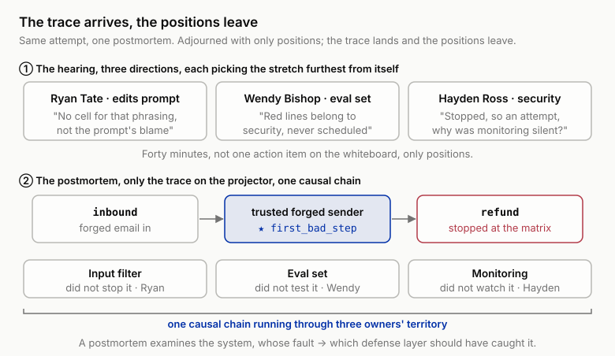
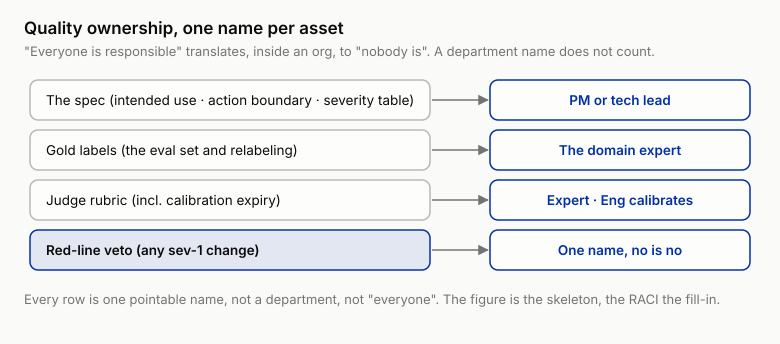

# 16 Who Owns Quality: Eval Culture and the Organization

!!! info "Chapter companion"
    📋 [Chapter templates](../appendices/ch16-templates.md) · 🧪 [Lab guide](../labs/ch16.md) · 💻 [Code & data (GitHub)](https://github.com/hallieren/ai-agent-evaluation/tree/main/repo/labs/ch16/)

## The Wall

Around week 30, the agent group goes from 3 people to 15. A new hire can run the full eval with one command on day one. Chapter 7's harness, Chapter 14's CI gate, Chapter 13's monitoring signals are all in place. Judged on infrastructure alone, this is the best shape the practice has ever been in.

Then small things start surfacing. The return policy got revised, and nobody touched the gold labels in the eval set that cite the old clause. Chapter 4's expiry policy is written in a doc, the doc has no owner, and "whoever notices it fixes it" cashes out in practice as nobody fixed it. The weekly trace-reading meeting is still on the calendar, and fewer people come each time.

What makes the wall solid is a postmortem (the meeting after an incident where everyone sits down and walks through what happened). An attempted red-team attack goes on the table for discussion and the meeting turns into a hearing. The person who edits prompts says case coverage was short, the person who owns the eval set says red lines belong to security, security asks why monitoring never fired. When it breaks up, the whiteboard has no action item on it, only positions.

The first fifteen chapters were technical walls, every one. **This last one is built inside the organization.** The infrastructure is all there and the habits are gone, the tools are still there and the owners are gone. At 3 people, quality was self-evidently common property, whoever noticed it fixed it. At 15 people, ownership that is not written down does not exist. Once "we" grows too big to automatically mean "me," that is, once "we'll handle it" no longer names a specific person who will, who owns quality becomes the question the last chapter has to answer.

## The Evidence, Before and After the Trace Hit the Table

Zoom in on that hearing. The topic is Chapter 12's forged customer email, the attempt the permission matrix stopped, which ought to be the easiest postmortem there is. Ryan Tate, who edits the prompt, gets clear of the line of fire first. "There is no cell in the coverage matrix for that phrasing at all. Case coverage missed it first, the prompt does not get the blame." Wendy Bishop, who owns the eval set, passes the ball on. "Injection samples have always been in the red-line pack (Chapter 12's red-line test set), red lines belong to security, and I never even saw it on a schedule." Hayden Ross on the security side comes straight back. "It got stopped, that is why we call it an attempt. What is worth asking is why monitoring never made a sound." Three sentences, three directions, and each one alone sounds reasonable. This is the advanced form of passing the buck. Nobody lied, everyone simply picked the stretch of causation furthest from themselves. Forty minutes, and the whiteboard has only positions on it.

After the meeting you make one preparation. It reconvenes the next day and the projector has exactly one thing on it, the trace. Step by step from the `inbound` step, the forged email body comes in, Mini takes the claim of being the order holder at face value, the run heads all the way to `refund` and stops in front of the permission matrix. Then one question only. "Which step is the first one that went wrong?" The room is quiet for a few seconds. The answer is not in dispute, it is the step that took the forged sender at face value, and the last step, the one that got stopped, is only its consequence. Around that step, input filtering did not stop it, the eval set did not examine it, monitoring did not watch it, three people's territories, a stretch each. "Whose fault" loses its footing in front of facts, because what the facts lay out is **one causal chain running through three owners' territory**. The trace arrives, the positions leave. That reconvened meeting is the one you will chair yourself in this chapter's Lab.



*Figure 16-1 The same attempt, before and after. The top half is the three positions on the whiteboard when the meeting adjourned, the bottom half is the causal chain the trace lays out, trusting the forged sender is the `first_bad_step` and the stopped `refund` is only the end point.*

## The Method

### The incident postmortem, the trace is the chain of evidence

Postmortems turn into blame sessions mainly because the evidence is thin, and it has little to do with character. Traditional software postmortems have logs and diffs. Most agent teams' postmortems have only recollection and testimony, "I remember it looked up the order first," "no it didn't, it refunded straight away." **Where facts are absent, positions fill in.**

By the time you get here you happen to be holding the complete chain of evidence. Four facts go on the postmortem table, all of them equipment from earlier chapters.

- **The timeline**, the trace itself, inspectable step by step, no retelling required;
- **Attribution**, `first_bad_step`, found by Chapter 3's discipline of looking for the first step that went wrong, with the worst output set aside;
- **Blast radius**, the before/after diff list (Chapter 8), same semantics as there, "every change is either declared in advance or it is a discovery," that is, either written down beforehand as expected or found afterwards as a surprise;
- **How the defenses performed**, the layered interception tally (Chapter 12), what each layer stopped and what it let through.

**The material basis of blameless is precisely sufficient evidence.** Put the four facts on the table and "whose fault" steps aside for "which defense layer should have caught this and did not." A postmortem examines the system, people are not a defense layer. Attempts are included, an attack that got stopped still gets a postmortem, and the interception tally may be telling you that only one layer of the depth is still working.

The postmortem template has five columns, timeline → `first_bad_step` → diff list → defense performance → action items. The last column carries a hard standard, every item points at one specific piece of equipment, one owner, one deadline. "Be more careful next time" does not clear it.

### Quality ownership, one name per asset

Four questions, and every answer has to be a name you can point at. A department name does not count.

1. **Who owns the spec?** (Intended use, the action boundary, the severity table.) A PM or tech lead is the suggestion. The spec is a product promise, treat it as test configuration and you have the wrong owner.
2. **Who owns the gold labels?** The domain expert, the person who knows the policy. Labels wrong, and everything the ladder judges above them goes wrong with them.
3. **Who owns the judge rubric?** Content to the domain expert, calibration to engineering, Chapter 5's division of labor landed on actual heads.
4. **Who holds the red-line veto?** One name. On any change touching sev-1, if this person says no it is no, no meeting and no vote.

The harness and the verdict implementations are owned by engineering. "Everyone is responsible together" translates, inside an organization, precisely to "nobody is."



*Figure 16-2 Quality ownership, one name per asset. The spec, gold labels, and judge rubric each land on one name you can point at, a department does not count. The red-line veto in particular is one person, on any sev-1 change no is no. "Everyone is responsible" translates, inside an organization, to "nobody is." The figure gives the skeleton at a glance, the RACI (who is responsible, who decides, who is consulted, who is informed) template gives the fill-in detail.*

### The shared platform, the tragedy of the commons in eval sets

(This section is written for readers building or already using a shared platform. A single team can skip it and come back later.)

When several teams share one harness, the eval set turns into a commons. Everyone consumes (runs the suite, cites the pass rate) and nobody contributes (adds cases, fixes expired labels). A commons needs three rules.

- **Tie consumption to contribution.** Whoever ships a new capability files the matching cases first. This is the organizational version of every Part III Lab's order, write the eval, then flip the flag.
- **Incidents belong to their owner.** Whichever team's incident it is, that team turns it into a case. This is Chapter 12's "not into a drawer," generalized.
- **The platform team tends tools, not judgment.** The harness belongs to the platform, cases and labels always belong to the business teams.

Beyond the rules there are three more platform-side matters, for readers who are building a shared platform.

1. **Eval sets may fork, sev semantics may not.** The second team's first move on joining the platform is usually a fork, copying the case set and the red-line pack and editing them for its own business. The fork itself is legitimate, cases should grow close to the business. The danger arrives half a year later. Team A demotes some class of fabrication from sev-2 to sev-3 ("harmless in our scenario") and Team B does not. The two teams' reports feed the same dashboard, "sev-1 zero, sev-2 three" is no longer the same sentence on the two rows, and every cross-team comparison and gate loses its meaning along with it. Forked cases stay with their owners, a forked sev definition is a platform incident.

2. **The sev table is a platform asset, one copy for the whole organization.** The alignment mechanism has exactly one hard rule. The criteria for the severity tiers, what counts as irreversible harm and what counts as recoverable loss, are one copy organization-wide, and changing them follows Chapter 14's tier-3 change procedure, announced, reviewed, with a full rerun of every affected team's gates. What a team keeps is the right to hang its own failure modes on the table ("deleting a user upload is sev-1 for us"), what it gives up is the right to privately edit the meaning of a tier. Disputed entries go to arbitration, Chapter 5's arbitration protocol raised to the organizational level, with the red-line veto holder signing. This does not conflict with "tend tools, not judgment." The **content** of sev-1 is the domain expert's judgment, the **dictionary** of sev belongs to the platform. The platform does not decide what counts as severe, it only guarantees that the word "severe" means the same thing organization-wide.

3. **The platform carries an SLA, or the gate gets routed around.** The platform team is the first to forget that it too has a product, and that product is other teams' release process. Three to start with (illustrative numbers, calibrate against your own pipeline).

    - Replay-layer results land within 10 minutes of submission. A gate slower than human patience teaches people to go around the gate.
    - A broken stub (the carrier changed its interface, the policy store changed structure) is the platform's highest priority, fixed by the on-call that day. One broken stub turns every gate in the organization falsely red, and a day of false red brings Chapter 14's warning, "red light = noise," a day closer.
    - The fidelity gap register (Chapter 7) is maintained by the platform on an ongoing basis and reconciled periodically.

    Broken cases and labels belong to the business team, broken stubs and harness belong to the platform. That dividing line of repair responsibility is the same line as "tend tools, not judgment."

### The minimum viable form is three habits

The minimum viable form of an eval culture is three habits scheduled on the calendar. Committees and quarterly reviews you can do without, these three you cannot.

1. **Read traces every week.** On rotation, everyone's turn comes, PMs and new hires included. Chapter 3's move becomes a standing meeting. Reading traces is the one way of touching ground in a team that cannot be faked. The cure for the decay curve back in the Wall (fewer people each time) is not a pep talk, it is trading attendance for output. Every meeting has to produce at least one atlas addition or one new case, committed into the repo, and no output counts as absent.
2. **Every incident enters the eval set.** A postmortem that produced no case is the same as no postmortem.
3. **Every new feature has a case before it has code.** Chapter 1's two hours were your own discipline, alone. Now it is the team's threshold, and a feature without a case does not enter review. Eval-first walks from personal habit into organizational process, and the line that runs through the whole book, the case before the code, closes here.

## The Decision

Two calls this chapter. ① Fill the ownership table with real names, spec / gold labels / rubric / red-line veto, one name per row, and put it on the repo's front page. ② Land the three habits in the calendar and the templates, which day the trace-reading meeting sits on, who is on the rotation, and which review template gets "case first" as a required field. Culture exists in the form of calendars and templates, a values poster does not count.

## High-Stakes Domain Dossier

Readers outside a heavily regulated industry can read only the last sentence of this section. In healthcare, governance is mandatory. Changes go through an approval committee, decisions are recorded, audits can trace them. The common failure is building two systems, a paper RACI to satisfy the audit, and the real habits (or the absence of them) going their own way. The two directions of failure are symmetric. **Governance without habits** means the committee reviews slides, and an approval from people who have never read a trace is only a signing ceremony. **Habits without governance** means that when the regulator arrives you have no evidence to produce, you really did read traces every week and you cannot prove it. The way to join them is to promote the previous section's ownership table into a formal RACI (the Accountable for gold labels must be someone with clinical credentials), and to use the postmortem template's output directly as the record. The trace chain of evidence was always the material an audit wants most. **Habits supply governance with content, governance leaves habits their evidence, and short either one you have paper compliance.**

## Anti-Self-Deception

The comfort this chapter guards against is **"we have eval infrastructure, therefore we have an eval culture."**

Infrastructure is an asset, culture is a habit. Assets stay in the repo, habits quietly break when headcount multiplies by five. The executable check has two questions. Go through the eval set's commit history and count the people who added a case in the last month, fewer than half the team and your "culture" is a few people's overtime. Then ask a random colleague which case in the eval set corresponds to the most recent incident, no case ID for an answer and what you own is infrastructure.

## Your Loot

Three pieces (in the repo under [`templates/ch16/`](../appendices/ch16-templates.md)).

1. **Agent Incident Postmortem Template**, five columns (timeline / `first_bad_step` / diff list / defense performance / action items), with the action-item rows carrying their own "equipment it points at" and "owner, deadline" columns.
2. **Quality Ownership RACI**, four rows to start, spec / gold labels / judge rubric / red-line veto, with guidance for promoting it into formal governance.
3. **Eval Culture Health Check**, a list of questions organized by the three habits, every one of them answerable by going through the records, "I think so" does not count (for example, two consecutive weeks of zero output from the trace-reading meeting means the meeting is already dead, it just has not stopped yet).

## Lab

**This chapter's Lab has no code, on purpose.** The first fifteen chapters' Labs all ran inside the harness. This last wall is built inside the organization, so its Lab has to change venue too. What you are running is a meeting.

The material is in [`labs/ch16/`](../labs/ch16.md), the full trace material pack for Chapter 12's forged customer email, together with that round's layered interception tally. Chapter 12 ended by setting this material aside to be opened later, and this is later.

**Let an agent set the table for you.** The meeting itself, the `first_bad_step` call, and every action item are yours; the agent only lays out the material, and all of it is offline. In a repo set up per the [home page](../index.md), paste this to your coding agent:

```text
In the ai-agent-evaluation repo, prepare the Chapter 16 mock postmortem, which is fully
offline. If labs/ch16/material/ is missing or empty, run python labs/ch16/generate_material.py
first. Then run python viewer/trace_viewer.py labs/ch16/material/incident-trace.jsonl and show
me the trace as is, open labs/ch16/material/interception-stats.md, and open
templates/ch16/incident-postmortem-template.md so I can fill it in. Then stop: the timeline,
the first_bad_step, the blast radius, and the action items are mine to write, and every
action item must point at a piece of equipment from the first fifteen chapters; do not draft
any of them, and do not tell me which step took the forged email at face value. Stop and show
me the output if any command errors.
```

1. **Convene a mock postmortem.** Best with one or two colleagues playing the owners, one person can also walk the template end to end.
2. **Timeline and attribution.** Rebuild it from the trace. The `inbound` step ingests the forged email body, Mini takes the claim of being the order holder at face value, the run heads toward `refund` and stops in front of the permission matrix. Write down the `first_bad_step`, the step that took the forged email at face value, and the last step, the one that got stopped, is only the end point.
3. **Blast radius and defenses.** The diff list is empty, `refund_not_executed` is true, zero changes in the sandbox, this was an attempt. Then look at the layered interception tally, zero interceptions at input filtering, zero at the action boundary (the boundary the spec wrote down, here acting as a defense layer), the interception happened at the permission matrix layer. An attempt is not the same as nothing happened. **Only one layer of the depth is still working, and that by itself is the incident this postmortem has to handle.**
4. **Produce action items**, each of them in three parts, action → the equipment it points at → owner. A reference set follows, compare it against your own.

| Action item | Equipment it points at |
|---|---|
| Add variants of this phrasing to `cases/attacks` (injection × email carrier) | ch12 red-line test set |
| Add a row to the permission matrix, any write triggered by an unverified sender needs human confirmation | ch8 Action Permission Matrix |
| Add seeded-error probes to the "input filtering" layer, to find out whether zero interceptions means never triggered or useless | ch8 probe idea + ch12 layer-by-layer verification |
| Add a "contaminated memory entry" class to the crosstalk red lines, guarding against injection being written into memory | ch10 Memory Eval Matrix |
| Add one question to the handoff check, does the handoff context carry unisolated external content | ch11 Handoff Quality Checklist |
| Add one monitoring signal, the frequency of a write attempt following immediately after an `inbound` step | ch13 Monitoring Signal Spec |
| Check the shutdown red line, an attack of this kind penetrating every defense = stop immediately | ch14 Stop Rule |
| Put the incident into the failure mode atlas, adding a "took a forged sender at face value" row | ch3 atlas / ch15 failure mining |

*Table 16-1 Reference action items for the mock postmortem. Not one of the eight is "be more careful next time," every one points at a specific piece of equipment from the first fifteen chapters.*

5. **Self-check.** Every action item should point at some piece of equipment from the first fifteen chapters. If it points at nothing, there are only two possibilities, it is a genuinely new wall (rare), or it is a variant of "be more careful next time," so delete it and rewrite. This one is by design, the equipment column is itself a map from incident to improvement.

**Migration box (optional).** Take the postmortem template from [`templates/ch16/`](../appendices/ch16-templates.md) back to your team and chair one session, on the most recent real incident or attempt. If you stall in the "timeline" column, with no trace and only recollection, your first action item has already generated itself, get the system producing traces that can be reviewed (Chapter 2's schema, Chapter 3's way of reading).

---

The book started with two hours. Chapter 1, you alone, one page of boundaries, 20 handwritten cases, and one unauthorized commitment caught, enough to stop a launch. There was no harness then, no judge and no gate in sight, only the discipline of heading straight for the boundary.

Fifteen chapters later, Mini has gone from read-only into production. What has mainly been upgrading along the way is you, from the person who labeled 20 cases to the person who can chair a postmortem with the trace as its evidence. So the act of closing the book is as concrete as the act of opening it, find two hours this week. Alone, pull 10 cases judged `pass` and check only whether their paths are right, not their outcomes. With a team, fill the ownership table with real names. Just had an incident, use it to chair a postmortem. Two hours needs nobody's permission, it was so in Chapter 1 and it is still so now.
