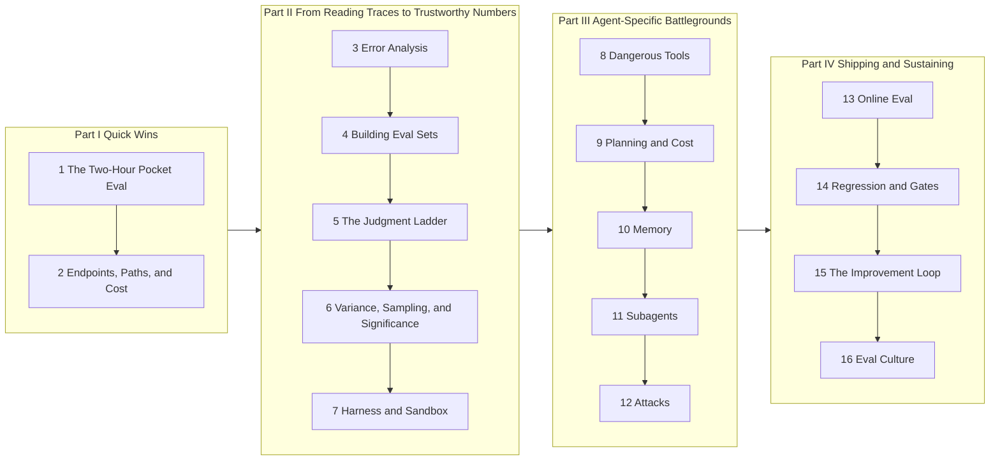
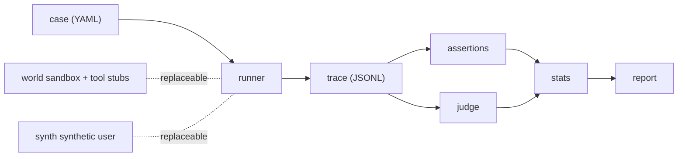

# AI Agent Evaluation

> **Score the endpoint, attribute the path, account for the side effects. Eval before you build.** (That line is the book's through-line; Chapter 2 unpacks it.)

Written for engineers pushing agents toward production, the ones asked "can we ship?" with no evidence in hand. No eval set, no dashboard, no list of failures, nothing. This book starts from a two-hour Pocket Eval and, across 16 chapters, takes you all the way to release gates and eval culture. Each chapter hits one real wall and leaves you one template (44 in all, compiled in Appendix A).

The whole book has one lab agent (**Mini**, a few hundred lines of pure-stdlib Python) and one task world (a fictional e-commerce company, **Shore & Summit**). Mini ships with its capabilities sealed behind flags, and every chapter's Lab keeps the same discipline: **write the eval first → then unlock the capability → watch what the eval catches.**

!!! note "Released chapter by chapter"
    Chapters 1 through 14 are live. The remaining chapters and appendices land one at a time, roughly weekly, each as it clears our own practice pass. Unreleased items appear below as plain titles marked 🚧.

## A 30-second start (no API key)

```bash
git clone https://github.com/hallieren/ai-agent-evaluation.git
cd ai-agent-evaluation/repo
python world/world.py                                        # sandbox self-check (resettable)
python viewer/trace_viewer.py traces/examples/t-0007.jsonl   # read one real trace
```

Running the full eval (`python -m harness.runner --cases cases/seed-20`) requires a real model: three environment variables, any OpenAI-compatible endpoint; see [repo/README.md](https://github.com/hallieren/ai-agent-evaluation/blob/main/repo/README.md). Zero third-party dependencies, Python ≥ 3.10.

**Rather hand the setup to an agent?** Paste this to Claude Code, Codex, or any coding agent to do the one-time clone and configure:

```text
Clone https://github.com/hallieren/ai-agent-evaluation and set it up so I can run the labs.
Python >= 3.10, zero third-party deps. Read repo/README.md, then set the three model env vars
(MODEL_BASE_URL / MODEL_NAME / MODEL_API_KEY). Verify from repo/ with the no-key checks:
python world/world.py and python viewer/trace_viewer.py traces/examples/t-0007.jsonl. Ask me
only for the API endpoint and key; handle everything else yourself, and stop and show me the
output if any command errors.
```

Each chapter's Lab carries its own "let an agent run it" prompt for that chapter's steps.

Every chapter follows the same skeleton: **The Wall** (your predicament) → **The Method** → **The Evidence** (field notes from Shore & Summit) → **The Decision** (the call you have to make) → **Anti-Self-Deception** → **Your Loot** (the template you take with you). Unfamiliar terms live in the glossary (Appendix E, 🚧).

## The roadmap



## Three ways to read

Reading Chapter 1 straight through to Chapter 16 is only one of three paths. Pick by situation.

- **A. Shipping next week, 3 hours a week:** ch1 → ch3 (minimal pass) → ch5 → ch8 → ch13, the rest as needed.
- **B. Building an eval practice from zero:** read straight through.
- **C. Platform / infrastructure engineer:** ch2 → ch6 → ch7 → ch13 → ch14 + Appendix B.

## Chapter overview

| # | The wall you hit | Your Loot | Chapter | Lab |
|---|---|---|---|---|
| 1 | The demo charms everyone; you hold no evidence | [Pocket Eval Template](appendices/ch01-templates.md) | [ch01](chapters/ch01-pocket-eval.md) | [lab](labs/ch01.md) |
| 2 ★ | One "right/wrong" dimension stopped being enough | [Attribute Map + Severity Tiers + Action Boundary Table](appendices/ch02-templates.md) | [ch02](chapters/ch02-defining-good.md) | [lab](labs/ch02.md) |
| 3 ★ | Intuition can't carry it anymore | [Trace Review Form + Failure Mode Atlas](appendices/ch03-templates.md) | [ch03](chapters/ch03-error-analysis.md) | [lab](labs/ch03.md) |
| 4 | Your cases don't represent reality | [Golden Task Design + Coverage Matrix](appendices/ch04-templates.md) | [ch04](chapters/ch04-eval-sets.md) | [lab](labs/ch04.md) |
| 5 ★ | Human labeling can't keep up | [Judgment Ladder Decision Tree + Judge Validation Report](appendices/ch05-templates.md) | [ch05](chapters/ch05-judgment-ladder.md) | [lab](labs/ch05.md) |
| 6 | Run it twice, get two different results | [Statistics Cheat Sheet](appendices/ch06-templates.md) | [ch06](chapters/ch06-variance.md) | [lab](labs/ch06.md) |
| 7 | You don't dare test in the real environment | [Harness Architecture Spec + Synthetic User Persona Library](appendices/ch07-templates.md) | [ch07](chapters/ch07-harness.md) | [lab](labs/ch07.md) |
| 8 ★ | The reply is impeccable; the danger hides in a mid-trace parameter | [Action Permission Matrix + Side-Effect Audit Table](appendices/ch08-templates.md) | [ch08](chapters/ch08-dangerous-tools.md) | [lab](labs/ch08.md) |
| 9 | The endpoint is still right; the bill has already doubled | [Plan Quality Rubric + Cost/Latency Report Template](appendices/ch09-templates.md) | [ch09](chapters/ch09-planning-and-cost.md) | [lab](labs/ch09.md) |
| 10 | It digs up last month's history to apologize to a customer | [Memory Eval Matrix + Long-Task Attribution Protocol](appendices/ch10-templates.md) | [ch10](chapters/ch10-memory.md) | [lab](labs/ch10.md) |
| 11 ★ | End-to-end failed; both agents say it wasn't them | [Multi-Agent Attribution Decision Tree + Handoff Checklist](appendices/ch11-templates.md) | [ch11](chapters/ch11-multi-agent.md) | [lab](labs/ch11.md) |
| 12 ★ | A piece of external content says "ignore previous instructions," and it does | [Red Team Protocol + Shutdown Red-Line Checklist](appendices/ch12-templates.md) | [ch12](chapters/ch12-adversarial.md) | [lab](labs/ch12.md) |
| 13 ★ | 91% offline, wrecked in week two of production | [Evidence Ladder + Monitoring Signal Spec](appendices/ch13-templates.md) | [ch13](chapters/ch13-online-eval.md) | [lab](labs/ch13.md) |
| 14 | You fixed scenario A; scenario B quietly regressed | [Release Gate + Change-Tier Matrix + Stop Rule](appendices/ch14-templates.md) | [ch14](chapters/ch14-release-engineering.md) | [lab](labs/ch14.md) |
| 15 | You have all the data and still don't know what to change | Failure Mining Protocol + Bottleneck-to-Lever Mapping | The Improvement Loop 🚧 | 🚧 |
| 16 | Nobody maintains the evals; postmortems turn into blame games | Incident Postmortem Template + Quality Ownership RACI | Eval Culture 🚧 | 🚧 |

★ = heavyweight chapter. Appendices (all 🚧): A Template Pack · B Repo Map & Migration · C High-Stakes Domains · D Failure-Mode Taxonomy · E Glossary.

## The repo's star is the harness; Mini is the teaching prop



The six components contain not a trace of Shore & Summit knowledge; all world knowledge lives in the two replaceable parts. Appendix B (🚧) shows how to detach the harness and bolt it onto your own agent; the trace schema is compatible with the OTel GenAI semantic conventions (the industry-standard set of LLM telemetry fields, so it plugs into existing observability stacks).

## FAQ

- **The ch14 Lab gate occasionally goes red?** On purpose. The release-gate baseline probabilistically trips a sev-1 after the vendor swaps the model underneath, a live specimen of Chapter 14's change tiers (which tier is a vendor model swap?). Details ship with Chapter 14's lab (`repo/labs/ch14/README.md`).
- **What are the traces in `labs/*/out/`?** Pre-generated teaching material, for following the Labs offline and checking against the reference answers. Committed on purpose.
- **Is `MODEL_FAKE=1` an evaluation method?** No. It's a programming interface for tests and teaching-trace generation (replies come from a scripted queue). Evaluation must measure a real model.
- **Is Shore & Summit a real company?** No. Shore & Summit is a synthetic teaching world assembled from common enterprise scenarios; it does not correspond to any real company, and every character in this book is fictional.

## Contributing & license

Errata, case submissions, and harness improvements: see the [contributing guide](https://github.com/hallieren/ai-agent-evaluation/blob/main/CONTRIBUTING.md). Prose is CC BY-NC-SA 4.0, code is MIT; see [LICENSE.md](https://github.com/hallieren/ai-agent-evaluation/blob/main/LICENSE.md).
